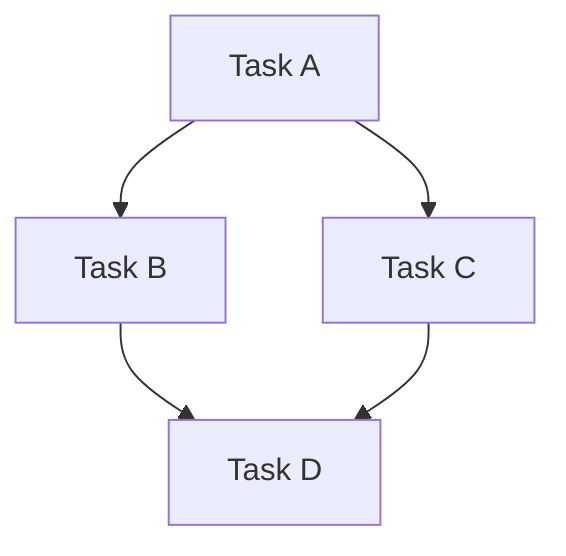
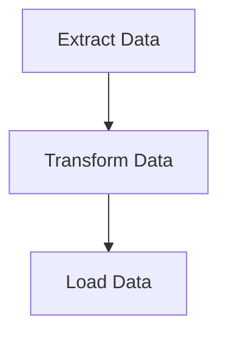

# Airflow DAG优化技巧

Apache Airflow是一个强大的工作流调度工具，广泛用于数据管道的编排和管理。然而，随着任务复杂性和规模的增加，DAG（有向无环图）的性能可能会受到影响。本文将介绍一些优化DAG的技巧，帮助你提升任务执行效率并减少资源消耗。

## 1. 理解DAG的结构

在优化DAG之前，首先需要理解DAG的结构。DAG由多个任务（Task）组成，任务之间通过依赖关系连接。优化DAG的关键在于减少任务之间的依赖、减少任务执行时间以及合理分配资源。



:::tip
**提示**：通过可视化DAG结构，可以更容易地识别潜在的优化点。
:::

## 2. 减少任务数量

过多的任务会增加调度器的负担，并可能导致性能下降。可以通过以下方式减少任务数量：

- **合并小任务**：将多个小任务合并为一个任务，减少调度器的负担。
- **使用子DAG**：将相关的任务组织到子DAG中，简化主DAG的结构。

```python
from airflow import DAG
from airflow.operators.python_operator import PythonOperator
from datetime import datetime

def task_a():
    print("Task A")

def task_b():
    print("Task B")

def task_c():
    print("Task C")

dag = DAG('optimized_dag', start_date=datetime(2023, 1, 1))

task_a = PythonOperator(task_id='task_a', python_callable=task_a, dag=dag)
task_b = PythonOperator(task_id='task_b', python_callable=task_b, dag=dag)
task_c = PythonOperator(task_id='task_c', python_callable=task_c, dag=dag)

task_a >> task_b >> task_c
```

## 3. 优化任务执行时间

任务执行时间过长会影响整个DAG的性能。可以通过以下方式优化任务执行时间：

- **并行化任务**：将可以并行执行的任务分开，减少整体执行时间。
- **使用高效的算法和数据结构**：优化任务中的代码，减少计算复杂度。

```python
from airflow import DAG
from airflow.operators.python_operator import PythonOperator
from datetime import datetime

def task_a():
    # 优化后的代码
    result = sum(range(1000000))
    print(f"Task A result: {result}")

dag = DAG('optimized_dag', start_date=datetime(2023, 1, 1))

task_a = PythonOperator(task_id='task_a', python_callable=task_a, dag=dag)
```

## 4. 合理分配资源

Airflow允许为每个任务分配不同的资源（如CPU、内存）。合理分配资源可以避免资源浪费和任务失败。

- **设置任务资源限制**：通过设置 `executor_config` 参数，为任务分配特定的资源。

```python
from airflow import DAG
from airflow.operators.python_operator import PythonOperator
from datetime import datetime

def task_a():
    print("Task A")

dag = DAG('optimized_dag', start_date=datetime(2023, 1, 1))

task_a = PythonOperator(
    task_id='task_a',
    python_callable=task_a,
    executor_config={"KubernetesExecutor": {"request_memory": "512Mi"}},
    dag=dag
)
```

## 5. 使用XCom进行任务间通信

XCom是Airflow中用于任务间通信的机制。合理使用XCom可以减少不必要的依赖，提升DAG的执行效率。

```python
from airflow import DAG
from airflow.operators.python_operator import PythonOperator
from datetime import datetime

def task_a(**kwargs):
    kwargs['ti'].xcom_push(key='my_key', value='my_value')

def task_b(**kwargs):
    value = kwargs['ti'].xcom_pull(key='my_key')
    print(f"Task B received: {value}")

dag = DAG('optimized_dag', start_date=datetime(2023, 1, 1))

task_a = PythonOperator(task_id='task_a', python_callable=task_a, provide_context=True, dag=dag)
task_b = PythonOperator(task_id='task_b', python_callable=task_b, provide_context=True, dag=dag)

task_a >> task_b
```

## 6. 实际案例：优化ETL管道

假设我们有一个ETL管道，包含数据提取、转换和加载三个步骤。通过优化任务结构、并行化任务和合理分配资源，我们可以显著提升管道的执行效率。



```python
from airflow import DAG
from airflow.operators.python_operator import PythonOperator
from datetime import datetime

def extract_data():
    print("Extracting data...")

def transform_data():
    print("Transforming data...")

def load_data():
    print("Loading data...")

dag = DAG('etl_pipeline', start_date=datetime(2023, 1, 1))

extract = PythonOperator(task_id='extract_data', python_callable=extract_data, dag=dag)
transform = PythonOperator(task_id='transform_data', python_callable=transform_data, dag=dag)
load = PythonOperator(task_id='load_data', python_callable=load_data, dag=dag)

extract >> transform >> load
```

## 总结

通过理解DAG结构、减少任务数量、优化任务执行时间、合理分配资源以及使用XCom进行任务间通信，你可以显著提升Airflow DAG的性能。希望本文的技巧能帮助你在实际项目中更好地优化DAG。

:::note
**附加资源**：
- [Airflow官方文档](https://airflow.apache.org/docs/)
- [Airflow最佳实践](https://airflow.apache.org/docs/apache-airflow/stable/best-practices.html)
:::

:::tip
**练习**：尝试优化一个现有的DAG，应用本文介绍的技巧，并观察性能提升。
:::