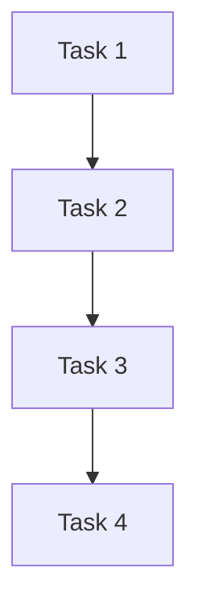
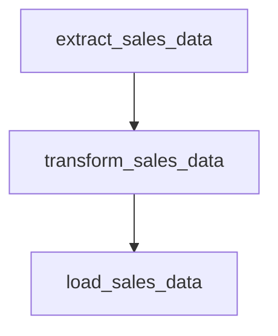

# Airflow 文档编写规范

Airflow是一个强大的工作流编排工具，广泛应用于数据工程、ETL管道和任务调度等领域。为了确保团队能够高效地使用和维护Airflow工作流，编写清晰、一致且易于理解的文档至关重要。本文将介绍Airflow文档编写的最佳实践，帮助初学者掌握文档编写的核心原则。

## 为什么需要文档编写规范？

Airflow工作流通常由多个任务、依赖关系和配置项组成。如果没有清晰的文档，团队成员可能会对工作流的设计意图、任务依赖关系和配置细节感到困惑。良好的文档不仅有助于新成员快速上手，还能减少维护成本，提高团队协作效率。

## 文档编写的基本原则

### 1. 清晰的结构

文档应具有清晰的结构，便于读者快速找到所需信息。以下是一个推荐的文档结构：

- **概述**：简要描述工作流的目的和功能。
- **任务说明**：列出所有任务及其功能。
- **依赖关系**：描述任务之间的依赖关系。
- **配置项**：列出所有配置项及其含义。
- **常见问题**：列出常见问题及其解决方案。

### 2. 一致的术语

在文档中使用一致的术语，避免混淆。例如，如果使用“DAG”来指代工作流，则在整个文档中保持一致。

### 3. 代码示例

在文档中提供代码示例，帮助读者理解如何实现特定功能。例如：

```python
from airflow import DAG
from airflow.operators.python_operator import PythonOperator
from datetime import datetime

def print_hello():
    print("Hello, Airflow!")

dag = DAG(
    'hello_world',
    description='A simple tutorial DAG',
    schedule_interval='@daily',
    start_date=datetime(2023, 1, 1),
    catchup=False
)

task = PythonOperator(
    task_id='print_hello',
    python_callable=print_hello,
    dag=dag
)
```

### 4. 注释和解释

在代码中添加注释，解释关键部分的逻辑。例如：

```python
# 定义一个简单的DAG
dag = DAG(
    'hello_world',
    description='A simple tutorial DAG',
    schedule_interval='@daily',  # 每天执行一次
    start_date=datetime(2023, 1, 1),  # 开始日期
    catchup=False  # 不进行历史任务补跑
)
```

### 5. 图表和可视化

使用图表展示任务之间的依赖关系，帮助读者直观理解工作流。例如，使用Mermaid绘制DAG图：



## 实际案例

假设我们有一个Airflow工作流，用于处理每日的销售数据。以下是一个文档示例：

### 概述

该工作流用于处理每日的销售数据，包括数据提取、转换和加载（ETL）过程。

### 任务说明

- **extract_sales_data**：从数据库中提取销售数据。
- **transform_sales_data**：对销售数据进行清洗和转换。
- **load_sales_data**：将处理后的数据加载到数据仓库中。

### 依赖关系



### 配置项

- **start_date**：工作流的开始日期。
- **schedule_interval**：工作流的调度间隔，设置为`@daily`。

### 常见问题

- **问题1**：数据提取失败。
  - **解决方案**：检查数据库连接配置。

## 总结

编写清晰、一致且易于维护的Airflow文档是确保团队高效协作的关键。通过遵循本文介绍的文档编写规范，您可以创建出高质量的文档，帮助团队成员更好地理解和使用Airflow工作流。

## 附加资源

- [Airflow官方文档](https://airflow.apache.org/docs/)
- [Airflow最佳实践指南](https://airflow.apache.org/docs/apache-airflow/stable/best-practices.html)

## 练习

1. 为您的Airflow工作流编写一份文档，包含概述、任务说明、依赖关系和配置项。
2. 使用Mermaid绘制一个简单的DAG图，展示任务之间的依赖关系。
