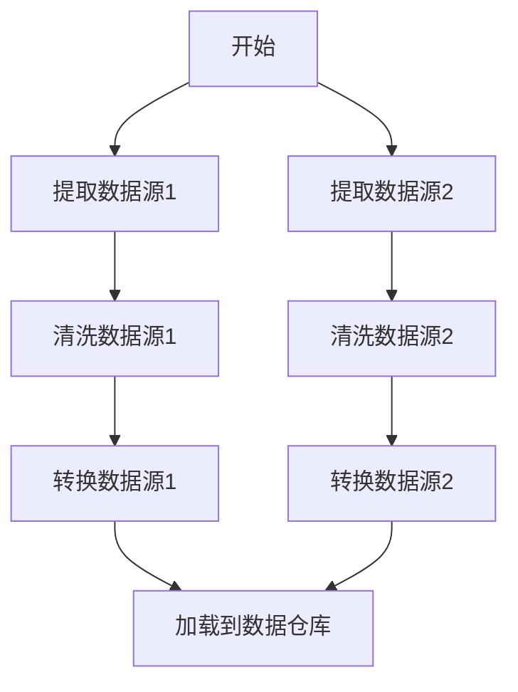

# Airflow 设计模式

Apache Airflow 是一个强大的工作流编排工具，广泛用于数据管道的调度和监控。为了构建高效、可维护的 Airflow 管道，理解并应用适当的设计模式至关重要。本文将介绍几种常见的 Airflow 设计模式，并通过实际案例帮助你更好地掌握这些概念。

## 1. 任务依赖模式

在 Airflow 中，任务之间的依赖关系是工作流的核心。通过合理设计任务依赖，可以确保任务的执行顺序符合预期。

### 示例：线性依赖

```python
from airflow import DAG
from airflow.operators.dummy_operator import DummyOperator
from datetime import datetime

dag = DAG('linear_dependency', description='线性依赖示例',
          schedule_interval='@daily',
          start_date=datetime(2023, 1, 1), catchup=False)

task1 = DummyOperator(task_id='task1', dag=dag)
task2 = DummyOperator(task_id='task2', dag=dag)
task3 = DummyOperator(task_id='task3', dag=dag)

task1 >> task2 >> task3
```

在这个示例中，`task1` 完成后才会执行 `task2`，`task2` 完成后才会执行 `task3`。

:::tip
使用 `>>` 操作符可以清晰地表示任务之间的依赖关系。
:::

## 2. 分支模式

分支模式允许根据某些条件选择不同的执行路径。这在处理复杂逻辑时非常有用。

### 示例：条件分支

```python
from airflow import DAG
from airflow.operators.python_operator import BranchPythonOperator
from airflow.operators.dummy_operator import DummyOperator
from datetime import datetime

def decide_branch(**kwargs):
    if kwargs['execution_date'].weekday() < 5:
        return 'weekday_task'
    else:
        return 'weekend_task'

dag = DAG('branch_pattern', description='分支模式示例',
          schedule_interval='@daily',
          start_date=datetime(2023, 1, 1), catchup=False)

branch_task = BranchPythonOperator(
    task_id='branch_task',
    python_callable=decide_branch,
    provide_context=True,
    dag=dag)

weekday_task = DummyOperator(task_id='weekday_task', dag=dag)
weekend_task = DummyOperator(task_id='weekend_task', dag=dag)

branch_task >> [weekday_task, weekend_task]
```

在这个示例中，`branch_task` 根据执行日期的星期几决定执行 `weekday_task` 还是 `weekend_task`。

:::caution
确保分支任务返回的任务 ID 存在于 DAG 中，否则会导致任务失败。
:::

## 3. 动态任务生成模式

有时需要根据输入数据动态生成任务。Airflow 提供了多种方式来实现这一点。

### 示例：动态生成任务

```python
from airflow import DAG
from airflow.operators.dummy_operator import DummyOperator
from datetime import datetime

dag = DAG('dynamic_task_generation', description='动态任务生成示例',
          schedule_interval='@daily',
          start_date=datetime(2023, 1, 1), catchup=False)

start_task = DummyOperator(task_id='start_task', dag=dag)
end_task = DummyOperator(task_id='end_task', dag=dag)

for i in range(5):
    task = DummyOperator(task_id=f'dynamic_task_{i}', dag=dag)
    start_task >> task >> end_task
```

在这个示例中，`start_task` 和 `end_task` 之间动态生成了 5 个任务。

:::note
动态任务生成可以显著提高 DAG 的灵活性，但需要注意任务数量过多可能导致性能问题。
:::

## 4. 任务重试模式

在数据处理过程中，任务可能会因各种原因失败。Airflow 提供了任务重试机制，确保任务在失败后可以自动重试。

### 示例：任务重试

```python
from airflow import DAG
from airflow.operators.python_operator import PythonOperator
from datetime import datetime, timedelta

def fail_task():
    raise Exception('任务失败')

default_args = {
    'retries': 3,
    'retry_delay': timedelta(minutes=5),
}

dag = DAG('retry_pattern', description='任务重试示例',
          schedule_interval='@daily',
          start_date=datetime(2023, 1, 1), catchup=False,
          default_args=default_args)

task = PythonOperator(
    task_id='fail_task',
    python_callable=fail_task,
    dag=dag)
```

在这个示例中，`fail_task` 任务在失败后会重试 3 次，每次重试间隔 5 分钟。

:::warning
过多的重试次数可能导致任务长时间无法完成，需谨慎设置重试参数。
:::

## 5. 任务并行模式

为了提高数据处理效率，Airflow 支持任务并行执行。通过合理设计任务依赖关系，可以充分利用集群资源。

### 示例：并行任务

```python
from airflow import DAG
from airflow.operators.dummy_operator import DummyOperator
from datetime import datetime

dag = DAG('parallel_tasks', description='并行任务示例',
          schedule_interval='@daily',
          start_date=datetime(2023, 1, 1), catchup=False)

start_task = DummyOperator(task_id='start_task', dag=dag)
end_task = DummyOperator(task_id='end_task', dag=dag)

for i in range(5):
    task = DummyOperator(task_id=f'parallel_task_{i}', dag=dag)
    start_task >> task >> end_task
```

在这个示例中，`start_task` 和 `end_task` 之间的 5 个任务会并行执行。

:::tip
并行任务可以显著提高数据处理速度，但需确保任务之间没有依赖关系。
:::

## 实际案例：数据管道设计

假设我们需要构建一个数据管道，每天从多个数据源提取数据，进行清洗和转换，最后加载到数据仓库中。我们可以结合上述设计模式来构建这个管道。



在这个案例中，我们使用了任务依赖模式、并行模式和动态任务生成模式来构建一个高效的数据管道。

## 总结

通过理解和应用 Airflow 设计模式，你可以构建出高效、可维护的数据管道。本文介绍了几种常见的设计模式，包括任务依赖模式、分支模式、动态任务生成模式、任务重试模式和任务并行模式。希望这些内容能帮助你在实际项目中更好地使用 Airflow。

## 附加资源

- [Airflow 官方文档](https://airflow.apache.org/docs/)
- [Airflow 最佳实践指南](https://airflow.apache.org/docs/apache-airflow/stable/best-practices.html)
- [Airflow 社区论坛](https://airflow.apache.org/community/)

## 练习

1. 创建一个包含分支模式的 DAG，根据不同的条件执行不同的任务。
2. 尝试动态生成 10 个任务，并让它们并行执行。
3. 修改一个现有 DAG，增加任务重试机制，并测试其效果。

通过完成这些练习，你将更深入地理解 Airflow 设计模式的应用。