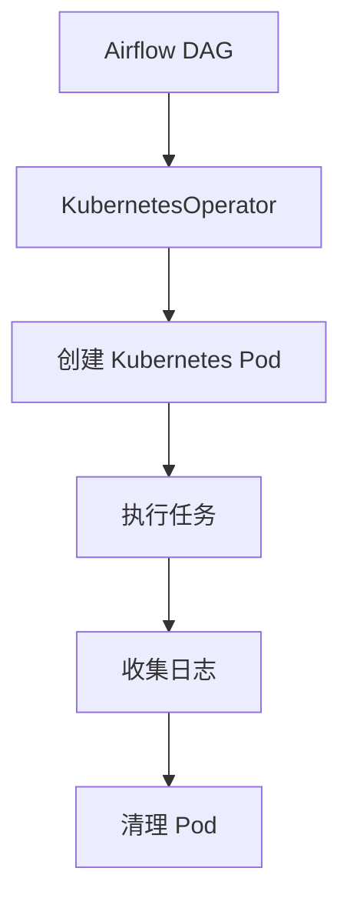

## 什么是 KubernetesOperator？

KubernetesOperator 是 Apache Airflow 中的一个强大工具，允许用户在 Kubernetes 集群中运行任务。它通过将任务封装为 Kubernetes Pod 来实现，从而充分利用 Kubernetes 的弹性、资源管理和调度能力。KubernetesOperator 非常适合需要动态资源分配、隔离环境或运行复杂任务的场景。

:::tip
KubernetesOperator 是 Airflow 与 Kubernetes 集成的核心组件之一，特别适合需要高可扩展性和灵活性的工作流。
:::

## KubernetesOperator 的工作原理

KubernetesOperator 的核心思想是将 Airflow 任务提交到 Kubernetes 集群中运行。具体步骤如下：

1. **任务定义**：在 Airflow DAG 中定义 KubernetesOperator 任务。
2. **Pod 创建**：KubernetesOperator 根据任务配置创建一个 Kubernetes Pod。
3. **任务执行**：Pod 启动并执行任务。
4. **日志收集**：任务完成后，日志会被收集并存储在 Airflow 中。
5. **Pod 清理**：任务完成后，Pod 会被自动清理。



## 如何使用 KubernetesOperator

### 1. 安装依赖

首先，确保你的 Airflow 环境已安装 Kubernetes 相关的依赖：

```bash
pip install apache-airflow[kubernetes]
```

### 2. 配置 Kubernetes 连接

在 Airflow 中配置 Kubernetes 连接。你可以通过 Airflow UI 或直接编辑 `airflow.cfg` 文件来设置连接信息。

```bash
kubectl config view --minify --flatten > ~/.kube/config
```

然后在 Airflow UI 中创建一个 Kubernetes 连接，命名为 `kubernetes_default`。

### 3. 定义 KubernetesOperator 任务

以下是一个简单的 KubernetesOperator 示例：

```python
from airflow import DAG
from airflow.providers.cncf.kubernetes.operators.kubernetes_pod import KubernetesPodOperator
from datetime import datetime

default_args = {
    'owner': 'airflow',
    'start_date': datetime(2023, 1, 1),
    'retries': 1,
}

with DAG('kubernetes_example', default_args=default_args, schedule_interval='@daily') as dag:
    task = KubernetesPodOperator(
        namespace='default',
        image='python:3.8-slim',
        cmds=['python', '-c'],
        arguments=['print("Hello from Kubernetes!")'],
        name='airflow-test-pod',
        task_id='run_python_script',
        get_logs=True,
        is_delete_operator_pod=True,
    )
```

### 4. 运行任务

将上述 DAG 添加到 Airflow 中并触发任务。任务会在 Kubernetes 集群中创建一个 Pod，运行 Python 脚本并输出日志。

:::note
确保 Kubernetes 集群中有足够的资源来运行 Pod，否则任务可能会失败。
:::

## 实际应用场景

### 场景 1：运行机器学习任务

假设你需要运行一个机器学习训练任务，该任务需要大量计算资源。你可以使用 KubernetesOperator 在 Kubernetes 集群中启动一个 GPU 加速的 Pod 来运行训练任务。

```python
task = KubernetesPodOperator(
    namespace='default',
    image='tensorflow/tensorflow:2.7.0-gpu',
    cmds=['python', 'train_model.py'],
    name='ml-training-pod',
    task_id='train_model',
    resources={'limits': {'nvidia.com/gpu': 1}},
    get_logs=True,
    is_delete_operator_pod=True,
)
```

### 场景 2：运行数据管道

如果你有一个数据管道任务，需要从多个数据源提取数据并进行处理，可以使用 KubernetesOperator 启动多个 Pod 并行处理数据。

```python
task = KubernetesPodOperator(
    namespace='default',
    image='data-pipeline:latest',
    cmds=['python', 'run_pipeline.py'],
    name='data-pipeline-pod',
    task_id='run_data_pipeline',
    get_logs=True,
    is_delete_operator_pod=True,
)
```

## 总结

KubernetesOperator 是 Airflow 中一个非常强大的工具，特别适合需要动态资源管理和高可扩展性的任务。通过将任务封装为 Kubernetes Pod，KubernetesOperator 能够充分利用 Kubernetes 集群的资源，实现任务的灵活调度和执行。

:::caution
在使用 KubernetesOperator 时，请确保 Kubernetes 集群的资源配置合理，并监控任务的资源使用情况，以避免资源耗尽。
:::

## 附加资源

- [Airflow 官方文档 - KubernetesOperator](https://airflow.apache.org/docs/apache-airflow-providers-kubernetes/stable/operators.html)
- [Kubernetes 官方文档](https://kubernetes.io/docs/home/)
- [Airflow 与 Kubernetes 集成指南](https://airflow.apache.org/docs/apache-airflow/stable/executor/kubernetes.html)

## 练习

1. 尝试在本地 Kubernetes 集群中运行一个简单的 KubernetesOperator 任务。
2. 修改任务配置，使用不同的 Docker 镜像和资源限制。
3. 探索如何在 KubernetesOperator 中传递环境变量和配置文件。

通过以上练习，你将更深入地理解 KubernetesOperator 的工作原理和使用方法。