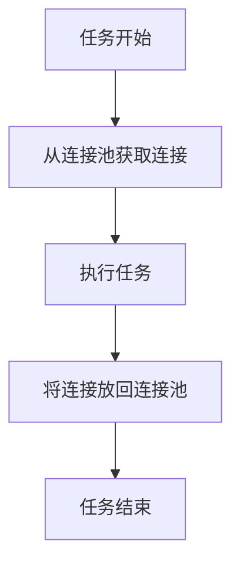

# Airflow 连接池管理

在Apache Airflow中，连接池（Connection Pooling）是一种用于管理数据库连接或其他外部资源连接的技术。通过连接池，Airflow可以有效地复用连接，减少资源开销，并提高任务执行的效率。本文将详细介绍Airflow中的连接池管理，包括其工作原理、配置方法以及实际应用场景。

## 什么是连接池？

连接池是一种用于管理数据库连接的技术。在传统的数据库操作中，每次执行任务时都需要创建和关闭连接，这会导致大量的资源浪费。连接池通过在任务执行前预先创建一定数量的连接，并在任务执行完毕后将连接放回池中，从而实现连接的复用。

在Airflow中，连接池不仅限于数据库连接，还可以用于管理其他外部资源的连接，如HTTP连接、FTP连接等。

## 连接池的工作原理

连接池的核心思想是“连接复用”。当任务需要连接时，它会从连接池中获取一个可用的连接，而不是每次都创建一个新的连接。任务执行完毕后，连接会被放回池中，供其他任务使用。



## 配置连接池

在Airflow中，连接池的配置可以通过`airflow.cfg`文件进行。以下是一个简单的配置示例：

```ini
[core]
# 设置连接池的大小
sql_alchemy_pool_size = 5
# 设置连接池的最大溢出大小
sql_alchemy_max_overflow = 10
# 设置连接池的连接回收时间（秒）
sql_alchemy_pool_recycle = 3600
```

- `sql_alchemy_pool_size`：连接池的大小，表示池中最多可以有多少个连接。
- `sql_alchemy_max_overflow`：连接池的最大溢出大小，表示当池中的连接用尽时，可以额外创建多少个连接。
- `sql_alchemy_pool_recycle`：连接池的连接回收时间，表示连接在多长时间后会被回收并重新创建。

## 实际应用场景

假设我们有一个Airflow DAG，其中包含多个任务，每个任务都需要连接到同一个数据库。如果每次任务执行时都创建新的连接，会导致数据库连接数迅速增加，最终可能导致数据库连接耗尽。

通过使用连接池，我们可以有效地管理这些连接，确保每个任务都能快速获取到连接，并且在任务执行完毕后将连接放回池中，供其他任务使用。

以下是一个简单的DAG示例，展示了如何在任务中使用连接池：

```python
from airflow import DAG
from airflow.operators.python_operator import PythonOperator
from airflow.utils.dates import days_ago
from airflow.hooks.base_hook import BaseHook
import psycopg2

def query_database():
    conn = BaseHook.get_connection('my_database')
    with psycopg2.connect(
        dbname=conn.schema,
        user=conn.login,
        password=conn.password,
        host=conn.host,
        port=conn.port
    ) as connection:
        with connection.cursor() as cursor:
            cursor.execute("SELECT * FROM my_table")
            result = cursor.fetchall()
            print(result)

default_args = {
    'owner': 'airflow',
    'start_date': days_ago(1),
}

dag = DAG(
    'database_query_dag',
    default_args=default_args,
    schedule_interval='@daily',
)

task = PythonOperator(
    task_id='query_database',
    python_callable=query_database,
    dag=dag,
)
```

在这个示例中，我们使用了`BaseHook.get_connection`方法从Airflow的连接管理中获取数据库连接，并在任务执行完毕后自动关闭连接。

## 总结

连接池是Airflow中一个非常重要的概念，它可以帮助我们有效地管理数据库连接和其他外部资源的连接，从而提高任务执行的效率。通过合理配置连接池的大小和回收时间，我们可以避免资源浪费，并确保任务的顺利执行。

## 附加资源与练习

- **练习**：尝试在你的Airflow环境中配置一个连接池，并观察其对任务执行的影响。
- **资源**：阅读Airflow官方文档中关于[连接池](https://airflow.apache.org/docs/apache-airflow/stable/concepts.html#connection-pooling)的更多信息。

:::tip
在实际生产环境中，建议根据任务的并发量和数据库的连接限制来合理配置连接池的大小和溢出大小。
:::