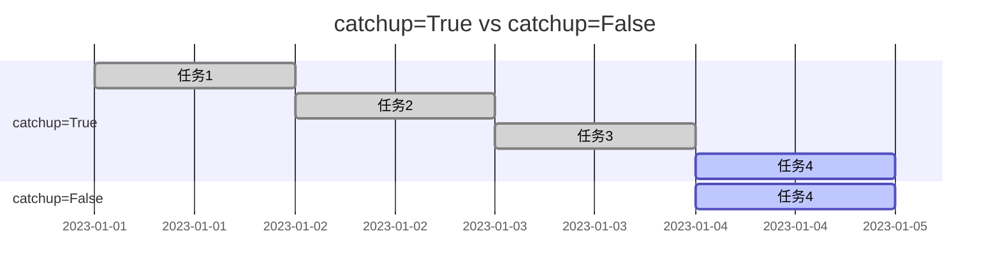

## 什么是 catchup 参数？

在 Apache Airflow 中，`catchup` 是一个非常重要的调度参数，用于控制 DAG（有向无环图）在启用调度后是否会自动补全历史任务。简单来说，`catchup` 决定了 Airflow 是否会在 DAG 启动时，自动执行从 `start_date` 到当前时间之间的所有未执行的任务。

默认情况下，`catchup` 参数是启用的（`True`），这意味着如果你设置了一个 DAG 的 `start_date` 为过去的时间，Airflow 会自动补全从 `start_date` 到当前时间的所有任务。这在某些场景下非常有用，但也可能导致不必要的任务重复执行。

## catchup 参数的作用

`catchup` 参数的主要作用是控制任务的调度行为，具体表现为：

1. **补全历史任务**：当 `catchup=True` 时，Airflow 会从 `start_date` 开始，按照调度间隔（`schedule_interval`）生成并执行所有未执行的任务。
2. **跳过历史任务**：当 `catchup=False` 时，Airflow 只会从当前时间开始调度任务，忽略 `start_date` 到当前时间之间的任务。

## 如何设置 catchup 参数

在定义 DAG 时，可以通过 `catchup` 参数来控制是否启用补全历史任务的功能。以下是一个简单的示例：

```python
from airflow import DAG
from airflow.operators.dummy_operator import DummyOperator
from datetime import datetime, timedelta

default_args = {
    'owner': 'airflow',
    'start_date': datetime(2023, 1, 1),
    'retries': 1,
    'retry_delay': timedelta(minutes=5),
}

# 定义 DAG，设置 catchup=False
dag = DAG(
    'example_catchup_dag',
    default_args=default_args,
    description='An example DAG to demonstrate catchup',
    schedule_interval=timedelta(days=1),
    catchup=False,  # 禁用补全历史任务
)

start_task = DummyOperator(task_id='start_task', dag=dag)
end_task = DummyOperator(task_id='end_task', dag=dag)

start_task >> end_task
```

在这个示例中，`catchup=False` 表示 Airflow 不会补全从 `start_date`（2023年1月1日）到当前时间之间的任务，只会从当前时间开始调度任务。

## catchup 的实际应用场景

### 场景 1：数据管道初始化

假设你有一个数据管道，每天从外部 API 获取数据并存储到数据库中。如果你在 2023年1月1日创建了这个 DAG，但直到 2023年1月10日才启用调度，那么：

- 如果 `catchup=True`，Airflow 会自动补全从 2023年1月1日到 2023年1月10日之间的所有任务，确保数据完整。
- 如果 `catchup=False`，Airflow 只会从 2023年1月10日开始调度任务，忽略之前的数据。

### 场景 2：避免重复执行

在某些情况下，补全历史任务可能会导致重复执行。例如，如果你有一个 DAG 每天生成一份报告，并且报告生成后无法更改，那么启用 `catchup` 可能会导致重复生成报告。此时，设置 `catchup=False` 可以避免这种情况。

## catchup 与调度时间的关系

为了更好地理解 `catchup` 参数，我们可以通过以下 Mermaid 图表展示 `catchup=True` 和 `catchup=False` 的区别：



在这个图表中，`catchup=True` 会补全从 2023年1月1日到 2023年1月4日之间的所有任务，而 `catchup=False` 只会从 2023年1月4日开始调度任务。

## 总结

`catchup` 参数是 Airflow 中一个非常重要的调度控制参数，它决定了 DAG 在启用调度后是否会自动补全历史任务。通过合理设置 `catchup` 参数，你可以避免不必要的任务重复执行，或者确保数据管道的完整性。

:::tip
在实际使用中，建议根据业务需求合理设置 `catchup` 参数。如果历史任务的执行是必要的，可以启用 `catchup`；如果历史任务的执行会导致重复或无效操作，建议禁用 `catchup`。
:::

## 附加资源与练习

1. **练习**：创建一个 DAG，设置 `start_date` 为过去的时间，并分别尝试 `catchup=True` 和 `catchup=False`，观察任务调度的区别。
2. **进一步阅读**：查阅 [Airflow 官方文档](https://airflow.apache.org/docs/) 中关于 `catchup` 参数的详细说明。

通过以上内容，你应该已经掌握了 `catchup` 参数的基本概念和使用方法。继续实践和探索，你将能够更好地利用 Airflow 进行任务调度和管理。