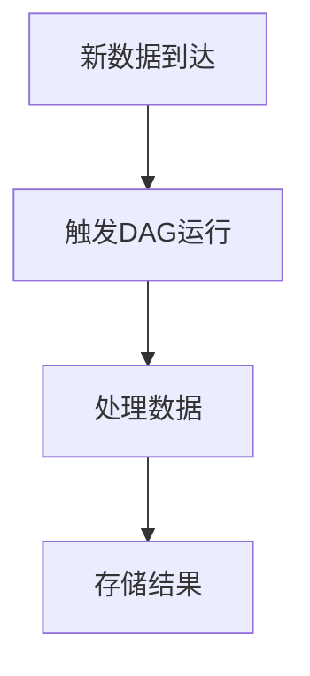

# Airflow 外部触发

Apache Airflow 是一个强大的工作流调度工具，能够自动化复杂的数据管道。除了通过调度器自动触发DAG运行外，Airflow还支持**外部触发**，即通过外部事件或手动操作来启动DAG。本文将详细介绍Airflow外部触发的概念、使用方法以及实际应用场景。

## 什么是外部触发？

在Airflow中，DAG（有向无环图）通常由调度器根据预定义的时间表自动触发运行。然而，在某些情况下，你可能希望通过外部事件或手动操作来触发DAG运行，这就是**外部触发**的用武之地。

外部触发允许你在不依赖调度器的情况下启动DAG运行。例如，当某个外部系统生成新数据时，你可以通过API调用或命令行工具手动触发DAG来处理这些数据。

## 如何实现外部触发？

### 1. 使用Airflow CLI触发DAG

Airflow提供了一个命令行接口（CLI），你可以使用它来手动触发DAG运行。以下是一个简单的示例：

```bash
airflow dags trigger my_dag_id
```

在这个命令中，`my_dag_id`是你要触发的DAG的ID。执行此命令后，Airflow将立即启动该DAG的运行。

### 2. 使用Airflow REST API触发DAG

Airflow还提供了一个REST API，允许你通过HTTP请求来触发DAG运行。以下是一个使用`curl`命令触发DAG的示例：

```bash
curl -X POST http://localhost:8080/api/v1/dags/my_dag_id/dagRuns \
  -H "Content-Type: application/json" \
  -d '{"conf": {"key": "value"}}'
```

在这个示例中，`my_dag_id`是你要触发的DAG的ID，`conf`是一个可选的配置对象，可以传递给DAG运行。

### 3. 在Python代码中触发DAG

如果你在Python脚本中工作，可以使用Airflow的Python API来触发DAG运行。以下是一个示例：

```python
from airflow.api.client.local_client import Client

client = Client(None, None)
client.trigger_dag(dag_id='my_dag_id', run_id='manual__2023-10-01T00:00:00', conf={'key': 'value'})
```

在这个示例中，`my_dag_id`是你要触发的DAG的ID，`run_id`是手动指定的运行ID，`conf`是一个可选的配置对象。

## 实际应用场景

### 场景1：数据到达时触发DAG

假设你有一个数据管道，用于处理从外部系统接收的新数据。当新数据到达时，你可以使用外部触发来启动DAG运行，而不是等待调度器按计划运行。



### 场景2：手动测试和调试

在开发和测试阶段，你可能需要手动触发DAG运行以验证其行为。外部触发允许你在不修改调度器配置的情况下快速启动DAG运行，从而加快开发和调试过程。

## 总结

外部触发是Airflow中一个非常有用的功能，它允许你通过外部事件或手动操作来启动DAG运行。无论是处理实时数据还是进行手动测试，外部触发都能为你提供更大的灵活性和控制力。

## 附加资源与练习

- **练习1**：尝试使用Airflow CLI触发一个简单的DAG运行，并观察其执行过程。
- **练习2**：编写一个Python脚本，使用Airflow的Python API触发DAG运行，并传递一些配置参数。
- **附加资源**：阅读Airflow官方文档中关于[外部触发](https://airflow.apache.org/docs/apache-airflow/stable/cli-and-env-variables-ref.html#trigger_dag)的部分，了解更多高级用法和配置选项。

通过掌握外部触发，你将能够更好地控制Airflow中的工作流，并应对各种复杂的场景。