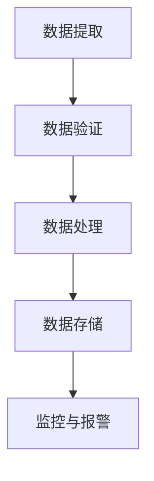

# Airflow 数据质量控制

在现代数据工程中，数据质量控制是确保数据管道可靠性和准确性的关键步骤。Apache Airflow作为一个强大的工作流管理工具，提供了多种机制来帮助开发者实现数据质量控制。本文将逐步介绍如何在Airflow中实施数据质量控制，并通过实际案例展示其应用。

## 什么是数据质量控制？

数据质量控制是指在数据处理的各个阶段，通过一系列检查、验证和监控手段，确保数据的准确性、完整性和一致性。在Airflow中，数据质量控制可以通过任务依赖、数据验证、错误处理和监控等方式实现。

## 数据质量控制的关键步骤

### 1. 任务依赖

在Airflow中，任务之间的依赖关系可以通过DAG（有向无环图）来定义。通过合理设置任务依赖，可以确保数据在进入下一个处理阶段之前已经通过了必要的检查。

```python
from airflow import DAG
from airflow.operators.dummy_operator import DummyOperator
from datetime import datetime

dag = DAG('data_quality_dag', description='A simple DAG for data quality control',
          schedule_interval='@daily',
          start_date=datetime(2023, 1, 1), catchup=False)

start_task = DummyOperator(task_id='start_task', dag=dag)
data_validation_task = DummyOperator(task_id='data_validation_task', dag=dag)
end_task = DummyOperator(task_id='end_task', dag=dag)

start_task >> data_validation_task >> end_task
```

### 2. 数据验证

数据验证是数据质量控制的核心步骤。在Airflow中，可以使用PythonOperator或自定义Operator来执行数据验证逻辑。以下是一个简单的数据验证示例：

```python
from airflow import DAG
from airflow.operators.python_operator import PythonOperator
from datetime import datetime

def validate_data(**kwargs):
    data = kwargs['ti'].xcom_pull(task_ids='extract_task')
    if not data:
        raise ValueError("Data is empty")
    if len(data) < 100:
        raise ValueError("Data size is too small")

dag = DAG('data_validation_dag', description='A DAG for data validation',
          schedule_interval='@daily',
          start_date=datetime(2023, 1, 1), catchup=False)

validate_task = PythonOperator(task_id='validate_task', python_callable=validate_data, provide_context=True, dag=dag)

validate_task
```

### 3. 错误处理

在数据质量控制过程中，错误处理是必不可少的。Airflow提供了多种错误处理机制，如重试、任务失败通知等。以下是一个简单的错误处理示例：

```python
from airflow import DAG
from airflow.operators.python_operator import PythonOperator
from datetime import datetime

def process_data(**kwargs):
    try:
        data = kwargs['ti'].xcom_pull(task_ids='extract_task')
        # Process data
    except Exception as e:
        print(f"Error processing data: {e}")
        raise

dag = DAG('error_handling_dag', description='A DAG for error handling',
          schedule_interval='@daily',
          start_date=datetime(2023, 1, 1), catchup=False)

process_task = PythonOperator(task_id='process_task', python_callable=process_data, provide_context=True, dag=dag)

process_task
```

### 4. 监控与报警

为了确保数据质量控制的持续有效性，监控与报警机制是必不可少的。Airflow可以与多种监控工具集成，如Prometheus、Grafana等，实时监控任务状态和数据质量。



## 实际案例

假设我们有一个电商网站，每天需要处理用户的订单数据。为了确保订单数据的准确性，我们可以使用Airflow实现以下数据质量控制流程：

1. **数据提取**：从数据库中提取当天的订单数据。
2. **数据验证**：检查订单数据是否完整，是否有缺失字段。
3. **数据处理**：对订单数据进行清洗和转换。
4. **数据存储**：将处理后的数据存储到数据仓库中。
5. **监控与报警**：实时监控数据质量，并在发现异常时发送报警。

```python
from airflow import DAG
from airflow.operators.python_operator import PythonOperator
from datetime import datetime

def extract_data(**kwargs):
    # 模拟从数据库中提取数据
    return [{"order_id": i, "amount": i * 10} for i in range(100)]

def validate_data(**kwargs):
    data = kwargs['ti'].xcom_pull(task_ids='extract_task')
    if not data:
        raise ValueError("Data is empty")
    if len(data) < 100:
        raise ValueError("Data size is too small")

def process_data(**kwargs):
    data = kwargs['ti'].xcom_pull(task_ids='extract_task')
    # 模拟数据处理
    return [{"order_id": d["order_id"], "processed_amount": d["amount"] * 1.1} for d in data]

def store_data(**kwargs):
    processed_data = kwargs['ti'].xcom_pull(task_ids='process_task')
    # 模拟数据存储
    print(f"Storing data: {processed_data}")

dag = DAG('ecommerce_data_quality_dag', description='A DAG for ecommerce data quality control',
          schedule_interval='@daily',
          start_date=datetime(2023, 1, 1), catchup=False)

extract_task = PythonOperator(task_id='extract_task', python_callable=extract_data, provide_context=True, dag=dag)
validate_task = PythonOperator(task_id='validate_task', python_callable=validate_data, provide_context=True, dag=dag)
process_task = PythonOperator(task_id='process_task', python_callable=process_data, provide_context=True, dag=dag)
store_task = PythonOperator(task_id='store_task', python_callable=store_data, provide_context=True, dag=dag)

extract_task >> validate_task >> process_task >> store_task
```

## 总结

数据质量控制是确保数据管道可靠性和准确性的关键步骤。通过合理设置任务依赖、数据验证、错误处理和监控机制，可以在Airflow中实现高效的数据质量控制。希望本文的内容能帮助你在实际项目中更好地应用这些技术。

## 附加资源与练习

- **练习**：尝试在Airflow中实现一个简单的数据质量控制流程，包括数据提取、验证、处理和存储。
- **资源**：阅读Airflow官方文档，了解更多关于任务依赖、错误处理和监控的内容。

:::tip
在实际项目中，数据质量控制是一个持续改进的过程。定期审查和优化数据质量控制流程，可以帮助你更好地应对数据质量挑战。
:::