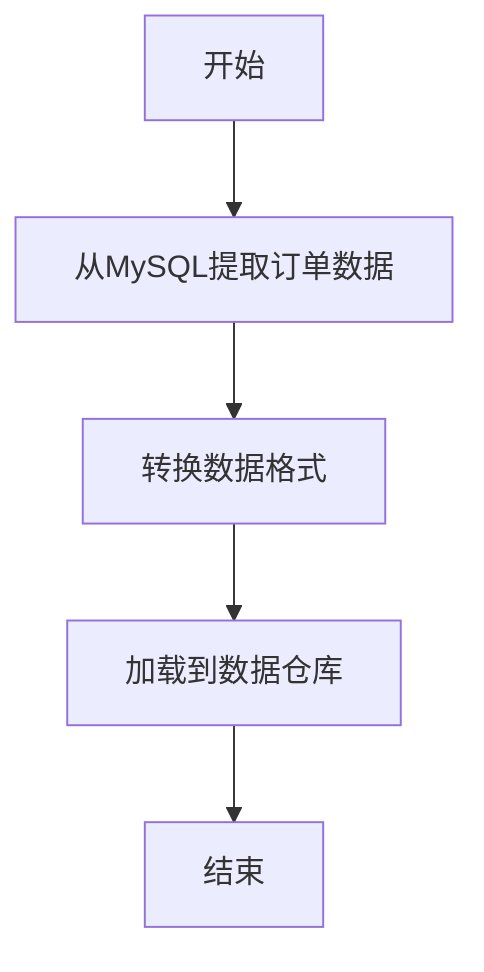

# Airflow 与MySQL集成

Apache Airflow 是一个强大的工作流管理工具，广泛用于数据管道的编排和调度。MySQL 是一个流行的关系型数据库，常用于存储和管理结构化数据。将 Airflow 与 MySQL 集成，可以帮助我们自动化数据提取、转换和加载（ETL）过程，从而实现高效的数据处理。

本文将逐步介绍如何在 Airflow 中与 MySQL 集成，并通过实际案例展示其应用场景。

## 1. 环境准备

在开始之前，请确保你已经安装了以下工具：

- Apache Airflow
- MySQL 数据库
- Python 的 `mysql-connector-python` 或 `pymysql` 库

你可以通过以下命令安装所需的 Python 库：

```bash
pip install mysql-connector-python
```

或者：

```bash
pip install pymysql
```

## 2. 配置 Airflow 连接

在 Airflow 中，我们需要配置一个连接（Connection）来访问 MySQL 数据库。你可以通过 Airflow 的 Web UI 或直接编辑 `airflow.cfg` 文件来完成配置。

### 通过 Web UI 配置

1. 登录 Airflow Web UI。
2. 导航到 **Admin > Connections**。
3. 点击 **Create** 按钮。
4. 填写以下信息：
   - **Conn Id**: `mysql_default`
   - **Conn Type**: `MySQL`
   - **Host**: 你的 MySQL 服务器地址
   - **Schema**: 数据库名称
   - **Login**: 数据库用户名
   - **Password**: 数据库密码
   - **Port**: 3306（默认端口）

### 通过代码配置

你也可以在 DAG 文件中通过代码配置连接：

```python
from airflow import settings
from airflow.models import Connection

conn = Connection(
    conn_id='mysql_default',
    conn_type='mysql',
    host='your_mysql_host',
    login='your_username',
    password='your_password',
    schema='your_database',
    port=3306
)
session = settings.Session()
session.add(conn)
session.commit()
```

## 3. 创建 DAG 与 MySQL 交互

接下来，我们将创建一个 DAG，用于从 MySQL 数据库中提取数据并执行一些操作。

### 示例：从 MySQL 中提取数据

以下是一个简单的 DAG 示例，它从 MySQL 数据库中提取数据并将其打印到日志中。

```python
from airflow import DAG
from airflow.providers.mysql.operators.mysql import MySqlOperator
from airflow.utils.dates import days_ago

default_args = {
    'owner': 'airflow',
    'start_date': days_ago(1),
}

dag = DAG(
    'mysql_example_dag',
    default_args=default_args,
    schedule_interval='@daily',
)

extract_data = MySqlOperator(
    task_id='extract_data',
    mysql_conn_id='mysql_default',
    sql='SELECT * FROM your_table LIMIT 10;',
    dag=dag,
)

extract_data
```

在这个示例中，我们使用了 `MySqlOperator` 来执行 SQL 查询。`mysql_conn_id` 参数指定了我们在前面配置的连接 ID。

### 示例：将数据插入 MySQL

你也可以使用 Airflow 将数据插入到 MySQL 数据库中。以下是一个示例：

```python
from airflow import DAG
from airflow.providers.mysql.operators.mysql import MySqlOperator
from airflow.utils.dates import days_ago

default_args = {
    'owner': 'airflow',
    'start_date': days_ago(1),
}

dag = DAG(
    'mysql_insert_dag',
    default_args=default_args,
    schedule_interval='@daily',
)

insert_data = MySqlOperator(
    task_id='insert_data',
    mysql_conn_id='mysql_default',
    sql='INSERT INTO your_table (column1, column2) VALUES ("value1", "value2");',
    dag=dag,
)

insert_data
```

## 4. 实际应用场景

### 场景：每日数据同步

假设你有一个在线商店，每天需要将订单数据从 MySQL 数据库同步到数据仓库中进行分析。你可以使用 Airflow 创建一个 DAG，每天自动执行以下步骤：

1. 从 MySQL 中提取当天的订单数据。
2. 将数据转换为适合分析的格式。
3. 将转换后的数据加载到数据仓库中。



## 5. 总结

通过本文，你已经学会了如何在 Apache Airflow 中与 MySQL 数据库集成。我们介绍了如何配置 Airflow 连接、创建 DAG 与 MySQL 交互，并通过实际案例展示了其应用场景。

## 6. 附加资源与练习

- **练习 1**: 创建一个 DAG，每天从 MySQL 中提取用户数据，并将其保存为 CSV 文件。
- **练习 2**: 修改上面的 DAG，使其能够将数据插入到另一个 MySQL 表中。

:::tip
如果你在配置过程中遇到问题，可以参考 [Airflow 官方文档](https://airflow.apache.org/docs/) 或 [MySQL 官方文档](https://dev.mysql.com/doc/)。
:::