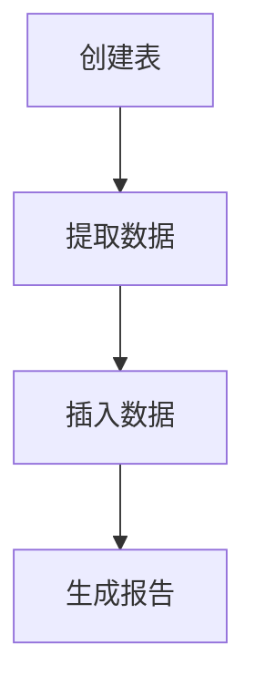

# Airflow 与PostgreSQL集成

Apache Airflow 是一个强大的工作流管理工具，广泛用于数据管道的编排和调度。PostgreSQL 是一个功能强大的开源关系型数据库，常用于存储和管理结构化数据。将 Airflow 与 PostgreSQL 集成，可以帮助你自动化数据管道的执行，例如数据提取、转换和加载（ETL）任务。

本文将逐步介绍如何在 Airflow 中与 PostgreSQL 集成，包括连接配置、任务定义以及实际应用案例。

---

## 1. 安装依赖

在开始之前，确保你已经安装了 Apache Airflow 和 PostgreSQL。为了在 Airflow 中使用 PostgreSQL，你需要安装 `apache-airflow-providers-postgres` 包。可以通过以下命令安装：

```bash
pip install apache-airflow-providers-postgres
```

---

## 2. 配置 PostgreSQL 连接

在 Airflow 中，连接信息通过 **Connection** 对象管理。你可以通过 Airflow 的 Web UI 或直接通过代码配置 PostgreSQL 连接。

### 通过 Web UI 配置连接

1. 打开 Airflow Web UI，导航到 **Admin > Connections**。
2. 点击 **Create** 按钮。
3. 填写以下信息：
   - **Conn Id**: `postgres_default`（或其他自定义名称）
   - **Conn Type**: `Postgres`
   - **Host**: PostgreSQL 服务器地址（例如 `localhost`）
   - **Schema**: 数据库名称
   - **Login**: 数据库用户名
   - **Password**: 数据库密码
   - **Port**: 数据库端口（默认是 `5432`）

### 通过代码配置连接

你也可以通过代码创建连接：

```python
from airflow.models import Connection
from airflow import settings

conn = Connection(
    conn_id='postgres_default',
    conn_type='postgres',
    host='localhost',
    login='your_username',
    password='your_password',
    schema='your_database',
    port=5432
)

session = settings.Session()
session.add(conn)
session.commit()
```

---

## 3. 使用 PostgresOperator 执行 SQL 任务

Airflow 提供了 `PostgresOperator`，用于在 PostgreSQL 数据库中执行 SQL 查询。以下是一个简单的 DAG 示例，展示如何使用 `PostgresOperator` 创建一个表并插入数据。

```python
from airflow import DAG
from airflow.providers.postgres.operators.postgres import PostgresOperator
from airflow.utils.dates import days_ago

default_args = {
    'owner': 'airflow',
    'start_date': days_ago(1),
}

with DAG(
    'postgres_example_dag',
    default_args=default_args,
    schedule_interval='@daily',
) as dag:

    create_table = PostgresOperator(
        task_id='create_table',
        postgres_conn_id='postgres_default',
        sql="""
        CREATE TABLE IF NOT EXISTS my_table (
            id SERIAL PRIMARY KEY,
            name VARCHAR(100) NOT NULL,
            created_at TIMESTAMP DEFAULT CURRENT_TIMESTAMP
        );
        """
    )

    insert_data = PostgresOperator(
        task_id='insert_data',
        postgres_conn_id='postgres_default',
        sql="""
        INSERT INTO my_table (name) VALUES ('Alice'), ('Bob'), ('Charlie');
        """
    )

    create_table >> insert_data
```

### 代码解释

- `PostgresOperator` 用于执行 SQL 查询。
- `postgres_conn_id` 指定了之前配置的连接 ID。
- `sql` 参数包含要执行的 SQL 语句。

---

## 4. 使用 PostgresHook 进行更复杂的操作

如果你需要更灵活地操作 PostgreSQL 数据库，可以使用 `PostgresHook`。以下是一个示例，展示如何使用 `PostgresHook` 查询数据并打印结果。

```python
from airflow import DAG
from airflow.providers.postgres.hooks.postgres import PostgresHook
from airflow.operators.python_operator import PythonOperator
from airflow.utils.dates import days_ago

def query_and_print():
    hook = PostgresHook(postgres_conn_id='postgres_default')
    records = hook.get_records("SELECT * FROM my_table;")
    for row in records:
        print(row)

default_args = {
    'owner': 'airflow',
    'start_date': days_ago(1),
}

with DAG(
    'postgres_hook_example_dag',
    default_args=default_args,
    schedule_interval='@daily',
) as dag:

    query_task = PythonOperator(
        task_id='query_and_print',
        python_callable=query_and_print,
    )

    query_task
```

---

## 5. 实际应用案例

假设你需要每天从多个数据源提取数据，将其存储到 PostgreSQL 中，然后生成报告。以下是一个简化的流程：

1. 使用 `PostgresOperator` 创建一个表来存储数据。
2. 使用 `PythonOperator` 从外部 API 提取数据。
3. 使用 `PostgresHook` 将数据插入到 PostgreSQL 中。
4. 使用 `PostgresOperator` 生成报告。



---

## 6. 总结

通过本文，你学习了如何在 Airflow 中与 PostgreSQL 集成，包括连接配置、任务定义以及实际应用案例。Airflow 的强大功能与 PostgreSQL 的结合，可以帮助你轻松构建和管理复杂的数据管道。

---

## 7. 附加资源与练习

- **练习**: 尝试创建一个 DAG，从 CSV 文件中读取数据并将其插入到 PostgreSQL 中。
- **资源**:
  - [Airflow 官方文档](https://airflow.apache.org/docs/)
  - [PostgreSQL 官方文档](https://www.postgresql.org/docs/)
  - [Airflow PostgreSQL Provider 文档](https://airflow.apache.org/docs/apache-airflow-providers-postgres/stable/index.html)

:::tip
如果你在配置过程中遇到问题，可以查看 Airflow 的日志文件，通常位于 `~/airflow/logs` 目录下。
:::