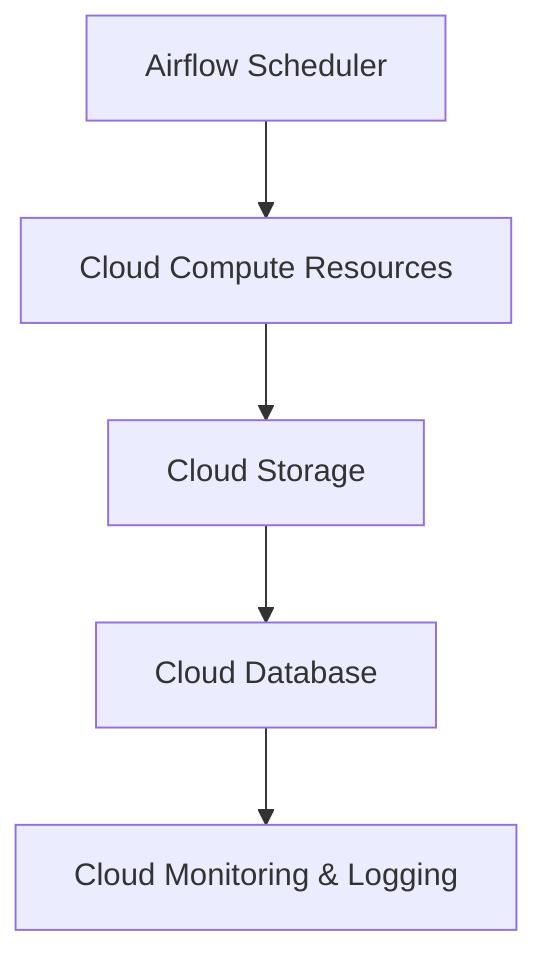

# Airflow 云平台概述

Apache Airflow 是一个开源的工作流管理平台，用于编排复杂的数据管道和工作流。它通过有向无环图（DAG）来定义任务之间的依赖关系，并提供了丰富的调度和监控功能。随着云计算的普及，Airflow 也逐渐被集成到各大云平台中，成为云原生工作流管理的核心工具之一。

## 什么是Airflow云平台集成？

Airflow云平台集成是指将Apache Airflow与云服务（如AWS、Google Cloud、Azure等）结合使用，以充分利用云平台的计算资源、存储服务和自动化能力。通过这种集成，用户可以在云环境中高效地运行和管理Airflow工作流，同时享受云平台提供的弹性扩展、高可用性和安全性。

## 为什么需要Airflow云平台集成？

1. **弹性扩展**：云平台可以根据工作流的需求动态分配计算资源，避免资源浪费。
2. **高可用性**：云平台通常提供高可用性和容错机制，确保工作流的稳定运行。
3. **无缝集成**：Airflow可以与云平台的其他服务（如存储、数据库、机器学习服务等）无缝集成，简化数据管道的构建。
4. **成本优化**：通过按需使用云资源，用户可以更好地控制成本。

## Airflow 云平台集成的基本架构

在云平台中运行Airflow时，通常采用以下架构：



- **Airflow Scheduler**：负责调度和执行DAG中的任务。
- **Cloud Compute Resources**：云平台提供的计算资源（如虚拟机、容器等），用于运行任务。
- **Cloud Storage**：用于存储任务输入和输出的数据。
- **Cloud Database**：存储Airflow的元数据（如任务状态、DAG定义等）。
- **Cloud Monitoring & Logging**：提供任务执行状态的监控和日志记录。

## 实际案例：在AWS上运行Airflow

以下是一个简单的案例，展示如何在AWS上运行Airflow并调度一个数据处理任务。

### 步骤1：创建Airflow环境

首先，在AWS上创建一个EC2实例，并安装Airflow：

```bash
# 安装Airflow
pip install apache-airflow

# 初始化Airflow数据库
airflow db init

# 启动Airflow Web服务器
airflow webserver --port 8080

# 启动Airflow Scheduler
airflow scheduler
```

### 步骤2：定义DAG

接下来，定义一个简单的DAG，用于从S3读取数据并处理：

```python
from airflow import DAG
from airflow.operators.python_operator import PythonOperator
from airflow.providers.amazon.aws.hooks.s3 import S3Hook
from datetime import datetime

def process_data():
    s3_hook = S3Hook(aws_conn_id='aws_default')
    data = s3_hook.read_key(bucket_name='my-bucket', key='data.csv')
    # 处理数据
    print(data)

default_args = {
    'owner': 'airflow',
    'start_date': datetime(2023, 1, 1),
}

dag = DAG(
    's3_data_processing',
    default_args=default_args,
    schedule_interval='@daily',
)

task = PythonOperator(
    task_id='process_data',
    python_callable=process_data,
    dag=dag,
)
```

### 步骤3：运行DAG

将DAG文件保存到Airflow的DAG目录中，Airflow Scheduler会自动检测并调度任务。任务执行后，可以在Airflow Web界面中查看任务状态和日志。

## 总结

Airflow云平台集成为用户提供了一种高效、灵活的方式来管理和调度复杂的工作流。通过将Airflow与云平台结合，用户可以充分利用云计算的弹性、高可用性和无缝集成能力，从而更好地满足业务需求。

## 附加资源

- [Apache Airflow官方文档](https://airflow.apache.org/docs/)
- [AWS Airflow集成指南](https://aws.amazon.com/blogs/opensource/managing-apache-airflow-workflows-on-aws/)
- [Google Cloud Composer](https://cloud.google.com/composer)（托管Airflow服务）

## 练习

1. 尝试在Google Cloud或Azure上部署Airflow，并运行一个简单的DAG。
2. 修改上述案例中的DAG，使其能够将处理后的数据写回到S3中。