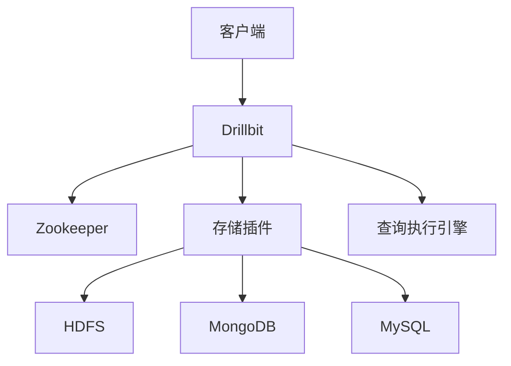

## 介绍

Apache Drill 是一个开源的分布式 SQL 查询引擎，专为大规模数据分析而设计。它能够直接查询多种数据源，包括文件系统（如 HDFS、S3）、NoSQL 数据库（如 MongoDB、Cassandra）以及关系型数据库（如 MySQL、PostgreSQL）。Drill 的核心优势在于其无模式（schema-free）的设计，允许用户在不预先定义表结构的情况下直接查询数据。

本文将深入探讨 Apache Drill 的架构，帮助初学者理解其核心组件、工作原理以及如何在实际场景中应用。

## Apache Drill 架构概述

Apache Drill 的架构设计旨在提供高性能、低延迟的查询能力，同时支持多种数据源。其核心架构包括以下几个主要组件：

1. **Drillbit**：Drillbit 是 Apache Drill 的核心服务进程，负责执行查询、管理资源以及与客户端通信。每个 Drillbit 都可以独立运行，也可以组成集群以提高查询性能。
2. **Zookeeper**：Zookeeper 用于管理 Drillbit 集群的元数据和状态信息。它帮助 Drillbit 发现彼此并协调任务分配。
3. **客户端**：客户端通过 JDBC、ODBC 或 REST API 与 Drillbit 通信，提交查询并获取结果。
4. **存储插件**：存储插件是 Drill 与不同数据源之间的桥梁。每个存储插件负责与特定类型的数据源进行交互，例如 HDFS、MongoDB 等。
5. **查询执行引擎**：Drill 的查询执行引擎基于 Apache Calcite，支持标准的 SQL 查询语法，并能够动态优化查询计划。

### 架构图

以下是一个简化的 Apache Drill 架构图：



### 核心组件详解

#### 1. Drillbit

Drillbit 是 Apache Drill 的核心服务进程，负责处理客户端提交的查询请求。每个 Drillbit 都可以独立运行，也可以组成集群以提高查询性能。Drillbit 的主要功能包括：

- 接收客户端查询请求
- 解析和优化查询计划
- 执行查询并返回结果
- 管理集群中的资源分配

#### 2. Zookeeper

Zookeeper 是 Apache Drill 集群的协调服务，负责管理 Drillbit 的元数据和状态信息。Zookeeper 帮助 Drillbit 发现彼此并协调任务分配，确保集群中的各个节点能够高效协作。

#### 3. 存储插件

存储插件是 Drill 与不同数据源之间的桥梁。每个存储插件负责与特定类型的数据源进行交互，例如 HDFS、MongoDB 等。存储插件的主要功能包括：

- 与数据源建立连接
- 读取数据源的元数据
- 将查询请求转换为数据源的原生查询语言

#### 4. 查询执行引擎

Drill 的查询执行引擎基于 Apache Calcite，支持标准的 SQL 查询语法，并能够动态优化查询计划。查询执行引擎的主要功能包括：

- 解析 SQL 查询
- 生成查询计划
- 优化查询计划以提高性能
- 执行查询并返回结果

## 实际案例

假设我们有一个存储在 HDFS 上的 JSON 文件，文件内容如下：

```json
[
    {"name": "Alice", "age": 25, "city": "New York"},
    {"name": "Bob", "age": 30, "city": "San Francisco"},
    {"name": "Charlie", "age": 35, "city": "Los Angeles"}
]
```

我们可以使用 Apache Drill 直接查询这个 JSON 文件，而不需要预先定义表结构。以下是一个简单的 SQL 查询示例：

```sql
SELECT name, age FROM dfs.`/path/to/file.json` WHERE age > 30;
```

查询结果如下：

```
+---------+-----+
|  name   | age |
+---------+-----+
| Charlie | 35  |
+---------+-----+
```

:::tip
在实际应用中，Apache Drill 可以用于直接查询多种数据源，例如日志文件、NoSQL 数据库等，而无需进行复杂的数据导入和转换。
:::

## 总结

Apache Drill 是一个强大的分布式 SQL 查询引擎，专为大规模数据分析而设计。其无模式的设计和灵活的存储插件机制使得它能够直接查询多种数据源，而无需预先定义表结构。通过理解 Apache Drill 的架构，初学者可以更好地掌握其工作原理，并在实际项目中应用。

## 附加资源

- [Apache Drill 官方文档](https://drill.apache.org/docs/)
- [Apache Calcite 官方文档](https://calcite.apache.org/docs/)
- [Zookeeper 官方文档](https://zookeeper.apache.org/doc/current/)

## 练习

1. 尝试在本地安装 Apache Drill，并连接到 HDFS 上的一个 JSON 文件进行查询。
2. 使用 Apache Drill 查询 MongoDB 中的一个集合，并分析查询性能。
3. 探索 Apache Drill 的存储插件机制，尝试添加一个新的存储插件以支持自定义数据源。
