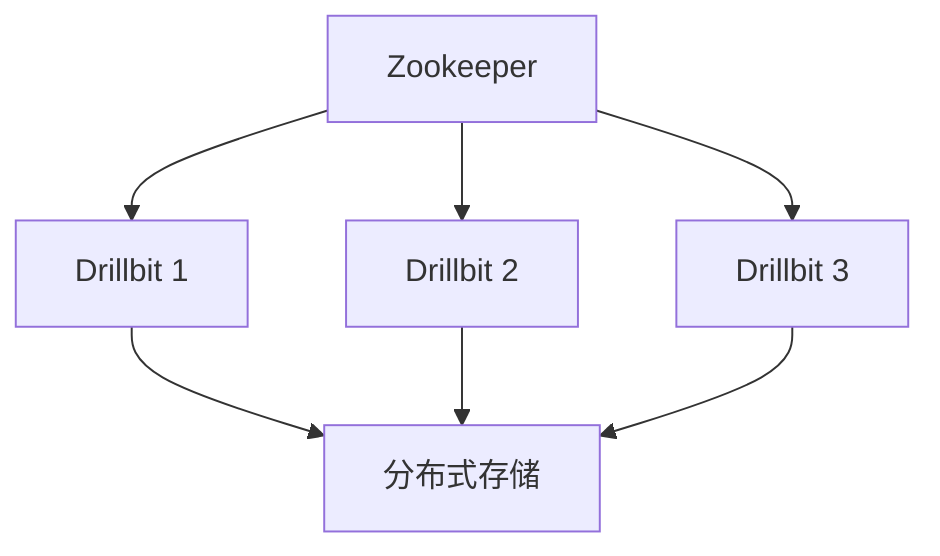

# Apache Drill 集群模式

Apache Drill 是一个分布式 SQL 查询引擎，专为大规模数据分析而设计。它支持多种数据源，包括 Hadoop、NoSQL 数据库和云存储。为了处理大规模数据，Drill 提供了集群模式，允许多个节点协同工作以加速查询处理。本文将详细介绍 Apache Drill 的集群模式，帮助初学者理解其工作原理和配置方法。

## 什么是 Apache Drill 集群模式？

Apache Drill 集群模式是指将多个 Drill 节点组合在一起，形成一个分布式计算集群。每个节点都可以独立执行查询任务，同时与其他节点共享数据和计算资源。通过集群模式，Drill 可以并行处理大规模数据集，显著提高查询性能。

:::note
集群模式的核心优势在于其分布式计算能力，能够将查询任务分解为多个子任务，并在多个节点上并行执行。
:::

## 集群模式的架构

Apache Drill 集群由以下主要组件组成：

1. **Drillbit**：Drillbit 是 Drill 的核心进程，负责执行查询任务。每个节点上运行一个 Drillbit 进程。
2. **Zookeeper**：Zookeeper 用于协调集群中的各个节点，确保它们能够协同工作。
3. **分布式存储**：Drill 支持多种分布式存储系统，如 HDFS、S3 等，用于存储和访问大规模数据。



## 配置 Apache Drill 集群模式

要配置 Apache Drill 集群模式，您需要完成以下步骤：

1. **安装 Zookeeper**：首先，确保在集群中安装并配置了 Zookeeper。Zookeeper 是 Drill 集群的协调者，负责管理集群状态。

2. **配置 Drillbit**：在每个节点上安装 Drillbit，并编辑 `drill-override.conf` 文件以指定 Zookeeper 的连接信息。

    ```bash
    drill.exec: {
      cluster-id: "drill-cluster",
      zk.connect: "zk-node1:2181,zk-node2:2181,zk-node3:2181"
    }
    ```

3. **启动 Drillbit**：在每个节点上启动 Drillbit 进程。启动后，Drillbit 会自动加入集群，并开始接受查询任务。

    ```bash
    ./bin/drillbit.sh start
    ```

4. **验证集群状态**：通过 Drill 的 Web 控制台或命令行工具，验证集群中的所有节点是否已成功加入。

    ```bash
    ./bin/drill-conf
    ```

## 实际案例：分布式查询处理

假设我们有一个包含 1 亿条记录的日志文件存储在 HDFS 上。我们希望查询过去一周内访问量最高的 10 个页面。在单节点模式下，这个查询可能需要几分钟甚至更长时间。但在集群模式下，Drill 可以将查询任务分解为多个子任务，并在多个节点上并行执行，从而显著缩短查询时间。

```sql
SELECT page_url, COUNT(*) AS visit_count
FROM hdfs.`/logs/access_log`
WHERE log_date >= DATE_SUB(CURRENT_DATE, 7)
GROUP BY page_url
ORDER BY visit_count DESC
LIMIT 10;
```

:::tip
在集群模式下，Drill 会自动将查询任务分配到不同的节点上执行，充分利用集群的计算资源。
:::

## 总结

Apache Drill 的集群模式为大规模数据分析提供了强大的分布式计算能力。通过配置多个 Drillbit 节点并使用 Zookeeper 进行协调，您可以显著提高查询性能，并处理更大规模的数据集。希望本文能帮助您理解 Apache Drill 集群模式的基本概念和配置方法。

## 附加资源

- [Apache Drill 官方文档](https://drill.apache.org/docs/)
- [Zookeeper 官方文档](https://zookeeper.apache.org/doc/current/)
- [HDFS 官方文档](https://hadoop.apache.org/docs/stable/hadoop-project-dist/hadoop-hdfs/HdfsUserGuide.html)

## 练习

1. 尝试在本地机器上配置一个简单的 Drill 集群，包含两个 Drillbit 节点。
2. 使用集群模式查询一个较大的数据集，并比较单节点和集群模式下的查询性能。
3. 探索如何在 Drill 集群中添加或移除节点，并观察集群状态的变化。

:::caution
在配置集群时，请确保所有节点的网络连接稳定，以避免因网络问题导致的集群不稳定。
:::