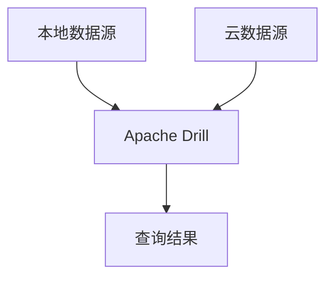

# Apache Drill 混合云架构

Apache Drill 是一个开源的分布式 SQL 查询引擎，专为大规模数据分析设计。它支持多种数据源，包括 Hadoop、NoSQL 数据库、云存储等。在混合云架构中，Apache Drill 能够无缝集成本地和云端的数据源，提供统一的查询接口。本文将详细介绍 Apache Drill 在混合云环境中的架构设计及其实际应用。

## 什么是混合云架构？

混合云架构是指将本地基础设施与云服务相结合的一种计算环境。它允许企业在保持对敏感数据的控制的同时，利用云计算的弹性和扩展性。Apache Drill 在混合云架构中扮演了重要角色，能够跨多个数据源执行查询，无论这些数据源位于本地还是云端。

## Apache Drill 的混合云架构设计

Apache Drill 的混合云架构设计主要包括以下几个关键组件：

1. **分布式查询引擎**：Apache Drill 的核心是一个分布式查询引擎，能够在多个节点上并行执行查询。
2. **数据源连接器**：Apache Drill 支持多种数据源连接器，包括 Hadoop、S3、Azure Blob Storage、Google Cloud Storage 等。
3. **查询优化器**：Apache Drill 的查询优化器能够根据数据源的位置和性能特征，优化查询执行计划。
4. **安全层**：Apache Drill 提供了多层次的安全机制，确保在混合云环境中的数据访问安全。

### 架构图

以下是一个简单的 Apache Drill 混合云架构图：



## 实际应用场景

### 场景一：跨本地和云端的日志分析

假设一家企业将其日志数据存储在本地 Hadoop 集群和 AWS S3 上。使用 Apache Drill，可以轻松地查询和分析这些日志数据，无论它们存储在何处。

```sql
SELECT * FROM (
  SELECT * FROM hdfs.`/logs/local_logs`
  UNION ALL
  SELECT * FROM s3.`s3://cloud-logs/`
) WHERE log_level = 'ERROR';
```

### 场景二：混合云环境中的实时数据分析

在混合云环境中，企业可能需要实时分析来自多个数据源的数据。Apache Drill 能够实时查询本地数据库和云端数据存储，提供实时的分析结果。

```sql
SELECT customer_id, SUM(order_amount) 
FROM (
  SELECT * FROM mysql.sales.orders
  UNION ALL
  SELECT * FROM s3.`s3://cloud-sales/orders`
)
GROUP BY customer_id;
```

## 总结

Apache Drill 的混合云架构设计使其成为处理跨本地和云端数据源的强大工具。通过分布式查询引擎、多种数据源连接器和查询优化器，Apache Drill 能够提供高效、灵活的数据查询和分析能力。无论是日志分析还是实时数据分析，Apache Drill 都能在混合云环境中发挥重要作用。

## 附加资源与练习

- **官方文档**：了解更多关于 Apache Drill 的详细信息，请访问 [Apache Drill 官方文档](https://drill.apache.org/docs/)。
- **练习**：尝试在本地和云端设置 Apache Drill，并执行跨数据源的查询。

:::tip
提示：在实际应用中，确保配置好数据源连接器的认证信息，以保证数据访问的安全性。
:::