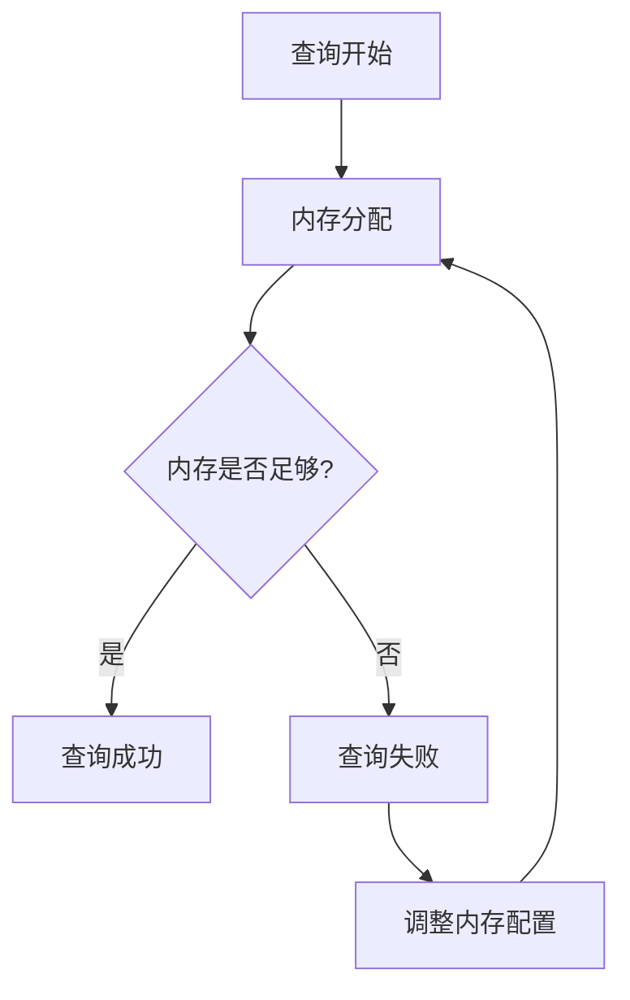

# Apache Drill 内存问题解决

Apache Drill 是一个分布式 SQL 查询引擎，专为大规模数据分析设计。然而，在处理复杂查询或大数据集时，可能会遇到内存问题，导致查询失败或性能下降。本文将帮助初学者理解 Apache Drill 中的内存问题，并提供解决这些问题的实用方法。

## 什么是内存问题？

内存问题通常发生在 Apache Drill 处理大量数据时，系统无法分配足够的内存来执行查询。这可能导致查询失败、性能下降，甚至系统崩溃。常见的内存问题包括：

- **Out of Memory (OOM) 错误**：系统无法分配足够的内存来执行查询。
- **内存泄漏**：内存使用量随着时间的推移不断增加，最终导致系统资源耗尽。
- **内存碎片化**：内存被分割成小块，无法有效利用。

## 识别内存问题

在解决内存问题之前，首先需要识别问题的根源。以下是一些常见的症状：

- 查询失败并显示 `Out of Memory` 错误。
- 查询执行时间显著增加。
- 系统日志中出现与内存相关的警告或错误。

:::tip
使用 Apache Drill 的 Web UI 或日志文件来监控内存使用情况，可以帮助你快速识别内存问题。
:::

## 解决内存问题

### 1. 调整内存配置

Apache Drill 的内存配置可以通过 `drill-env.sh` 文件进行调整。以下是一些关键参数：

- **DRILL_HEAP**：设置 Drill 进程的堆内存大小。
- **DRILL_MAX_DIRECT_MEMORY**：设置直接内存的最大值。

```bash
export DRILL_HEAP="4G"
export DRILL_MAX_DIRECT_MEMORY="8G"
```

:::caution
确保分配的内存不超过系统可用内存，否则可能导致系统不稳定。
:::

### 2. 优化查询

优化查询可以减少内存使用量。以下是一些优化建议：

- **减少数据量**：使用 `LIMIT` 子句限制返回的行数。
- **避免全表扫描**：使用索引或分区来减少扫描的数据量。
- **使用聚合函数**：减少中间结果集的大小。

```sql
SELECT COUNT(*) FROM large_table WHERE date = '2023-01-01';
```

### 3. 监控和调优

使用 Apache Drill 的监控工具来跟踪内存使用情况，并根据需要进行调优。以下是一些常用的监控工具：

- **Drill Web UI**：提供实时的内存使用情况。
- **JMX**：通过 Java Management Extensions 监控内存使用情况。



## 实际案例

假设你正在处理一个包含数百万行数据的查询，并且遇到了 `Out of Memory` 错误。通过以下步骤解决问题：

1. **调整内存配置**：将 `DRILL_HEAP` 从 `2G` 增加到 `4G`。
2. **优化查询**：使用 `LIMIT` 子句限制返回的行数。
3. **监控内存使用**：使用 Drill Web UI 监控内存使用情况，确保内存分配合理。

```sql
SELECT * FROM large_table LIMIT 1000;
```

## 总结

Apache Drill 的内存问题可能会影响查询性能和系统稳定性。通过调整内存配置、优化查询和监控内存使用情况，可以有效解决这些问题。希望本文能帮助你更好地理解和解决 Apache Drill 中的内存问题。

## 附加资源

- [Apache Drill 官方文档](https://drill.apache.org/docs/)
- [Drill 内存配置指南](https://drill.apache.org/docs/configuring-drill-memory/)
- [Drill 查询优化技巧](https://drill.apache.org/docs/optimizing-drill-queries/)

:::note
练习：尝试在你的环境中运行一个复杂查询，并使用本文中的方法优化内存使用。
:::