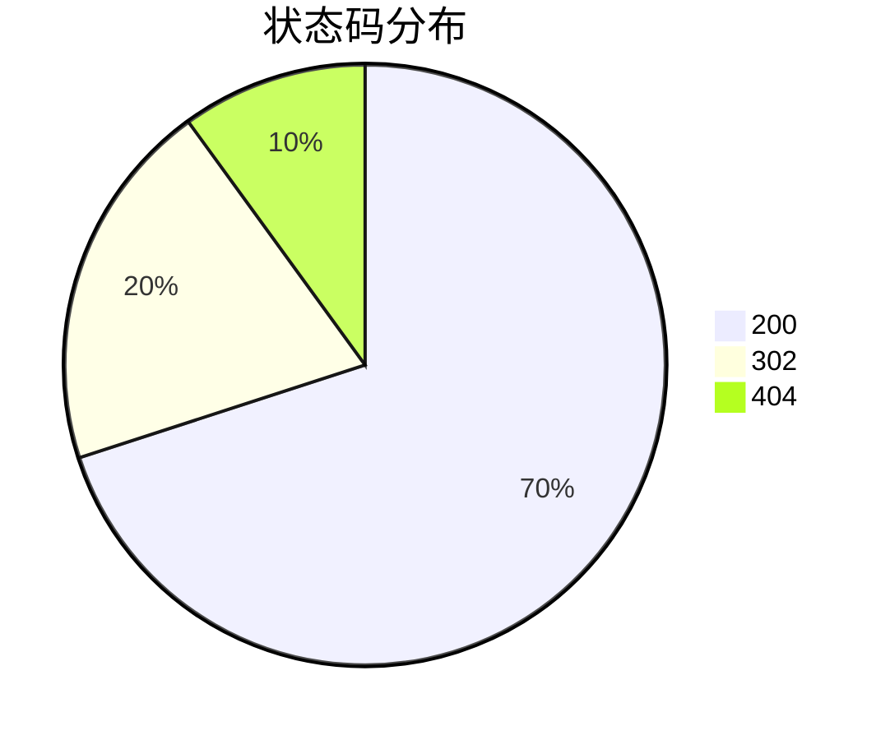

# Apache Drill 日志分析实战

## 介绍

Apache Drill 是一个开源的分布式 SQL 查询引擎，专为大规模数据分析而设计。它支持对多种数据源（如文件、NoSQL 数据库、云存储等）进行查询，而无需预先定义模式。这使得 Drill 成为日志分析的理想工具，因为日志数据通常是非结构化的，且格式多样。

在本教程中，我们将通过一个实际案例，展示如何使用 Apache Drill 来分析日志数据。我们将从简单的查询开始，逐步深入到更复杂的分析场景。

## 准备工作

在开始之前，请确保你已经安装并配置好了 Apache Drill。你可以通过以下命令启动 Drill 的嵌入式模式：

```bash
$ drill-embedded
```

启动后，你可以通过浏览器访问 `http://localhost:8047` 来使用 Drill 的 Web UI。

## 日志数据示例

假设我们有一个日志文件 `access.log`，内容如下：

```plaintext
192.168.1.1 - - [10/Oct/2023:13:55:36 +0000] "GET /index.html HTTP/1.1" 200 1024
192.168.1.2 - - [10/Oct/2023:13:55:37 +0000] "POST /login HTTP/1.1" 302 512
192.168.1.3 - - [10/Oct/2023:13:55:38 +0000] "GET /about.html HTTP/1.1" 404 0
```

我们将使用 Drill 来查询和分析这些日志数据。

## 基本查询

首先，我们需要将日志文件加载到 Drill 中。假设日志文件位于 `/var/log/access.log`，我们可以通过以下 SQL 查询来查看日志内容：

```sql
SELECT * FROM dfs.`/var/log/access.log`;
```

这将返回日志文件中的所有行。接下来，我们可以使用 Drill 的 `REGEX` 函数来解析日志中的各个字段。

```sql
SELECT 
  regexp_extract(columns[0], '([0-9]{1,3}\\.[0-9]{1,3}\\.[0-9]{1,3}\\.[0-9]{1,3})', 1) AS ip,
  regexp_extract(columns[0], '\$$(.*?)\$$', 1) AS timestamp,
  regexp_extract(columns[0], '\\"(.*?)\\"', 1) AS request,
  regexp_extract(columns[0], '\\" ([0-9]{3}) ', 1) AS status,
  regexp_extract(columns[0], ' ([0-9]+)$', 1) AS bytes
FROM dfs.`/var/log/access.log`;
```

这个查询将日志中的 IP 地址、时间戳、请求、状态码和字节数提取出来，并以表格形式返回。

## 实际案例：分析访问日志

假设我们想要分析哪些 IP 地址访问了我们的网站，并且这些访问的响应状态码是什么。我们可以使用以下查询：

```sql
SELECT 
  ip,
  status,
  COUNT(*) AS count
FROM (
  SELECT 
    regexp_extract(columns[0], '([0-9]{1,3}\\.[0-9]{1,3}\\.[0-9]{1,3}\\.[0-9]{1,3})', 1) AS ip,
    regexp_extract(columns[0], '\\" ([0-9]{3}) ', 1) AS status
  FROM dfs.`/var/log/access.log`
)
GROUP BY ip, status
ORDER BY count DESC;
```

这个查询将返回每个 IP 地址的访问次数及其对应的状态码，并按访问次数降序排列。

## 可视化分析

为了更好地理解数据，我们可以使用 Drill 的 Web UI 来生成图表。以下是一个简单的 Mermaid 图表，展示了不同状态码的分布情况：



## 总结

通过本教程，我们学习了如何使用 Apache Drill 来分析日志数据。我们从基本的查询开始，逐步深入到更复杂的分析场景，并展示了如何将分析结果可视化。

Apache Drill 的强大之处在于它的灵活性和易用性，使得即使是初学者也能快速上手进行数据分析。

## 附加资源

- [Apache Drill 官方文档](https://drill.apache.org/docs/)
- [SQL 正则表达式教程](https://www.w3schools.com/sql/sql_ref_regexp.asp)
- [Mermaid 图表语法](https://mermaid-js.github.io/mermaid/#/)

## 练习

1. 尝试使用 Drill 分析你自己的日志文件，并提取出有用的信息。
2. 修改查询，统计每个 IP 地址的总访问字节数。
3. 使用 Mermaid 生成一个饼图，展示不同 IP 地址的访问比例。

希望本教程对你有所帮助，祝你在 Apache Drill 的学习之旅中取得成功！