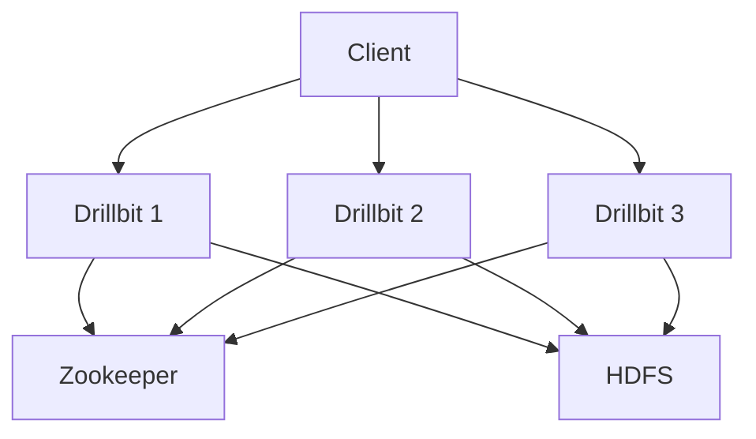

## 介绍

Apache Drill 是一个开源的分布式 SQL 查询引擎，专为大规模数据分析而设计。它支持多种数据源（如 HDFS、S3、NoSQL 数据库等），并提供了强大的可扩展性方案，使其能够处理 PB 级数据。对于初学者来说，理解 Apache Drill 的可扩展性方案是掌握其核心功能的关键。

本文将逐步讲解 Apache Drill 的可扩展性方案，包括其分布式架构、插件机制以及实际应用场景。

---

## 分布式架构

Apache Drill 的可扩展性首先体现在其分布式架构上。它采用了无共享（shared-nothing）架构，这意味着每个节点都独立运行，彼此之间不共享内存或磁盘。这种设计使得 Apache Drill 能够轻松扩展到数百甚至数千个节点。

### 核心组件

1. **Drillbit**：Drillbit 是 Apache Drill 的核心进程，负责执行查询、协调任务和管理资源。每个节点上都可以运行一个 Drillbit 进程。
2. **Zookeeper**：用于集群管理和协调，确保 Drillbit 节点之间的通信和状态同步。
3. **分布式存储**：Apache Drill 支持多种分布式存储系统，如 HDFS、S3 等。



:::tip
分布式架构使得 Apache Drill 能够并行处理查询，从而显著提高查询性能。
:::

---

## 插件机制

Apache Drill 的另一个关键可扩展性特性是其插件机制。通过插件，用户可以轻松扩展 Drill 的功能，支持新的数据源或自定义函数。

### 插件类型

1. **存储插件**：用于连接不同的数据源，如 HDFS、S3、MongoDB 等。
2. **格式插件**：用于解析不同的文件格式，如 JSON、Parquet、CSV 等。
3. **函数插件**：用于添加自定义 SQL 函数。

### 示例：添加存储插件

以下是一个添加 MongoDB 存储插件的示例：

```sql
CREATE STORAGE PLUGIN mongo
TYPE 'mongo'
CONFIG '{
  "connection": "mongodb://localhost:27017",
  "enabled": true
}';
```

:::note
存储插件的配置通常包括连接字符串、认证信息等。
:::

---

## 实际应用场景

### 场景 1：跨数据源查询

假设你有一个存储在 HDFS 中的 Parquet 文件和一个存储在 MongoDB 中的集合。你可以使用 Apache Drill 轻松查询这两个数据源：

```sql
SELECT *
FROM hdfs.`/data/sales.parquet` AS sales
JOIN mongo.`sales_db`.`transactions` AS transactions
ON sales.id = transactions.sale_id;
```

### 场景 2：动态模式发现

Apache Drill 支持动态模式发现，这意味着你无需预先定义表结构即可查询数据。例如，查询一个 JSON 文件：

```sql
SELECT *
FROM dfs.`/data/sales.json`;
```

:::caution
动态模式发现虽然方便，但在处理复杂数据结构时可能会导致性能下降。
:::

---

## 总结

Apache Drill 的可扩展性方案使其成为处理大规模数据分析的理想工具。通过分布式架构和插件机制，用户可以轻松扩展其功能并优化查询性能。无论是跨数据源查询还是动态模式发现，Apache Drill 都提供了强大的支持。

---

## 附加资源

- [Apache Drill 官方文档](https://drill.apache.org/docs/)
- [Drill 插件开发指南](https://drill.apache.org/docs/plugin-development-basics/)
- [分布式 SQL 查询引擎对比](https://www.databricks.com/blog/2020/01/30/distributed-sql-engines.html)

---

## 练习

1. 尝试在本地安装 Apache Drill 并配置一个存储插件。
2. 使用 Apache Drill 查询一个 JSON 文件，并观察其动态模式发现功能。
3. 编写一个跨数据源查询，结合 HDFS 和 MongoDB 中的数据。

:::