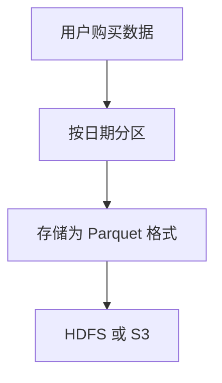

# Apache Drill 数据架构设计

Apache Drill 是一个分布式 SQL 查询引擎，专为大规模数据分析而设计。它支持对多种数据源（如 HDFS、S3、NoSQL 数据库等）进行实时查询，而无需预先定义模式。为了充分利用 Apache Drill 的强大功能，设计一个高效且可扩展的数据架构至关重要。本文将逐步讲解如何设计 Apache Drill 数据架构，并通过实际案例展示其应用。

## 1. 什么是 Apache Drill 数据架构？

Apache Drill 数据架构是指在使用 Apache Drill 进行数据分析时，如何组织和优化数据存储、查询和处理的整体设计。一个好的数据架构能够提高查询性能、简化数据管理，并支持复杂的数据分析需求。

:::note
Apache Drill 的核心优势在于其无模式（schema-free）设计，允许用户直接查询半结构化数据（如 JSON、Parquet 等），而无需预先定义表结构。
:::

## 2. 数据架构设计的关键原则

在设计 Apache Drill 数据架构时，需要遵循以下关键原则：

### 2.1 数据分区
将数据分区存储可以提高查询性能。例如，按日期或地理位置分区数据，可以减少查询时需要扫描的数据量。

```sql
-- 示例：按日期分区查询
SELECT * FROM dfs.`/data/sales`
WHERE year = 2023 AND month = 10;
```

### 2.2 数据格式选择
选择合适的数据格式（如 Parquet、JSON、CSV 等）可以显著影响查询性能。Parquet 是 Apache Drill 推荐的格式，因为它支持列式存储和压缩。

```sql
-- 示例：查询 Parquet 格式的数据
SELECT * FROM dfs.`/data/sales.parquet`
WHERE region = 'North America';
```

### 2.3 数据缓存
利用 Apache Drill 的分布式缓存功能，可以加速重复查询的执行速度。

```sql
-- 示例：启用查询缓存
ALTER SESSION SET `planner.enable_cache` = true;
```

### 2.4 数据源连接
Apache Drill 支持多种数据源（如 HDFS、S3、MongoDB 等）。在设计架构时，需要确保数据源的连接配置正确且高效。

```sql
-- 示例：配置 S3 数据源
CREATE OR REPLACE SCHEMA s3_data
LOCATION 's3a://my-bucket/data/';
```

## 3. 实际案例：电商数据分析

假设我们有一个电商平台，需要分析用户的购买行为。以下是使用 Apache Drill 设计数据架构的步骤：

### 3.1 数据存储
将用户购买数据按日期分区存储为 Parquet 格式，存储在 HDFS 或 S3 上。



### 3.2 数据查询
使用 Apache Drill 查询特定日期的购买数据，并分析用户的购买行为。

```sql
-- 示例：查询 2023 年 10 月的购买数据
SELECT user_id, SUM(amount) AS total_spent
FROM dfs.`/data/purchases`
WHERE year = 2023 AND month = 10
GROUP BY user_id;
```

### 3.3 性能优化
通过启用查询缓存和优化数据分区，提高查询性能。

```sql
-- 示例：启用查询缓存
ALTER SESSION SET `planner.enable_cache` = true;
```

## 4. 总结

设计一个高效的 Apache Drill 数据架构需要综合考虑数据分区、格式选择、缓存和连接配置等因素。通过遵循本文中的原则和案例，您可以构建一个支持复杂查询和大规模数据分析的数据架构。

:::tip
为了进一步优化 Apache Drill 的性能，建议定期监控查询执行计划，并根据需要进行调整。
:::

## 5. 附加资源与练习

- **资源**：
  - [Apache Drill 官方文档](https://drill.apache.org/docs/)
  - [Parquet 文件格式介绍](https://parquet.apache.org/documentation/latest/)
  - [HDFS 数据存储指南](https://hadoop.apache.org/docs/stable/hadoop-project-dist/hadoop-hdfs/HdfsUserGuide.html)

- **练习**：
  1. 尝试将 CSV 格式的数据转换为 Parquet 格式，并比较查询性能。
  2. 设计一个按地理位置分区的数据架构，并编写查询语句分析不同地区的销售数据。