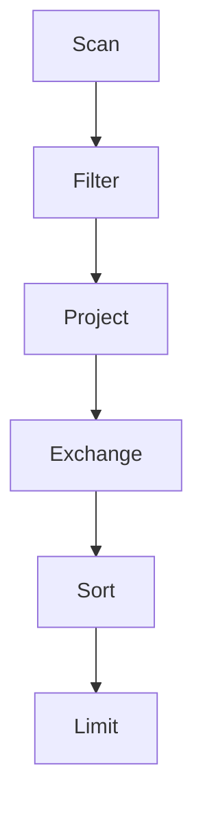

## 介绍

Apache Drill 是一个分布式 SQL 查询引擎，专为大规模数据分析设计。它能够直接查询多种数据源，如 HDFS、S3、NoSQL 数据库等，而无需预先定义模式。为了确保查询性能，理解并优化 Apache Drill 的执行计划至关重要。

执行计划是 Drill 在执行查询时生成的一系列操作步骤。通过分析执行计划，我们可以识别性能瓶颈，优化查询，从而提升整体性能。

## 执行计划的基本概念

在 Apache Drill 中，执行计划分为两个主要部分：

1. **逻辑计划（Logical Plan）**：这是查询的抽象表示，描述了查询的逻辑操作，如过滤、聚合、连接等。
2. **物理计划（Physical Plan）**：这是逻辑计划的具体实现，描述了 Drill 如何在集群中执行这些操作。

### 查看执行计划

要查看查询的执行计划，可以使用 `EXPLAIN` 语句。例如：

```sql
EXPLAIN PLAN FOR SELECT * FROM dfs.`/path/to/data` WHERE column1 = 'value';
```

执行上述语句后，Drill 会返回查询的逻辑计划和物理计划。

## 执行计划的结构

执行计划通常以树形结构表示，每个节点代表一个操作。以下是一个简单的执行计划示例：



在这个示例中：

- **Scan**：从数据源读取数据。
- **Filter**：应用过滤条件。
- **Project**：选择特定的列。
- **Exchange**：在集群节点之间交换数据。
- **Sort**：对数据进行排序。
- **Limit**：限制返回的行数。

## 分析执行计划

### 1. 识别瓶颈

通过分析执行计划，我们可以识别查询中的性能瓶颈。常见的瓶颈包括：

- **数据倾斜**：某些节点处理的数据量远大于其他节点。
- **过多的 Exchange 操作**：Exchange 操作通常涉及数据在网络中的传输，过多的 Exchange 操作会导致性能下降。
- **不必要的排序**：排序操作通常代价较高，如果排序不是必需的，可以考虑移除。

### 2. 优化建议

- **减少数据扫描**：通过添加过滤条件或使用分区数据，减少扫描的数据量。
- **优化连接顺序**：在连接多个表时，优化连接顺序可以减少中间结果的大小。
- **使用索引**：如果数据源支持索引，使用索引可以加速查询。

## 实际案例

假设我们有一个包含销售数据的表 `sales`，我们希望查询某个地区的销售总额。以下是查询示例：

```sql
SELECT region, SUM(sales_amount) AS total_sales
FROM dfs.`/path/to/sales`
WHERE region = 'North'
GROUP BY region;
```

通过 `EXPLAIN` 语句查看执行计划，我们发现 `Exchange` 操作占据了大部分时间。为了优化查询，我们可以尝试以下方法：

1. **分区数据**：将数据按地区分区，减少扫描的数据量。
2. **减少 Exchange 操作**：通过调整查询逻辑，减少数据在网络中的传输。

优化后的查询如下：

```sql
SELECT region, SUM(sales_amount) AS total_sales
FROM dfs.`/path/to/sales/region=North`
GROUP BY region;
```

通过分区数据，我们减少了扫描的数据量，从而提升了查询性能。

## 总结

Apache Drill 的执行计划分析是优化查询性能的关键步骤。通过理解执行计划的结构，识别瓶颈，并应用优化策略，我们可以显著提升查询性能。

:::tip
建议在实际应用中定期分析执行计划，并根据数据变化调整优化策略。
:::

## 附加资源

- [Apache Drill 官方文档](https://drill.apache.org/docs/)
- [SQL 性能优化指南](https://www.sqlperformance.com/)
- [分布式系统优化实践](https://www.oreilly.com/library/view/distributed-systems-principles/9781492043012/)

## 练习

1. 使用 `EXPLAIN` 语句分析一个复杂查询的执行计划，并尝试识别性能瓶颈。
2. 根据执行计划分析结果，优化查询并比较优化前后的性能差异。
3. 尝试在不同数据源上执行查询，并分析执行计划的差异。
