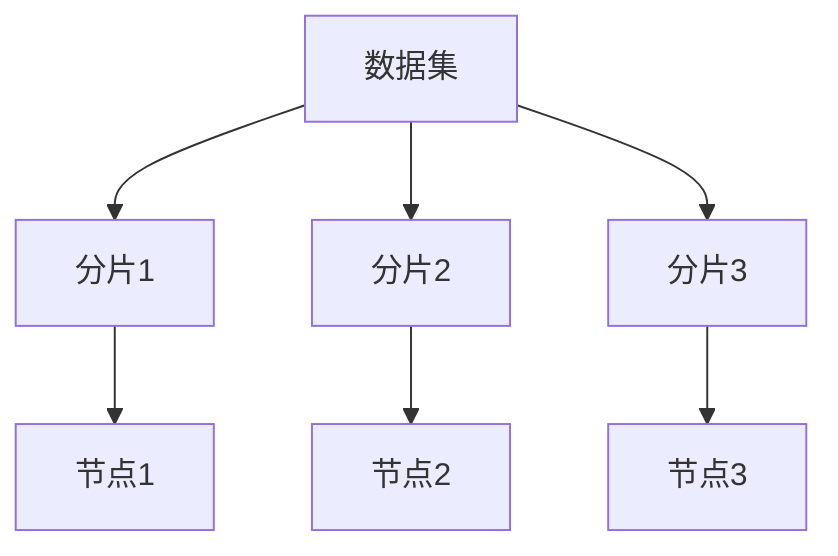
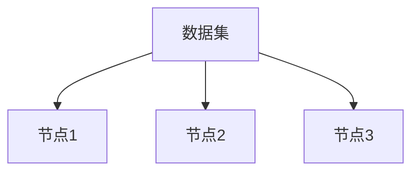

## 介绍

Apache Drill 是一个分布式 SQL 查询引擎，能够高效地查询大规模数据集。为了充分利用分布式系统的优势，Drill 采用了数据分布策略，将数据分布在多个节点上并行处理。理解数据分布策略对于优化查询性能至关重要。

在分布式系统中，数据分布策略决定了数据如何在集群中的节点之间分配和处理。合理的数据分布可以显著减少数据传输和计算开销，从而提高查询性能。

## 数据分布策略的核心概念

### 1. 数据分片（Data Sharding）

数据分片是将数据集划分为多个较小的部分（称为分片），并将这些分片分布在不同的节点上。每个节点只处理自己负责的分片，从而实现并行处理。



### 2. 数据复制（Data Replication）

数据复制是将同一份数据存储在多个节点上，以提高数据的可用性和容错性。当某个节点发生故障时，系统可以从其他节点获取数据，确保查询的连续性。



### 3. 数据本地性（Data Locality）

数据本地性是指将计算任务分配到存储数据的节点上，以减少数据传输的开销。通过保持数据本地性，Drill 可以最大限度地减少网络传输，提高查询性能。

## 数据分布策略的实际应用

### 案例 1：分布式文件系统中的数据分片

假设我们有一个分布式文件系统（如 HDFS），其中存储了一个大型数据集。Drill 会将数据集划分为多个分片，并将这些分片分布在集群中的不同节点上。当执行查询时，Drill 会并行处理每个分片，最后将结果合并。

```sql
-- 示例查询
SELECT COUNT(*) FROM hdfs.`/data/large_dataset`;
```

在这个查询中，Drill 会将 `/data/large_dataset` 划分为多个分片，并在每个节点上并行执行 `COUNT(*)` 操作，最后将结果汇总。

### 案例 2：数据复制提高查询性能

假设我们有一个高并发的查询场景，多个用户同时查询同一份数据。为了提高查询性能，Drill 可以将数据复制到多个节点上，从而分散查询负载。

```sql
-- 示例查询
SELECT * FROM replicated_data WHERE user_id = 123;
```

在这个查询中，Drill 可以从多个节点并行获取数据，从而加快查询速度。

## 数据分布策略的优化建议

1. **合理设置分片大小**：分片过小会导致过多的分片，增加管理开销；分片过大则可能导致负载不均衡。建议根据数据量和集群规模合理设置分片大小。

2. **利用数据本地性**：尽量将计算任务分配到存储数据的节点上，以减少网络传输开销。

3. **适当使用数据复制**：在需要高可用性和高并发查询的场景下，适当增加数据复制可以提高查询性能和容错性。

## 总结

Apache Drill 的数据分布策略是优化查询性能的关键。通过合理的数据分片、数据复制和数据本地性策略，Drill 能够高效地处理大规模数据集。理解这些策略并加以应用，可以显著提升查询性能。

## 附加资源

- [Apache Drill 官方文档](https://drill.apache.org/docs/)
- [分布式系统数据分布策略详解](https://en.wikipedia.org/wiki/Data_distribution_strategy)

## 练习

1. 在一个分布式文件系统中，如何设置分片大小以优化查询性能？
2. 在什么情况下应该使用数据复制策略？请举例说明。
3. 编写一个 SQL 查询，利用数据本地性策略优化查询性能。

:::tip
提示：在实际应用中，建议结合集群的硬件配置和数据特性，灵活调整数据分布策略。
:::