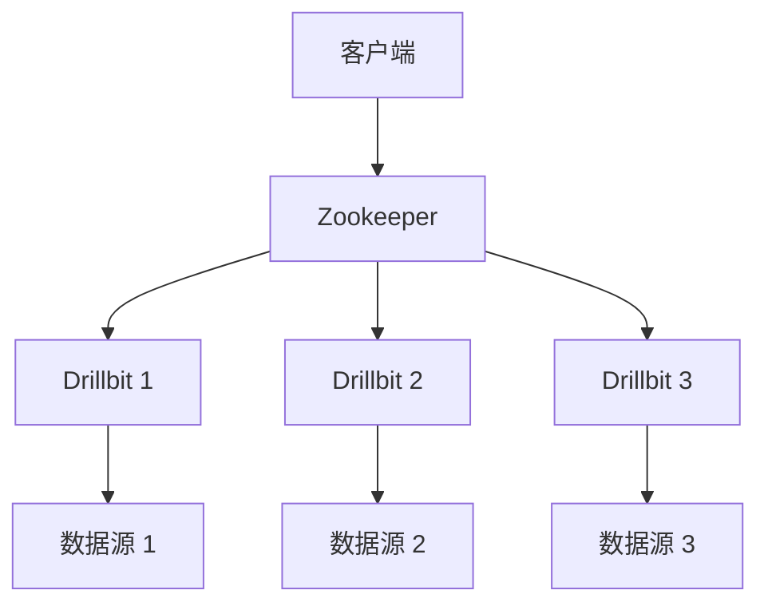

## 介绍

Apache Drill 是一个开源的分布式 SQL 查询引擎，专为大规模数据分析而设计。它支持对多种数据源（如HDFS、S3、NoSQL数据库等）进行快速查询，而无需预先定义模式。为了处理大规模数据，Drill 采用了分布式集群架构，允许多个节点协同工作以高效执行查询任务。

在本节中，我们将深入探讨 Apache Drill 的集群架构，了解其核心组件、工作原理以及如何在实际场景中应用。

---

## Apache Drill 集群架构概述

Apache Drill 的集群架构由以下几个核心组件组成：

1. **Drillbit**：Drill 集群中的基本工作单元，负责执行查询任务。
2. **Zookeeper**：用于集群协调和服务发现。
3. **客户端**：提交查询请求并接收结果的应用程序或工具。

以下是一个典型的 Apache Drill 集群架构图：



---

## 核心组件详解

### 1. Drillbit

Drillbit 是 Apache Drill 的核心执行引擎。每个 Drillbit 实例都可以执行查询任务，并且可以与其他 Drillbit 实例协同工作以完成分布式查询。Drillbit 的主要功能包括：

- **查询解析与优化**：将 SQL 查询解析为逻辑计划并优化执行。
- **任务执行**：将查询任务分解为多个子任务，并在集群中并行执行。
- **数据访问**：直接从数据源（如 HDFS、S3 或 NoSQL 数据库）读取数据。

:::tip
Drillbit 是无状态的，这意味着它们不存储任何查询状态或数据。这使得集群的扩展和管理更加简单。
:::

### 2. Zookeeper

Zookeeper 是 Apache Drill 集群的协调服务。它负责以下任务：

- **服务发现**：客户端通过 Zookeeper 找到可用的 Drillbit 实例。
- **集群管理**：Zookeeper 监控 Drillbit 的健康状态，并在节点故障时重新分配任务。

:::caution
Zookeeper 是 Apache Drill 集群的关键组件。如果 Zookeeper 服务不可用，整个集群将无法正常工作。
:::

### 3. 客户端

客户端是提交查询请求的工具或应用程序。Drill 支持多种客户端，包括：

- **JDBC/ODBC 驱动程序**：用于与 BI 工具或应用程序集成。
- **REST API**：用于通过 HTTP 请求提交查询。
- **命令行工具**：如 `sqlline`，用于交互式查询。

---

## 集群工作原理

当客户端提交一个查询请求时，Apache Drill 集群的工作流程如下：

1. **查询提交**：客户端通过 Zookeeper 找到一个可用的 Drillbit 实例，并将查询请求发送给它。
2. **查询解析与优化**：Drillbit 解析 SQL 查询并生成逻辑计划，然后优化执行计划。
3. **任务分配**：Drillbit 将查询任务分解为多个子任务，并将这些子任务分配给集群中的其他 Drillbit 实例。
4. **并行执行**：每个 Drillbit 实例并行执行其分配的子任务，并从数据源读取数据。
5. **结果聚合**：执行结果被汇总并返回给客户端。

:::note
Apache Drill 的分布式执行模型使其能够高效处理大规模数据查询，同时保持低延迟。
:::

---

## 实际应用场景

### 场景：跨多个数据源的联合查询

假设你有一个存储在 HDFS 中的日志文件和一个存储在 MongoDB 中的用户信息表。你需要查询某个用户的日志记录并将其与用户信息关联。

使用 Apache Drill，你可以直接编写 SQL 查询：

```sql
SELECT l.timestamp, l.action, u.username
FROM hdfs.`/logs/access.log` l
JOIN mongo.test.users u
ON l.user_id = u.user_id
WHERE u.username = 'john_doe';
```

在这个例子中，Drill 会自动从 HDFS 和 MongoDB 中读取数据，并在集群中并行执行查询。

---

## 总结

Apache Drill 的集群架构是其高效处理大规模数据查询的关键。通过分布式执行模型和灵活的架构，Drill 能够无缝集成多种数据源，并提供低延迟的查询性能。

:::tip
如果你想进一步学习 Apache Drill，可以尝试以下练习：
1. 部署一个简单的 Drill 集群。
2. 使用 `sqlline` 工具提交查询并观察集群的执行过程。
3. 尝试在不同数据源之间执行联合查询。
:::

---

## 附加资源

- [Apache Drill 官方文档](https://drill.apache.org/docs/)
- [Zookeeper 入门指南](https://zookeeper.apache.org/doc/current/zookeeperStarted.html)
- [分布式系统设计模式](https://www.oreilly.com/library/view/designing-distributed-systems/9781491983638/)