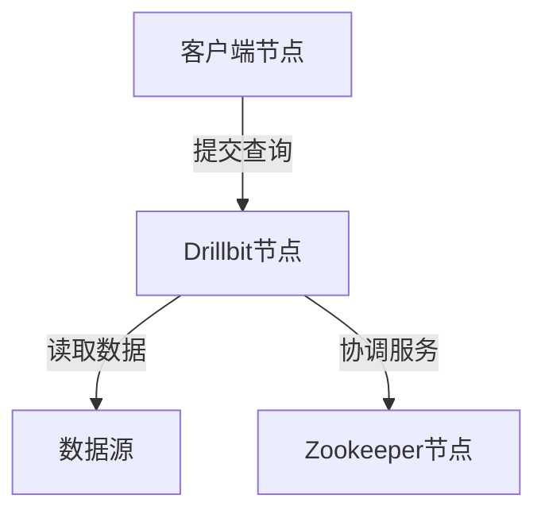

## 介绍

Apache Drill是一个分布式SQL查询引擎，专为大规模数据分析设计。它支持对多种数据源（如HDFS、S3、NoSQL数据库等）进行高效查询。在Drill集群中，节点是构成集群的基本单元，不同类型的节点承担不同的角色。理解这些节点类型对于管理和优化Drill集群至关重要。

本文将详细介绍Apache Drill中的三种主要节点类型：**Drillbit节点**、**Zookeeper节点**和**客户端节点**，并通过实际案例展示它们的作用。

---

## Drill bit节点

Drillbit节点是Apache Drill的核心组件，负责执行查询任务。每个Drillbit节点都可以独立运行查询，并且可以与其他Drillbit节点协作以完成分布式查询。

### 功能
- **查询执行**：Drillbit节点解析SQL查询并生成执行计划。
- **数据访问**：直接从数据源（如HDFS、S3）读取数据。
- **分布式计算**：多个Drillbit节点协同工作，实现并行查询处理。

### 配置示例
在`drill-override.conf`中配置Drillbit节点：

```plaintext
drill.exec: {
  cluster-id: "my-drill-cluster",
  zk.connect: "zk1:2181,zk2:2181,zk3:2181"
}
```

### 实际案例
假设你有一个包含3个Drillbit节点的集群，每个节点都可以处理部分查询任务。当用户提交一个查询时，Drill会自动将任务分配给这些节点，从而实现高效的数据处理。

---

## Zookeeper节点

Zookeeper节点用于管理Drill集群的元数据和协调服务。它确保集群中的各个Drillbit节点能够正确通信和协作。

### 功能
- **集群协调**：管理Drillbit节点的注册和状态。
- **元数据存储**：存储集群配置和查询计划。
- **故障恢复**：在节点故障时重新分配任务。

### 配置示例
在`drill-override.conf`中配置Zookeeper连接：

```plaintext
drill.exec: {
  zk.connect: "zk1:2181,zk2:2181,zk3:2181"
}
```

### 实际案例
在一个高可用性集群中，Zookeeper节点确保即使某个Drillbit节点发生故障，查询任务也能被重新分配到其他节点，从而保证服务的连续性。

---

## 客户端节点

客户端节点是用户与Drill集群交互的入口。它可以是任何支持JDBC或ODBC的工具，如SQL客户端或BI工具。

### 功能
- **查询提交**：向Drill集群发送SQL查询。
- **结果返回**：接收查询结果并展示给用户。

### 配置示例
使用JDBC连接Drill集群：

```java
String url = "jdbc:drill:zk=zk1:2181,zk2:2181,zk3:2181";
Connection conn = DriverManager.getConnection(url);
```

### 实际案例
假设你使用Tableau连接到Drill集群，Tableau作为客户端节点，通过JDBC接口提交查询并获取结果，从而生成可视化报表。

---

## 节点类型的关系

以下Mermaid图表展示了Drill集群中节点类型的关系：



---

## 总结

Apache Drill集群中的节点类型各司其职，共同协作以实现高效的分布式查询处理。Drillbit节点负责查询执行，Zookeeper节点提供集群协调服务，而客户端节点则是用户与集群交互的桥梁。理解这些节点类型的功能和配置方法，有助于更好地管理和优化Drill集群。

---

## 附加资源与练习

- **练习**：尝试在一个本地环境中配置一个包含多个Drillbit节点和Zookeeper节点的Drill集群，并提交一个简单的SQL查询。
- **资源**：
  - [Apache Drill官方文档](https://drill.apache.org/docs/)
  - [Zookeeper入门指南](https://zookeeper.apache.org/doc/current/zookeeperStarted.html)
