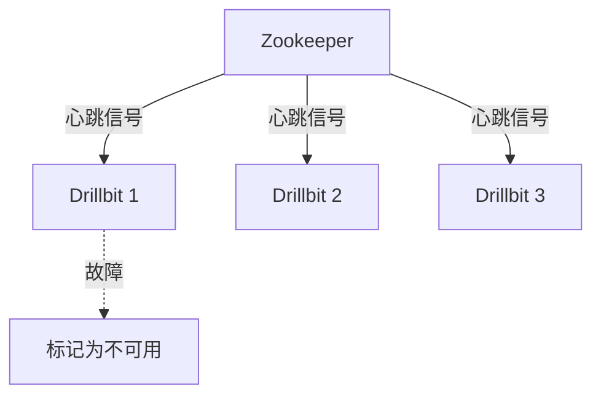
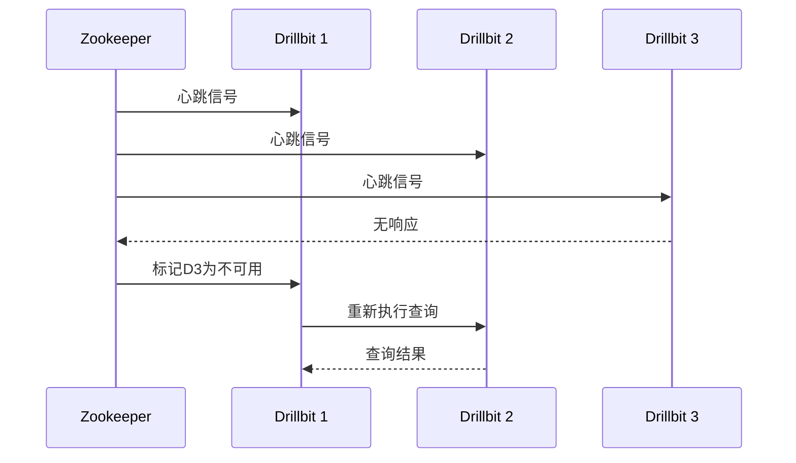

# Apache Drill 故障恢复

Apache Drill是一个分布式SQL查询引擎，能够对大规模数据集进行实时分析。在分布式环境中，故障是不可避免的，因此了解如何管理和恢复故障是确保系统高可用性的关键。本文将介绍Apache Drill中的故障恢复机制，帮助初学者理解如何在集群中处理故障。

## 介绍

在分布式系统中，故障可能由多种原因引起，例如网络问题、硬件故障或软件错误。Apache Drill通过其内置的故障恢复机制，能够在这些情况下保持系统的稳定性和数据的一致性。理解这些机制对于管理Apache Drill集群至关重要。

## 故障恢复机制

### 1. 节点故障检测

Apache Drill使用Zookeeper来管理集群中的节点状态。当一个节点发生故障时，Zookeeper会检测到该节点的失联，并将其标记为不可用。Drill的Drillbit进程会定期向Zookeeper发送心跳信号，以确保其状态是最新的。



### 2. 查询重试

当一个查询在执行过程中遇到节点故障时，Apache Drill会自动尝试在其他可用节点上重新执行该查询。这种机制确保了查询的连续性，即使部分节点不可用，查询仍能成功完成。

```sql
-- 示例查询
SELECT * FROM dfs.`/data/sample.csv` WHERE column1 = 'value';
```

:::note
**注意**：查询重试可能会导致查询执行时间的增加，因此在设计查询时应考虑到可能的故障情况。
:::

### 3. 数据一致性

Apache Drill通过分布式存储系统（如HDFS或S3）来确保数据的一致性。即使某个节点发生故障，数据仍然可以从其他节点或存储系统中恢复。Drill的查询引擎会确保在故障恢复过程中，数据的一致性不会被破坏。

## 实际案例

假设我们有一个由三个Drillbit节点组成的Apache Drill集群，其中一个节点由于硬件故障而宕机。以下是故障恢复的步骤：

1. **故障检测**：Zookeeper检测到故障节点并标记其为不可用。
2. **查询重试**：正在执行的查询会在其他两个节点上重新启动。
3. **数据恢复**：查询所需的数据从分布式存储系统中读取，确保数据一致性。



## 总结

Apache Drill的故障恢复机制确保了在分布式环境中，即使发生节点故障，系统仍能保持高可用性和数据一致性。通过Zookeeper的节点状态管理、查询重试机制以及分布式存储系统的数据一致性保障，Apache Drill能够在故障发生时迅速恢复，确保查询的连续性和数据的完整性。

## 附加资源

- [Apache Drill官方文档](https://drill.apache.org/docs/)
- [Zookeeper入门指南](https://zookeeper.apache.org/doc/current/zookeeperStarted.html)
- [分布式系统故障恢复策略](https://en.wikipedia.org/wiki/Fault_tolerance)

## 练习

1. 在一个三节点的Apache Drill集群中，模拟一个节点故障，并观察查询如何在其他节点上重新执行。
2. 修改查询，使其在遇到故障时能够更快地重试，并记录执行时间的变化。

通过以上内容，您应该对Apache Drill的故障恢复机制有了初步的了解。继续探索和实践，您将能够更好地管理和优化您的Apache Drill集群。