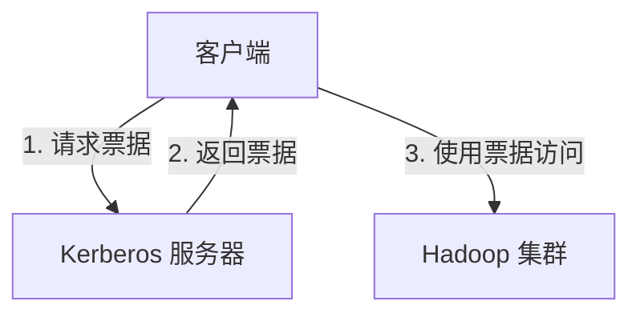

## 介绍

Apache Drill 是一个开源的分布式 SQL 查询引擎，专为大规模数据集设计。它能够无缝集成到 Hadoop 生态系统中，支持对多种数据源（如 HDFS、HBase、S3 等）进行实时查询。然而，随着数据规模的增加，数据安全问题变得尤为重要。本文将探讨 Apache Drill 如何与 Hadoop 生态系统协同工作，并确保数据的安全性。

## Hadoop 安全概述

Hadoop 生态系统提供了多种安全机制，包括身份验证、授权和数据加密。Apache Drill 作为 Hadoop 生态系统的一部分，也需要遵循这些安全机制。

### 身份验证

Hadoop 使用 Kerberos 进行身份验证。Kerberos 是一种网络认证协议，允许节点在不安全的网络中安全地相互通信。



### 授权

Hadoop 使用访问控制列表（ACL）和基于角色的访问控制（RBAC）来管理用户权限。Apache Drill 可以通过配置与 Hadoop 的授权机制集成。

### 数据加密

Hadoop 支持数据传输和存储的加密。Apache Drill 可以通过配置使用这些加密机制来保护数据。

## Apache Drill 与 Hadoop 安全集成

### 配置 Kerberos 身份验证

要在 Apache Drill 中启用 Kerberos 身份验证，需要在 `drill-override.conf` 文件中进行配置：

```plaintext
drill.exec: {
  security: {
    auth: "kerberos",
    principal: "drill/_HOST@YOUR_REALM",
    keytab: "/path/to/drill.keytab"
  }
}
```

### 配置 Hadoop 授权

Apache Drill 可以通过配置与 Hadoop 的授权机制集成。以下是一个示例配置：

```plaintext
drill.exec: {
  security: {
    auth: "kerberos",
    principal: "drill/_HOST@YOUR_REALM",
    keytab: "/path/to/drill.keytab",
    impersonation: {
      enabled: true,
      max_chained_user_hops: 3
    }
  }
}
```

### 数据加密

Apache Drill 支持通过配置使用 Hadoop 的数据加密机制。以下是一个示例配置：

```plaintext
drill.exec: {
  security: {
    auth: "kerberos",
    principal: "drill/_HOST@YOUR_REALM",
    keytab: "/path/to/drill.keytab",
    ssl: {
      enabled: true,
      keystore: "/path/to/keystore.jks",
      keystore_password: "password"
    }
  }
}
```

## 实际案例

假设我们有一个 Hadoop 集群，存储了敏感的用户数据。我们需要确保只有经过身份验证和授权的用户才能访问这些数据。

1. **配置 Kerberos 身份验证**：首先，我们在 Apache Drill 中启用 Kerberos 身份验证，确保只有经过身份验证的用户可以访问 Drill。

2. **配置 Hadoop 授权**：接下来，我们配置 Apache Drill 与 Hadoop 的授权机制集成，确保用户只能访问他们有权限的数据。

3. **启用数据加密**：最后，我们启用数据加密，确保数据在传输和存储过程中是安全的。

## 总结

Apache Drill 与 Hadoop 生态系统的集成提供了强大的数据查询能力，同时也确保了数据的安全性。通过配置 Kerberos 身份验证、Hadoop 授权和数据加密，我们可以有效地保护敏感数据。

## 附加资源

- [Apache Drill 官方文档](https://drill.apache.org/docs/)
- [Hadoop 安全指南](https://hadoop.apache.org/docs/current/hadoop-project-dist/hadoop-common/SecureMode.html)
- [Kerberos 身份验证指南](https://web.mit.edu/kerberos/)

## 练习

1. 在你的本地环境中配置 Apache Drill 与 Kerberos 身份验证。
2. 尝试配置 Apache Drill 与 Hadoop 的授权机制集成。
3. 启用数据加密，并测试数据传输和存储的安全性。
