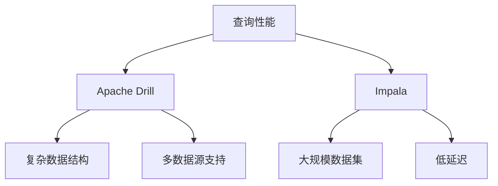

# Apache Drill 与Impala对比

在大数据生态系统中，Apache Drill和Impala是两个非常流行的SQL查询引擎。它们都允许用户使用SQL查询大规模数据集，但在设计理念、性能和应用场景上存在显著差异。本文将从多个角度对比这两者，帮助初学者更好地理解它们的特性。

## 1. 概述

### Apache Drill
Apache Drill是一个开源的分布式SQL查询引擎，专为大规模数据分析设计。它支持无模式（schema-free）的JSON数据模型，能够直接查询多种数据源，如HDFS、HBase、MongoDB等，而无需预先定义模式。Drill的核心优势在于其灵活性和对复杂数据格式的支持。

### Impala
Impala是由Cloudera开发的高性能SQL查询引擎，专为Hadoop生态系统优化。它提供了类似传统关系型数据库的查询性能，支持对HDFS和HBase中的数据进行快速交互式查询。Impala的核心优势在于其低延迟和高吞吐量。

## 2. 核心功能对比

### 数据源支持
- **Apache Drill**：支持多种数据源，包括HDFS、HBase、MongoDB、S3、Kafka等。Drill的“无模式”特性使其能够动态适应数据结构的变化。
- **Impala**：主要支持HDFS和HBase，对数据源的支持相对有限，但针对这些数据源进行了深度优化。

### 查询性能
- **Apache Drill**：由于支持无模式查询，Drill在处理复杂数据结构时表现优异，但在大规模数据集的查询性能上可能略逊于Impala。
- **Impala**：Impala在HDFS和HBase上的查询性能非常出色，尤其是在大规模数据集上，能够提供接近传统数据库的查询速度。

### 数据格式支持
- **Apache Drill**：支持JSON、Parquet、Avro、CSV等多种数据格式，且无需预先定义模式。
- **Impala**：主要支持Parquet、ORC等列式存储格式，对数据格式的支持较为有限。

## 3. 实际案例

### 案例1：查询JSON数据
假设我们有一个存储在HDFS中的JSON文件，内容如下：

```json
{
  "name": "Alice",
  "age": 30,
  "address": {
    "city": "New York",
    "state": "NY"
  }
}
```

#### 使用Apache Drill查询
```sql
SELECT name, address.city FROM dfs.`/path/to/file.json`;
```

#### 使用Impala查询
由于Impala不支持直接查询JSON文件，我们需要先将JSON数据转换为Parquet格式，然后才能查询。

```sql
SELECT name, address.city FROM parquet_table;
```

### 案例2：查询HDFS中的Parquet文件
假设我们有一个存储在HDFS中的Parquet文件，内容如下：

| name  | age | city      | state |
|-------|-----|-----------|-------|
| Alice | 30  | New York  | NY    |
| Bob   | 25  | San Francisco | CA    |

#### 使用Apache Drill查询
```sql
SELECT name, city FROM dfs.`/path/to/file.parquet` WHERE age > 25;
```

#### 使用Impala查询
```sql
SELECT name, city FROM parquet_table WHERE age > 25;
```

## 4. 性能对比



## 5. 总结

Apache Drill和Impala各有优劣，选择哪个工具取决于具体的应用场景：
- 如果你需要查询多种数据源，尤其是复杂的数据结构，Apache Drill是更好的选择。
- 如果你主要处理HDFS和HBase中的数据，并且需要高性能的查询，Impala可能更适合你。

## 6. 附加资源与练习

### 附加资源
- [Apache Drill官方文档](https://drill.apache.org/docs/)
- [Impala官方文档](https://impala.apache.org/docs/)

### 练习
1. 使用Apache Drill查询一个存储在MongoDB中的JSON数据集。
2. 使用Impala查询一个存储在HDFS中的Parquet文件，并比较查询性能。

通过本文的学习，你应该对Apache Drill和Impala有了更深入的理解。希望你能在实际项目中灵活运用这些知识！