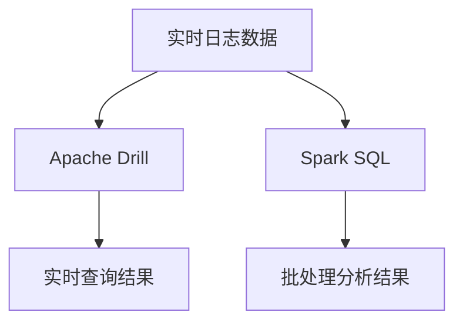

# Apache Drill 与Spark SQL交互

在大数据生态系统中，Apache Drill和Spark SQL都是强大的工具，分别用于查询和分析大规模数据集。Apache Drill以其无模式SQL查询引擎而闻名，而Spark SQL则提供了与Spark生态系统的深度集成。本文将介绍如何在Apache Drill和Spark SQL之间实现交互，并展示如何利用两者的优势来处理复杂的数据分析任务。

## 介绍

Apache Drill和Spark SQL都支持SQL查询，但它们的设计目标和应用场景有所不同。Apache Drill专注于实时查询和探索性数据分析，而Spark SQL则更适用于批处理和复杂的数据转换任务。通过将两者结合，用户可以在一个统一的平台上实现实时查询和批处理的结合。

### 为什么需要交互？

- **实时查询与批处理的结合**：Apache Drill适合实时查询，而Spark SQL适合批处理。通过交互，可以在一个平台上同时实现这两种功能。
- **数据源的多样性**：Apache Drill支持多种数据源（如HDFS、HBase、JSON等），而Spark SQL可以与Spark生态系统无缝集成。通过交互，可以访问更多数据源。
- **性能优化**：在某些场景下，结合两者的优势可以提高查询性能。

---

## Apache Drill 与Spark SQL的集成方式

Apache Drill和Spark SQL可以通过以下方式实现交互：

1. **通过JDBC连接**：Apache Drill支持JDBC接口，Spark SQL可以通过JDBC连接到Drill并执行查询。
2. **共享数据存储**：两者可以共享HDFS或S3等分布式存储系统，通过读取相同的数据文件实现数据交互。
3. **使用Apache Arrow**：Apache Arrow是一种内存中的数据格式，Drill和Spark SQL都支持Arrow，可以通过Arrow实现高效的数据交换。

### 通过JDBC连接

以下是一个通过JDBC连接Apache Drill和Spark SQL的示例：

```python
from pyspark.sql import SparkSession

# 创建Spark会话
spark = SparkSession.builder \
    .appName("Drill-SparkSQL Integration") \
    .getOrCreate()

# 配置JDBC连接
drill_jdbc_url = "jdbc:drill:drillbit=localhost:31010"
drill_query = "(SELECT * FROM dfs.tmp.`sample_data.csv`) AS drill_table"

# 通过JDBC读取Drill数据
drill_df = spark.read \
    .format("jdbc") \
    .option("url", drill_jdbc_url) \
    .option("dbtable", drill_query) \
    .load()

# 显示数据
drill_df.show()
```

**输出示例：**
```
+----+--------+-------+
| id | name   | value |
+----+--------+-------+
| 1  | Alice  | 100   |
| 2  | Bob    | 200   |
| 3  | Charlie| 300   |
+----+--------+-------+
```

### 共享数据存储

假设数据存储在HDFS上，Drill和Spark SQL都可以直接读取：

```sql
-- 在Apache Drill中查询HDFS数据
SELECT * FROM hdfs.`/data/sample_data.csv`;

-- 在Spark SQL中查询相同的数据
val df = spark.read.csv("hdfs://localhost:9000/data/sample_data.csv")
df.show()
```

---

## 实际应用场景

### 场景1：实时数据探索与批处理分析

假设你有一个实时日志系统，日志数据存储在HDFS中。你可以使用Apache Drill对实时日志进行探索性分析，同时使用Spark SQL对历史日志进行批处理分析。



### 场景2：多数据源联合查询

假设你有来自不同数据源的数据（如HBase、JSON文件、关系数据库），你可以使用Apache Drill对这些数据源进行联合查询，然后将结果导入Spark SQL进行进一步处理。

```sql
-- 在Apache Drill中联合查询
SELECT * FROM hbase.`table1` 
UNION ALL 
SELECT * FROM dfs.`/data/sample.json`;

-- 将结果导入Spark SQL
val result = spark.read.jdbc(drill_jdbc_url, "combined_query")
```

---

## 总结

Apache Drill和Spark SQL的交互为大数据处理提供了更多的灵活性和性能优化机会。通过JDBC连接、共享数据存储或使用Apache Arrow，用户可以在一个平台上实现实时查询和批处理的结合。这种集成方式特别适用于需要同时处理实时数据和历史数据的场景。

---

## 附加资源与练习

### 资源
- [Apache Drill官方文档](https://drill.apache.org/docs/)
- [Spark SQL官方文档](https://spark.apache.org/docs/latest/sql-programming-guide.html)
- [Apache Arrow官网](https://arrow.apache.org/)

### 练习
1. 使用JDBC连接Apache Drill和Spark SQL，查询一个CSV文件并显示结果。
2. 将Apache Drill的查询结果导入Spark SQL，并使用Spark SQL进行聚合操作。
3. 尝试使用Apache Arrow在Drill和Spark SQL之间传输数据，并比较性能差异。

:::tip
在实际项目中，建议根据数据规模和查询需求选择合适的集成方式。对于小规模数据，JDBC连接可能足够；而对于大规模数据，共享存储或Apache Arrow可能是更好的选择。
:::