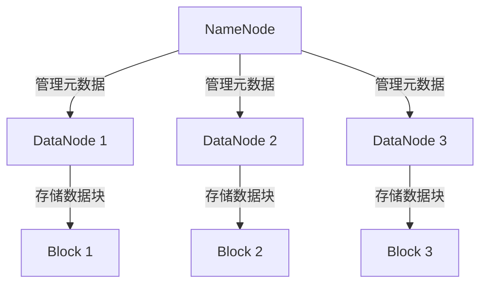

## 什么是Hadoop？

Hadoop是一个开源的分布式计算框架，旨在处理大规模数据集。它最初由Apache软件基金会开发，灵感来源于Google的MapReduce和Google文件系统（GFS）。Hadoop的核心设计目标是能够在廉价的硬件集群上高效地存储和处理海量数据。

Hadoop的主要优势在于其**可扩展性**和**容错性**。它能够将数据分布到多个节点上进行并行处理，即使某些节点发生故障，系统仍能继续运行。

---

## Hadoop 的核心组件

Hadoop生态系统由多个核心组件组成，以下是其中最重要的几个：

1. **HDFS（Hadoop Distributed File System）**  
   HDFS是Hadoop的分布式文件系统，用于存储大规模数据集。它将文件分割成多个块，并将这些块分布到集群中的不同节点上。

2. **MapReduce**  
   MapReduce是Hadoop的计算模型，用于并行处理大规模数据集。它将任务分为两个阶段：**Map**（映射）和**Reduce**（归约）。

3. **YARN（Yet Another Resource Negotiator）**  
   YARN是Hadoop的资源管理框架，负责集群资源的调度和管理。

4. **Hadoop Common**  
   这是Hadoop的核心库，提供了其他组件所需的基础工具和功能。

---

## HDFS的工作原理

HDFS采用主从架构，包含以下两个关键角色：

- **NameNode**：负责管理文件系统的元数据，例如文件目录结构和块的位置。
- **DataNode**：负责存储实际的数据块。

以下是一个简单的HDFS文件存储示意图：



:::note
HDFS默认将每个文件分割成128MB的块（可配置），并将这些块复制到多个DataNode上以实现容错。
:::

---

## MapReduce的工作原理

MapReduce是一种分布式计算模型，分为两个阶段：

1. **Map阶段**：将输入数据分割成独立的块，并由多个Map任务并行处理。
2. **Reduce阶段**：将Map阶段的输出进行汇总和归约，生成最终结果。

以下是一个简单的MapReduce示例，用于统计文本中单词的出现次数：

```java
// Map函数
public void map(LongWritable key, Text value, Context context) {
    String[] words = value.toString().split(" ");
    for (String word : words) {
        context.write(new Text(word), new IntWritable(1));
    }
}

// Reduce函数
public void reduce(Text key, Iterable<IntWritable> values, Context context) {
    int sum = 0;
    for (IntWritable val : values) {
        sum += val.get();
    }
    context.write(key, new IntWritable(sum));
}
```

**输入**：
```
Hello World
Hello Hadoop
```

**输出**：
```
Hello 2
World 1
Hadoop 1
```

---

## Hadoop 的实际应用场景

Hadoop广泛应用于需要处理大规模数据的领域，例如：

1. **日志分析**  
   企业可以使用Hadoop分析服务器日志，以监控系统性能和用户行为。

2. **推荐系统**  
   电商平台可以利用Hadoop处理用户行为数据，生成个性化推荐。

3. **科学研究**  
   生物信息学领域使用Hadoop处理基因序列数据，加速研究进程。

4. **金融风控**  
   银行和金融机构使用Hadoop分析交易数据，检测异常行为。

---

## 总结

Hadoop是一个强大的分布式计算框架，能够高效处理大规模数据集。它的核心组件包括HDFS、MapReduce和YARN，分别负责数据存储、计算和资源管理。通过分布式存储和并行计算，Hadoop能够实现高可扩展性和容错性。

:::tip
如果你对Hadoop感兴趣，可以尝试以下练习：
1. 在本地安装Hadoop并运行一个简单的MapReduce任务。
2. 使用HDFS上传和下载文件，体验分布式文件系统的操作。
:::

---

## 附加资源

- [Apache Hadoop官方文档](https://hadoop.apache.org/docs/current/)
- 《Hadoop权威指南》——Tom White
- [Hadoop入门教程](https://www.tutorialspoint.com/hadoop/index.htm)