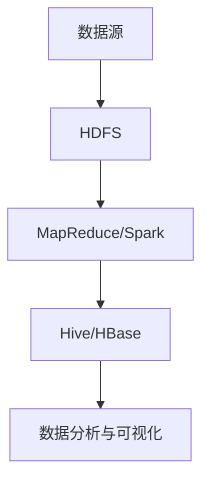

## 介绍

Hadoop是一个开源的分布式计算框架，旨在处理大规模数据集。它的核心设计理念是将数据分布存储在多个节点上，并通过并行处理实现高效计算。Hadoop生态系统由多个组件组成，每个组件都有其特定的功能，共同协作以支持大数据处理和分析。

本文将带您了解Hadoop生态系统的主要组件及其功能，并通过实际案例展示其应用场景。

---

## Hadoop 核心组件

Hadoop生态系统由以下几个核心组件组成：

1. **HDFS（Hadoop Distributed File System）**  
   HDFS是Hadoop的分布式文件系统，用于存储大规模数据集。它将文件分割成多个块，并将这些块分布存储在集群中的多个节点上，从而实现高容错性和高吞吐量。

2. **MapReduce**  
   MapReduce是Hadoop的分布式计算框架，用于处理和分析存储在HDFS上的数据。它将计算任务分为两个阶段：Map阶段（数据映射）和Reduce阶段（数据汇总）。

3. **YARN（Yet Another Resource Negotiator）**  
   YARN是Hadoop的资源管理框架，负责集群资源的分配和任务调度。它允许多个应用程序共享集群资源，并支持多种计算框架（如MapReduce、Spark等）。

4. **Hive**  
   Hive是一个基于Hadoop的数据仓库工具，允许用户使用类似SQL的查询语言（HiveQL）来查询和分析存储在HDFS上的数据。

5. **HBase**  
   HBase是一个分布式的、面向列的NoSQL数据库，适用于实时读写大规模数据集。

6. **Spark**  
   Spark是一个快速、通用的分布式计算引擎，支持内存计算，适用于迭代算法和实时数据处理。

7. **Pig**  
   Pig是一个高级数据流语言和执行框架，用于简化MapReduce任务的编写。

8. **ZooKeeper**  
   ZooKeeper是一个分布式协调服务，用于管理集群中的配置信息、命名服务和分布式同步。

---

## Hadoop 生态系统的工作流程

以下是一个典型的Hadoop生态系统工作流程：



1. **数据存储**：数据首先被存储在HDFS中，HDFS将数据分布存储在多个节点上。
2. **数据处理**：使用MapReduce或Spark对数据进行处理和分析。
3. **数据查询**：通过Hive或HBase查询和分析数据。
4. **数据应用**：将分析结果用于决策支持或可视化展示。

---

## 实际案例：电商网站的用户行为分析

假设我们有一个电商网站，每天产生大量的用户行为数据（如点击、购买、评论等）。我们可以使用Hadoop生态系统来分析这些数据，以了解用户行为模式并优化推荐系统。

### 步骤1：数据存储
将用户行为日志上传到HDFS中：
```bash
hdfs dfs -put user_behavior_logs /data/logs
```

### 步骤2：数据处理
使用MapReduce计算每个用户的点击次数：
```java
// Map阶段
public void map(LongWritable key, Text value, Context context) {
    String[] fields = value.toString().split(",");
    String userId = fields[0];
    context.write(new Text(userId), new IntWritable(1));
}

// Reduce阶段
public void reduce(Text key, Iterable<IntWritable> values, Context context) {
    int sum = 0;
    for (IntWritable val : values) {
        sum += val.get();
    }
    context.write(key, new IntWritable(sum));
}
```

### 步骤3：数据查询
使用Hive查询点击次数最多的用户：
```sql
SELECT user_id, click_count
FROM user_clicks
ORDER BY click_count DESC
LIMIT 10;
```

### 步骤4：数据应用
将分析结果用于优化推荐系统，例如为高点击用户推荐更多相关商品。

---

## 总结

Hadoop生态系统是一个功能强大的工具集，适用于处理和分析大规模数据集。通过HDFS、MapReduce、YARN等核心组件，以及Hive、HBase、Spark等扩展工具，您可以构建高效的大数据解决方案。

:::tip 提示
如果您是初学者，建议从HDFS和MapReduce开始学习，逐步深入了解其他组件。
:::

---

## 附加资源与练习

1. **资源**  
   - [Hadoop官方文档](https://hadoop.apache.org/docs/stable/)  
   - [Hive官方文档](https://hive.apache.org/)  
   - [Spark官方文档](https://spark.apache.org/docs/latest/)

2. **练习**  
   - 尝试在本地搭建一个Hadoop单节点集群，并运行一个简单的MapReduce任务。  
   - 使用Hive查询一个示例数据集，并生成统计报告。

通过学习和实践，您将逐步掌握Hadoop生态系统的核心技能，为大数据处理打下坚实的基础。