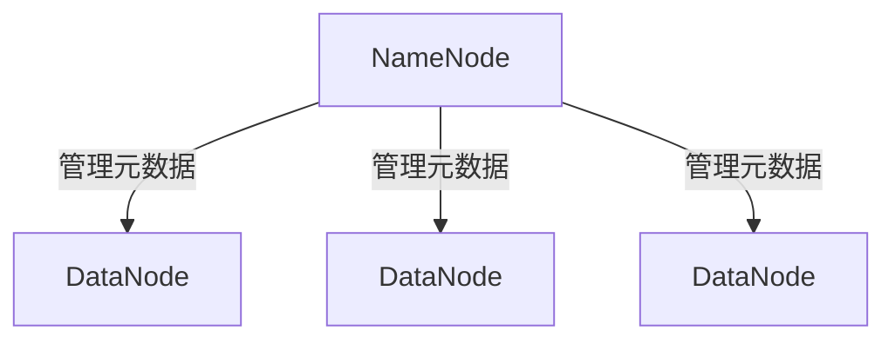
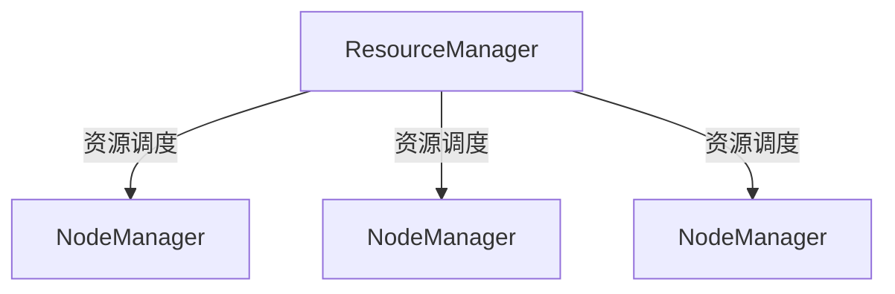

## 介绍

Hadoop是一个开源的分布式计算框架，旨在处理大规模数据集。它的设计目标是能够在廉价的硬件集群上高效地存储和处理数据。Hadoop的核心架构由多个组件组成，每个组件都有其特定的功能。本文将详细介绍这些组件及其在Hadoop生态系统中的作用。

## Hadoop 架构组件

Hadoop的核心架构主要由以下几个组件组成：

1. **HDFS (Hadoop Distributed File System)**
2. **YARN (Yet Another Resource Negotiator)**
3. **MapReduce**

### 1. HDFS (Hadoop Distributed File System)

HDFS是Hadoop的分布式文件系统，负责存储大规模数据集。它将数据分割成多个块，并将这些块分布在集群中的不同节点上。HDFS的设计目标是高容错性和高吞吐量。

#### HDFS的主要组件

- **NameNode**: NameNode是HDFS的主节点，负责管理文件系统的命名空间和元数据。它记录了文件系统中所有文件和目录的元数据，以及文件块的位置信息。
- **DataNode**: DataNode是HDFS的从节点，负责存储实际的数据块。DataNode定期向NameNode报告其存储的块信息。



#### 实际案例

假设我们有一个1TB的文件需要存储在HDFS中。HDFS会将这个文件分割成多个128MB的块，并将这些块分布在集群中的不同DataNode上。NameNode会记录每个块的位置信息，以便在需要时快速访问。

### 2. YARN (Yet Another Resource Negotiator)

YARN是Hadoop的资源管理框架，负责集群资源的管理和调度。它将计算资源（如CPU和内存）分配给不同的应用程序。

#### YARN的主要组件

- **ResourceManager**: ResourceManager是YARN的主节点，负责整个集群的资源管理和调度。它接收来自客户端的资源请求，并将资源分配给各个应用程序。
- **NodeManager**: NodeManager是YARN的从节点，负责管理单个节点上的资源。它向ResourceManager报告节点的资源使用情况，并执行ResourceManager分配的任务。



#### 实际案例

假设我们有一个MapReduce作业需要运行。YARN的ResourceManager会接收这个作业的资源请求，并将任务分配给集群中的NodeManager。NodeManager会启动容器来执行这些任务，并监控任务的执行情况。

### 3. MapReduce

MapReduce是Hadoop的编程模型，用于处理大规模数据集。它将计算任务分为两个阶段：Map阶段和Reduce阶段。

#### MapReduce的主要组件

- **Mapper**: Mapper负责将输入数据转换为键值对。每个Mapper处理输入数据的一个分片，并生成中间键值对。
- **Reducer**: Reducer负责将Mapper生成的中间键值对进行聚合和计算，生成最终的输出结果。

#### 代码示例

以下是一个简单的MapReduce示例，用于计算文本文件中每个单词的出现次数。

```java
// Mapper类
public class WordCountMapper extends Mapper<LongWritable, Text, Text, IntWritable> {
    private final static IntWritable one = new IntWritable(1);
    private Text word = new Text();

    public void map(LongWritable key, Text value, Context context) throws IOException, InterruptedException {
        String line = value.toString();
        StringTokenizer tokenizer = new StringTokenizer(line);
        while (tokenizer.hasMoreTokens()) {
            word.set(tokenizer.nextToken());
            context.write(word, one);
        }
    }
}

// Reducer类
public class WordCountReducer extends Reducer<Text, IntWritable, Text, IntWritable> {
    private IntWritable result = new IntWritable();

    public void reduce(Text key, Iterable<IntWritable> values, Context context) throws IOException, InterruptedException {
        int sum = 0;
        for (IntWritable val : values) {
            sum += val.get();
        }
        result.set(sum);
        context.write(key, result);
    }
}
```

#### 输入和输出

**输入**:
```
hello world
hello hadoop
```

**输出**:
```
hello 2
world 1
hadoop 1
```

#### 实际案例

假设我们有一个包含数百万条记录的日志文件，我们需要统计每个IP地址的访问次数。我们可以使用MapReduce模型来处理这个任务。Mapper会将每条日志记录中的IP地址提取出来，并生成中间键值对。Reducer会将这些中间键值对进行聚合，生成最终的统计结果。

## 总结

Hadoop的核心架构组件包括HDFS、YARN和MapReduce。HDFS负责存储大规模数据集，YARN负责资源管理和调度，MapReduce负责数据处理。这些组件共同协作，使得Hadoop能够高效地处理大规模数据。

## 附加资源

- [Hadoop官方文档](https://hadoop.apache.org/docs/current/)
- 《Hadoop权威指南》 - Tom White
- [Hadoop入门教程](https://www.tutorialspoint.com/hadoop/index.htm)

## 练习

1. 编写一个MapReduce程序，统计一个文本文件中每个单词的长度。
2. 配置一个简单的Hadoop集群，包含一个NameNode和一个DataNode。
3. 使用YARN运行一个简单的MapReduce作业，并观察资源分配情况。
