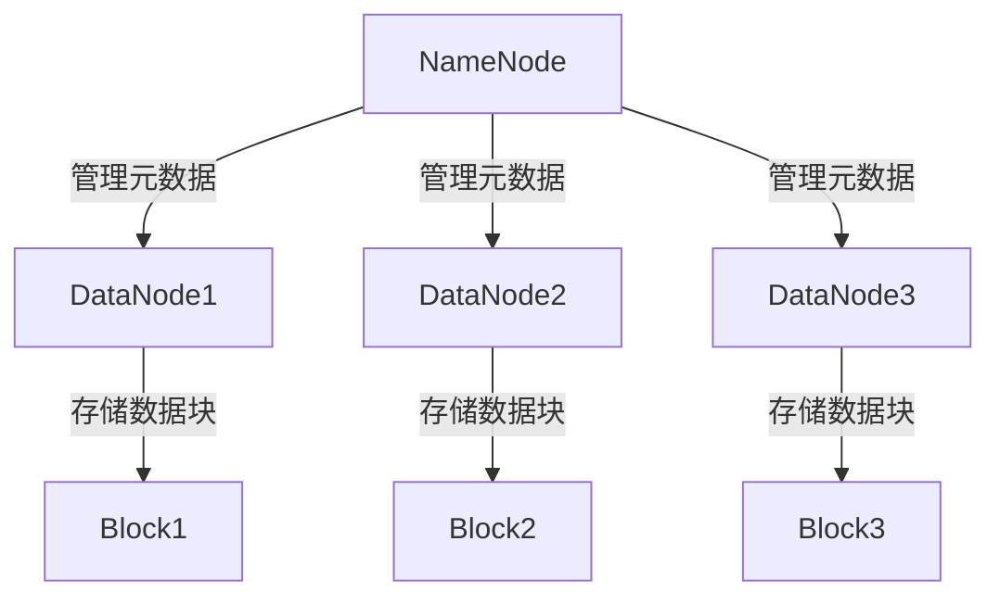

# Hadoop 分布式文件系统原理

Hadoop分布式文件系统（HDFS）是Hadoop生态系统中的核心组件之一，专门设计用于存储和管理大规模数据集。HDFS通过分布式存储和并行处理，能够高效地处理海量数据。本文将详细介绍HDFS的工作原理、架构及其在实际应用中的重要性。

## 什么是HDFS？

HDFS（Hadoop Distributed File System）是一个分布式文件系统，旨在运行在廉价的硬件上，并提供高吞吐量的数据访问。HDFS的设计目标是存储超大文件，并通过分布式存储和并行处理来实现高效的数据访问。

### HDFS的主要特点

- **高容错性**：HDFS能够自动检测和恢复硬件故障，确保数据的可靠性和可用性。
- **高吞吐量**：HDFS通过并行处理数据块，能够实现高吞吐量的数据访问。
- **大数据支持**：HDFS设计用于存储和处理大规模数据集，通常从GB到TB甚至PB级别。
- **流式数据访问**：HDFS适合一次写入、多次读取的数据访问模式。

## HDFS的架构

HDFS采用主从架构，主要由以下两个组件组成：

1. **NameNode**：负责管理文件系统的元数据，如文件名、目录结构、文件块的位置等。NameNode是HDFS的主节点。
2. **DataNode**：负责存储实际的数据块。DataNode是HDFS的从节点，负责数据的读写操作。

### HDFS架构图

## HDFS的工作原理

### 1. 文件分块

在HDFS中，文件被分割成多个数据块（Block），每个块的大小通常为128MB或256MB。这些数据块被分布式存储在多个DataNode上。

### 2. 数据复制

为了保证数据的可靠性和容错性，HDFS会对每个数据块进行复制，默认情况下每个块会复制三份，存储在不同的DataNode上。这样即使某个DataNode发生故障，数据仍然可以从其他节点访问。

### 3. 数据写入

当客户端向HDFS写入数据时，数据首先被分割成多个块，然后NameNode会为每个块分配存储位置。客户端将数据块写入指定的DataNode，DataNode再将数据块复制到其他节点。

### 4. 数据读取

当客户端从HDFS读取数据时，NameNode会提供数据块的位置信息，客户端直接从相应的DataNode读取数据块。

## 实际应用场景

### 案例：日志分析

假设某公司每天产生大量的日志数据，这些数据需要存储和分析。使用HDFS可以将日志数据分布式存储在多个节点上，并通过MapReduce等工具进行并行处理，从而快速分析日志数据，提取有价值的信息。

:::tip
在实际应用中，HDFS通常与MapReduce、Spark等计算框架结合使用，以实现高效的大数据处理。
:::

## 总结

HDFS是Hadoop生态系统的核心组件之一，通过分布式存储和并行处理，能够高效地处理大规模数据集。HDFS的高容错性和高吞吐量使其成为大数据处理的理想选择。

### 附加资源

- [HDFS官方文档](https://hadoop.apache.org/docs/stable/hadoop-project-dist/hadoop-hdfs/HdfsDesign.html)
- [HDFS入门教程](https://www.tutorialspoint.com/hadoop/hadoop_hdfs_overview.htm)

### 练习

1. 尝试在本地搭建一个HDFS集群，并上传一个文件到HDFS中。
2. 使用HDFS命令行工具查看文件的分块信息和存储位置。

:::caution
在搭建HDFS集群时，请确保配置正确，以避免数据丢失或系统故障。
:::