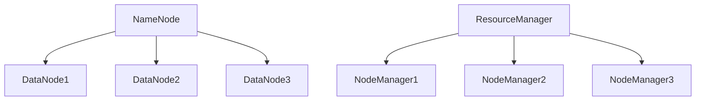

# Hadoop 集群模式

Hadoop是一个开源的分布式计算框架，专为处理大规模数据集而设计。Hadoop集群模式是Hadoop的核心运行方式之一，它允许多台计算机协同工作，以高效地存储和处理海量数据。本文将详细介绍Hadoop集群模式的基本概念、架构及其在实际中的应用。

## 什么是Hadoop集群模式？

Hadoop集群模式是指将多台计算机（节点）连接在一起，形成一个分布式系统，共同完成数据处理任务。在这种模式下，数据被分割成多个小块，并分布存储在不同的节点上。每个节点都可以独立处理自己存储的数据，同时与其他节点协同工作，完成复杂的计算任务。

Hadoop集群模式的核心组件包括：

- **HDFS（Hadoop Distributed File System）**：分布式文件系统，用于存储大规模数据。
- **YARN（Yet Another Resource Negotiator）**：资源管理框架，负责集群资源的调度和任务管理。
- **MapReduce**：分布式计算模型，用于处理和分析存储在HDFS上的数据。

## Hadoop 集群模式的架构

Hadoop集群通常由以下类型的节点组成：

1. **NameNode**：HDFS的主节点，负责管理文件系统的元数据（如文件目录结构、文件块的位置等）。
2. **DataNode**：HDFS的从节点，负责存储实际的数据块。
3. **ResourceManager**：YARN的主节点，负责集群资源的分配和任务调度。
4. **NodeManager**：YARN的从节点，负责在单个节点上管理资源和执行任务。

以下是一个简单的Hadoop集群架构图：



:::note
在小型集群中，NameNode和ResourceManager可以运行在同一台机器上。但在生产环境中，通常会将它们部署在不同的机器上以提高可靠性。
:::

## Hadoop 集群模式的工作流程

1. **数据存储**：数据被分割成多个块，并分布存储在多个DataNode上。NameNode负责记录每个数据块的位置信息。
2. **任务分配**：当用户提交一个MapReduce任务时，ResourceManager会将该任务分配给可用的NodeManager。
3. **任务执行**：每个NodeManager在自己的节点上执行Map或Reduce任务，处理本地存储的数据。
4. **结果汇总**：MapReduce任务完成后，结果会被汇总并返回给用户。

## 实际应用场景

Hadoop集群模式广泛应用于大数据处理领域，以下是一些典型的应用场景：

1. **日志分析**：企业可以使用Hadoop集群模式分析服务器日志，以监控系统性能、检测异常行为等。
2. **推荐系统**：电商平台可以利用Hadoop集群模式处理用户行为数据，生成个性化推荐。
3. **基因组学研究**：生物信息学领域使用Hadoop集群模式处理大规模的基因组数据，以加速研究进程。

## 示例：运行一个简单的MapReduce任务

以下是一个简单的MapReduce任务示例，用于统计文本文件中每个单词的出现次数。

### 输入文件（input.txt）
```
hello world
hello hadoop
hadoop is great
```

### MapReduce代码（WordCount.java）
```java
import java.io.IOException;
import java.util.StringTokenizer;
import org.apache.hadoop.conf.Configuration;
import org.apache.hadoop.fs.Path;
import org.apache.hadoop.io.IntWritable;
import org.apache.hadoop.io.Text;
import org.apache.hadoop.mapreduce.Job;
import org.apache.hadoop.mapreduce.Mapper;
import org.apache.hadoop.mapreduce.Reducer;
import org.apache.hadoop.mapreduce.lib.input.FileInputFormat;
import org.apache.hadoop.mapreduce.lib.output.FileOutputFormat;

public class WordCount {
    public static class TokenizerMapper extends Mapper<Object, Text, Text, IntWritable> {
        private final static IntWritable one = new IntWritable(1);
        private Text word = new Text();

        public void map(Object key, Text value, Context context) throws IOException, InterruptedException {
            StringTokenizer itr = new StringTokenizer(value.toString());
            while (itr.hasMoreTokens()) {
                word.set(itr.nextToken());
                context.write(word, one);
            }
        }
    }

    public static class IntSumReducer extends Reducer<Text, IntWritable, Text, IntWritable> {
        private IntWritable result = new IntWritable();

        public void reduce(Text key, Iterable<IntWritable> values, Context context) throws IOException, InterruptedException {
            int sum = 0;
            for (IntWritable val : values) {
                sum += val.get();
            }
            result.set(sum);
            context.write(key, result);
        }
    }

    public static void main(String[] args) throws Exception {
        Configuration conf = new Configuration();
        Job job = Job.getInstance(conf, "word count");
        job.setJarByClass(WordCount.class);
        job.setMapperClass(TokenizerMapper.class);
        job.setCombinerClass(IntSumReducer.class);
        job.setReducerClass(IntSumReducer.class);
        job.setOutputKeyClass(Text.class);
        job.setOutputValueClass(IntWritable.class);
        FileInputFormat.addInputPath(job, new Path(args[0]));
        FileOutputFormat.setOutputPath(job, new Path(args[1]));
        System.exit(job.waitForCompletion(true) ? 0 : 1);
    }
}
```

### 输出结果
```
hadoop 2
hello 2
is 1
great 1
world 1
```

:::tip
在实际生产环境中，Hadoop集群模式通常需要处理TB甚至PB级别的数据。因此，优化MapReduce任务的性能（如减少数据倾斜、合理设置Reducer数量等）是非常重要的。
:::

## 总结

Hadoop集群模式是大数据处理的核心技术之一，它通过分布式存储和计算，能够高效地处理海量数据。本文介绍了Hadoop集群模式的基本概念、架构、工作流程以及实际应用场景，并通过一个简单的MapReduce任务示例展示了其使用方法。

## 附加资源与练习

- **官方文档**：访问[Hadoop官方文档](https://hadoop.apache.org/docs/stable/)以获取更多详细信息。
- **练习**：尝试在本地或云环境中搭建一个小型Hadoop集群，并运行上述的WordCount示例。

:::caution
在搭建Hadoop集群时，请确保所有节点的网络配置正确，并且防火墙规则允许节点之间的通信。
:::