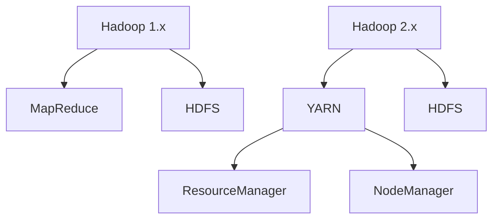
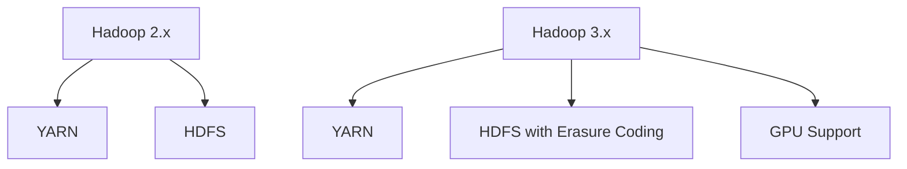

# Hadoop 版本对比

Hadoop是一个开源的分布式计算框架，广泛用于大数据处理。随着技术的发展，Hadoop经历了多个版本的迭代，每个版本都有其独特的特性和改进。本文将对比Hadoop的主要版本，帮助初学者理解它们的差异，并选择适合的版本进行学习和开发。

## 1. Hadoop版本概述

Hadoop的版本主要分为两大类：**Apache Hadoop**和**商业发行版**。Apache Hadoop是官方开源版本，而商业发行版则是在Apache Hadoop基础上进行了优化和增强的版本，如Cloudera、Hortonworks和MapR等。

### 1.1 Apache Hadoop

Apache Hadoop是Hadoop的官方开源版本，由Apache软件基金会维护。它包含了HDFS（Hadoop Distributed File System）和MapReduce等核心组件。Apache Hadoop的版本号通常以“x.y.z”的形式表示，其中“x”表示主版本号，“y”表示次版本号，“z”表示修订版本号。

### 1.2 商业发行版

商业发行版通常基于Apache Hadoop，但提供了更多的企业级功能和支持。常见的商业发行版包括：

- **Cloudera Distribution for Hadoop (CDH)**
- **Hortonworks Data Platform (HDP)**
- **MapR**

这些发行版通常提供了更友好的管理工具、更好的性能优化以及更全面的技术支持。

## 2. Hadoop版本对比

### 2.1 Apache Hadoop 1.x vs 2.x

#### 2.1.1 Hadoop 1.x

Hadoop 1.x是Hadoop的早期版本，主要包含HDFS和MapReduce两个核心组件。它的架构相对简单，但存在一些局限性：

- **单点故障**：JobTracker是MapReduce的单点故障，一旦JobTracker崩溃，整个集群将无法工作。
- **资源管理**：资源管理功能较弱，无法有效管理集群资源。

#### 2.1.2 Hadoop 2.x

Hadoop 2.x引入了YARN（Yet Another Resource Negotiator），解决了Hadoop 1.x中的一些关键问题：

- **资源管理**：YARN将资源管理和作业调度分离，提高了集群的资源利用率。
- **高可用性**：HDFS引入了NameNode的高可用性（HA）机制，减少了单点故障的风险。



### 2.2 Hadoop 2.x vs 3.x

#### 2.2.1 Hadoop 2.x

Hadoop 2.x是当前广泛使用的版本，引入了YARN和HDFS的高可用性等关键特性。它支持多种计算框架，如MapReduce、Spark和Tez等。

#### 2.2.2 Hadoop 3.x

Hadoop 3.x在2.x的基础上进行了进一步的优化和改进：

- **Erasure Coding**：引入了纠删码（Erasure Coding），减少了存储开销。
- **GPU支持**：支持GPU加速计算，提高了计算性能。
- **NameNode Federation**：进一步增强了HDFS的扩展性。



## 3. 实际案例

### 3.1 案例1：使用Hadoop 2.x进行日志分析

假设你有一个大型网站，每天产生大量的日志数据。你可以使用Hadoop 2.x的YARN和MapReduce来处理这些日志数据，分析用户行为。

```bash
# 示例：提交MapReduce作业
hadoop jar hadoop-mapreduce-examples.jar wordcount /input/logs /output/results
```

### 3.2 案例2：使用Hadoop 3.x进行数据存储优化

如果你需要存储大量的冷数据（不经常访问的数据），可以使用Hadoop 3.x的纠删码功能来减少存储开销。

```bash
# 示例：启用纠删码
hdfs ec -enablePolicy -policy RS-6-3-1024k
```

## 4. 总结

Hadoop的不同版本各有其优缺点，选择合适的版本取决于你的具体需求。对于初学者来说，Hadoop 2.x是一个不错的选择，因为它稳定且功能丰富。如果你需要更先进的特性，如纠删码或GPU支持，可以考虑使用Hadoop 3.x。

## 5. 附加资源与练习

- **资源**：
  - [Apache Hadoop官方文档](https://hadoop.apache.org/docs/)
  - [Cloudera Documentation](https://docs.cloudera.com/)
  - [Hortonworks Documentation](https://docs.hortonworks.com/)

- **练习**：
  1. 在Hadoop 2.x集群上运行一个简单的MapReduce作业。
  2. 在Hadoop 3.x集群上启用纠删码并测试其效果。

通过本文的学习，你应该对Hadoop的不同版本有了更深入的了解，并能够根据需求选择合适的版本进行学习和开发。