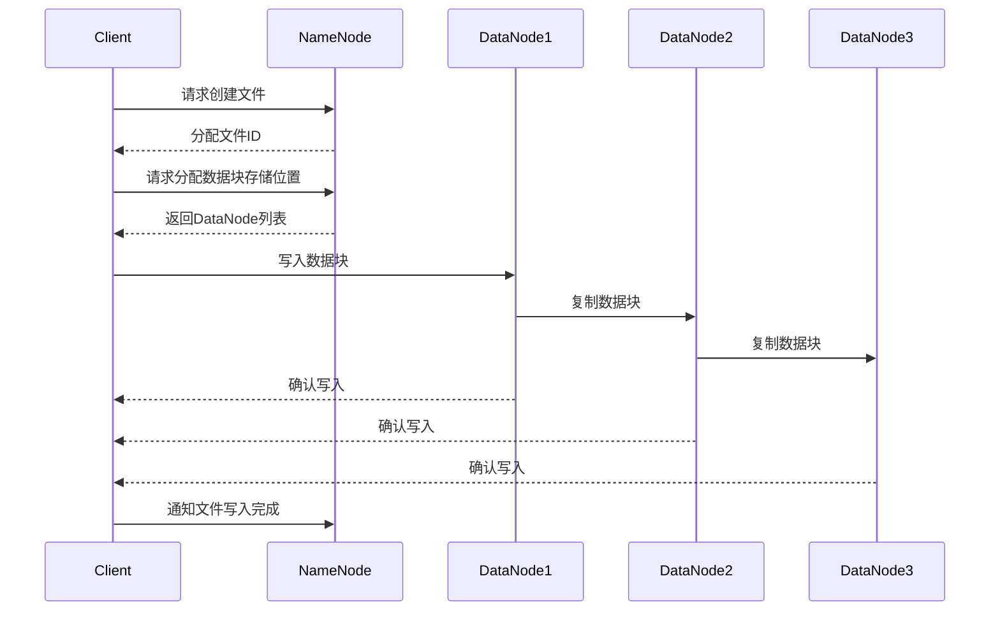
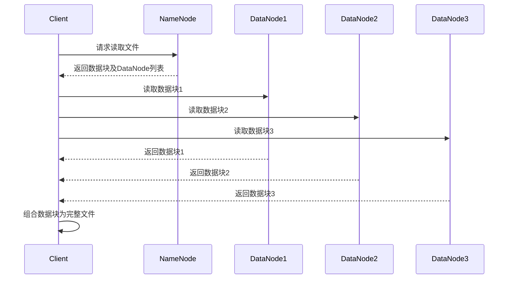

# HDFS文件读写流程

HDFS（Hadoop Distributed File System）是Hadoop生态系统中的分布式文件系统，专为处理大规模数据集而设计。它通过将文件分割成多个块并分布存储在集群中的多个节点上，实现了高吞吐量的数据访问。本文将详细介绍HDFS文件的读写流程，帮助初学者理解其工作原理。

## 1. HDFS文件系统简介

HDFS是一个高度容错的分布式文件系统，适用于处理大规模数据集。它的设计目标是：

- **高吞吐量**：通过并行处理数据块，HDFS能够高效地处理大量数据。
- **容错性**：数据块在多个节点上复制，确保在节点故障时数据不会丢失。
- **可扩展性**：HDFS可以轻松扩展到数千个节点，支持PB级数据存储。

## 2. HDFS文件写入流程

当客户端向HDFS写入文件时，HDFS会将文件分割成多个数据块，并将这些数据块分布存储在集群中的多个节点上。以下是HDFS文件写入的详细流程：

### 2.1 客户端与NameNode通信

1. 客户端首先与NameNode通信，请求创建一个新文件。
2. NameNode检查文件是否存在以及客户端是否有权限创建文件。如果检查通过，NameNode会为文件分配一个唯一的文件ID。

### 2.2 数据块分配与写入

3. 客户端将文件数据分割成多个数据块（默认大小为128MB），并向NameNode请求分配数据块存储位置。
4. NameNode返回一组DataNode的列表，这些DataNode将用于存储数据块。
5. 客户端将数据块写入第一个DataNode，该DataNode会将数据块复制到其他DataNode上，确保数据的冗余存储。

### 2.3 数据块确认

6. 每个DataNode在成功接收并存储数据块后，会向客户端发送确认消息。
7. 客户端在收到所有DataNode的确认后，会通知NameNode文件写入完成。

## 3. HDFS文件读取流程

当客户端从HDFS读取文件时，HDFS会根据文件的数据块分布情况，从多个DataNode并行读取数据。以下是HDFS文件读取的详细流程：

### 3.1 客户端与NameNode通信

1. 客户端首先与NameNode通信，请求读取文件。
2. NameNode返回文件的数据块列表以及每个数据块所在的DataNode列表。

### 3.2 数据块读取

3. 客户端根据NameNode返回的信息，直接与存储数据块的DataNode通信，并行读取数据块。
4. 客户端将读取的数据块按顺序组合成完整的文件。

## 4. 实际应用场景

HDFS的读写流程在大数据处理中有着广泛的应用。例如：

- **日志分析**：企业可以将大量的日志数据存储在HDFS中，并通过MapReduce或Spark等工具进行并行分析。
- **数据仓库**：HDFS可以作为数据仓库的基础存储层，支持大规模数据的存储和查询。
- **机器学习**：机器学习算法通常需要处理大量的训练数据，HDFS能够高效地存储和读取这些数据。

## 5. 总结

HDFS通过将文件分割成多个数据块并分布存储在集群中的多个节点上，实现了高吞吐量的数据访问。本文详细介绍了HDFS文件的读写流程，包括客户端与NameNode的通信、数据块的分配与写入、以及数据块的读取与组合。理解这些流程对于掌握HDFS的工作原理至关重要。

:::tip
**附加资源**：
- [HDFS官方文档](https://hadoop.apache.org/docs/stable/hadoop-project-dist/hadoop-hdfs/HdfsDesign.html)
- 《Hadoop权威指南》—— Tom White
:::

:::caution
**练习**：
1. 尝试在本地搭建一个Hadoop集群，并实践HDFS文件的读写操作。
2. 修改HDFS的默认数据块大小，观察其对文件读写性能的影响。
:::