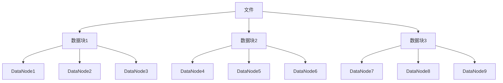

# HDFS数据块概念

HDFS（Hadoop分布式文件系统）是Hadoop生态系统的核心组件之一，用于存储和管理大规模数据集。在HDFS中，**数据块**是一个基本概念，理解它对于掌握HDFS的工作原理至关重要。

## 什么是HDFS数据块？

HDFS将大文件分割成固定大小的块（默认大小为128MB或256MB），这些块被称为**数据块**。每个数据块是HDFS存储和管理的独立单元。数据块的设计使得HDFS能够高效地存储和处理大规模数据。

:::note
**注意**：HDFS数据块的大小可以根据需要进行配置，但默认值通常为128MB或256MB。
:::

## 为什么需要数据块？

1. **分布式存储**：数据块允许文件被分布存储在多个节点上，从而实现并行处理和高效存储。
2. **容错性**：每个数据块可以有多个副本（默认是3个），存储在不同的节点上，以防止数据丢失。
3. **简化存储管理**：通过将大文件分割成固定大小的块，HDFS可以更高效地管理存储空间。

## 数据块的工作原理

当文件被上传到HDFS时，HDFS会将其分割成多个数据块。每个数据块会被复制并存储在不同的数据节点上。HDFS的NameNode负责管理这些数据块的元数据，而DataNode负责存储实际的数据块。

## 实际案例

假设我们有一个1GB的文件需要存储在HDFS中。如果数据块的大小为128MB，那么HDFS会将这个文件分割成8个数据块（1GB / 128MB = 8）。每个数据块会被复制并存储在不同的DataNode上。

:::tip
**提示**：在实际应用中，数据块的大小和副本数可以根据数据的重要性和存储需求进行调整。
:::

## 总结

HDFS数据块是Hadoop分布式文件系统的核心概念之一。通过将大文件分割成固定大小的数据块，HDFS能够实现高效的分布式存储和容错性。理解数据块的概念对于掌握HDFS的工作原理至关重要。

## 附加资源

- [HDFS官方文档](https://hadoop.apache.org/docs/stable/hadoop-project-dist/hadoop-hdfs/HdfsDesign.html)
- [Hadoop权威指南](https://www.oreilly.com/library/view/hadoop-the-definitive/9781491901687/)

## 练习

1. 尝试在本地Hadoop集群上上传一个文件，并观察HDFS如何将其分割成数据块。
2. 修改HDFS的配置文件，调整数据块的大小和副本数，观察其对存储和性能的影响。

:::caution
**警告**：在修改HDFS配置时，请确保了解每个参数的作用，以避免影响系统的正常运行。
:::