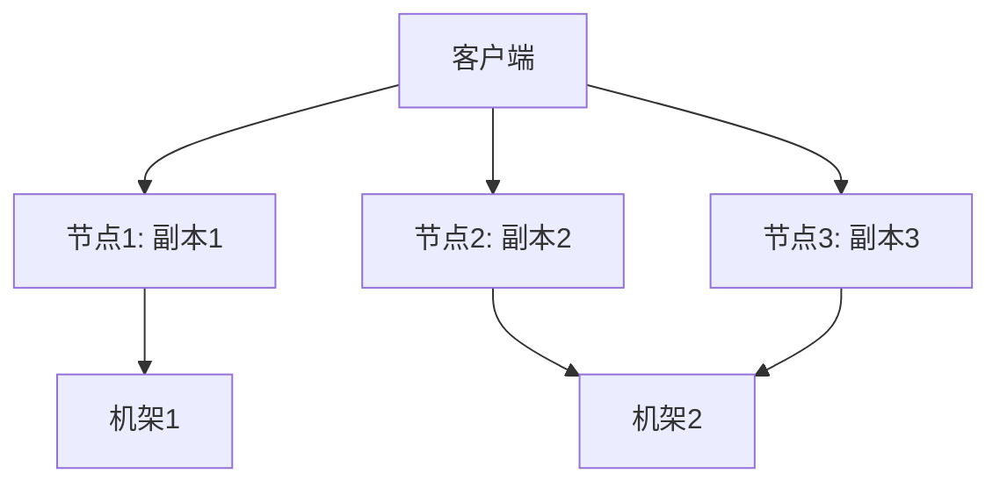

# HDFS 数据复制策略

Hadoop 分布式文件系统（HDFS）是 Hadoop 生态系统的核心组件之一，专为存储和处理大规模数据集而设计。HDFS 通过数据复制策略确保数据的高可用性和容错性。本文将详细介绍 HDFS 数据复制策略的工作原理、配置方式以及实际应用场景。

## 什么是 HDFS 数据复制策略？

HDFS 数据复制策略是 HDFS 用于确保数据可靠性和可用性的机制。HDFS 将文件分割成多个数据块（Block），并将这些数据块复制到集群中的多个节点上。默认情况下，每个数据块会被复制三份（即副本数为 3），分别存储在不同的节点上。这种复制策略可以有效防止数据丢失，并在节点故障时提供数据恢复能力。

### 为什么需要数据复制？

1. **容错性**：如果某个节点发生故障，其他节点上的副本可以继续提供服务。
2. **高可用性**：多个副本分布在不同的节点上，可以提高数据的访问速度。
3. **负载均衡**：通过将数据分布在多个节点上，可以平衡集群的负载。

---

## HDFS 数据复制策略的工作原理

### 1. 数据块的复制
HDFS 将文件分割成固定大小的数据块（默认大小为 128 MB）。每个数据块会被复制到多个节点上，副本的数量由配置参数 `dfs.replication` 决定。

### 2. 副本的放置策略
HDFS 采用智能的副本放置策略，以确保数据的高可用性和性能：
- **第一个副本**：存储在客户端所在的节点上（如果客户端在集群外，则随机选择一个节点）。
- **第二个副本**：存储在与第一个副本不同机架的节点上。
- **第三个副本**：存储在与第二个副本相同机架的另一个节点上。

这种策略可以最大限度地减少跨机架的网络传输，同时保证数据的可靠性。



### 3. 副本的管理
HDFS 会定期检查数据块的副本数量。如果某个副本丢失（例如节点故障），HDFS 会自动创建新的副本，以确保数据的完整性。

---

## 配置 HDFS 数据复制策略

HDFS 的副本数量可以通过配置文件或命令行进行设置。

### 1. 修改配置文件
在 `hdfs-site.xml` 中设置 `dfs.replication` 参数：

```xml
<property>
    <name>dfs.replication</name>
    <value>3</value>
</property>
```

### 2. 使用命令行
可以通过以下命令动态修改文件的副本数量：

```bash
hdfs dfs -setrep -w 2 /path/to/file
```

上述命令将 `/path/to/file` 的副本数量设置为 2。

---

## 实际应用场景

### 场景 1：数据备份
假设你有一个存储重要日志文件的 HDFS 集群。通过设置副本数为 3，即使某个节点发生故障，数据仍然可以从其他节点恢复。

### 场景 2：提高读取性能
在数据分析任务中，多个任务可能需要同时读取同一份数据。通过将数据复制到多个节点，可以提高读取性能，减少网络瓶颈。

---

## 总结

HDFS 数据复制策略是确保数据可靠性和高可用性的关键机制。通过将数据块复制到多个节点，HDFS 可以有效应对节点故障，并提高数据访问性能。初学者可以通过修改配置文件或使用命令行来调整副本数量，以满足不同的需求。

---

## 附加资源与练习

### 资源
- [HDFS 官方文档](https://hadoop.apache.org/docs/stable/hadoop-project-dist/hadoop-hdfs/HdfsDesign.html)
- 《Hadoop 权威指南》—— Tom White

### 练习
1. 在本地 Hadoop 集群中，尝试修改 `dfs.replication` 参数，并观察文件副本的变化。
2. 使用 `hdfs dfs -setrep` 命令动态调整某个文件的副本数量，并验证其效果。
3. 模拟节点故障，观察 HDFS 如何自动恢复丢失的副本。

:::tip
如果你在练习中遇到问题，可以参考 HDFS 日志文件（通常位于 `/var/log/hadoop-hdfs/`）来排查错误。
:::