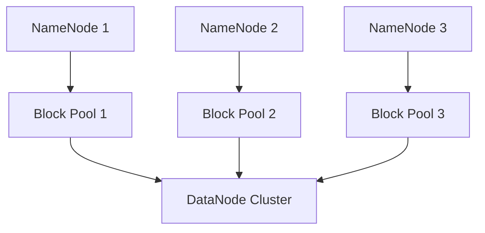

# HDFS联邦架构

## 介绍

HDFS（Hadoop Distributed File System）是Hadoop生态系统中的核心组件之一，用于存储和管理大规模数据。随着数据量的增长，传统的HDFS架构面临一些挑战，例如单点故障和元数据管理的瓶颈。为了解决这些问题，HDFS引入了**联邦架构**（Federation Architecture）。

HDFS联邦架构通过将元数据和数据存储分离，允许多个独立的命名空间（Namespace）共享同一个物理存储池。这种设计不仅提高了系统的可扩展性，还增强了系统的容错能力。

## HDFS联邦架构的核心概念

### 1. 命名空间（Namespace）
在HDFS联邦架构中，每个命名空间都是一个独立的逻辑文件系统，拥有自己的元数据（如目录结构和文件属性）。多个命名空间可以共享同一个物理存储池（Block Pool），但彼此之间是独立的。

### 2. 块池（Block Pool）
块池是存储实际数据块的逻辑单元。每个命名空间对应一个块池，块池中的数据块由DataNode管理。多个命名空间可以共享同一个DataNode集群，但每个命名空间的块池是独立的。

### 3. 命名空间卷（Namespace Volume）
命名空间卷是命名空间和块池的组合。每个命名空间卷都有自己的元数据和数据块存储。

### 4. 元数据服务（NameNode）
在联邦架构中，每个命名空间都有自己的NameNode来管理元数据。多个NameNode可以同时运行，彼此之间相互独立。

## HDFS联邦架构的工作原理

HDFS联邦架构的核心思想是将元数据和数据存储分离，并通过多个命名空间共享同一个物理存储池。以下是其工作原理的简要说明：

1. **多个命名空间**：每个命名空间都有自己的NameNode，负责管理该命名空间的元数据。
2. **共享DataNode**：所有命名空间共享同一个DataNode集群，DataNode负责存储实际的数据块。
3. **块池管理**：每个命名空间对应一个块池，块池中的数据块由DataNode管理。



## 实际应用场景

### 场景1：多租户环境
在大规模的多租户环境中，不同的用户或团队可能需要独立的文件系统。HDFS联邦架构允许每个租户拥有自己的命名空间，同时共享同一个物理存储资源。这种方式不仅提高了资源利用率，还简化了权限管理和数据隔离。

### 场景2：大规模数据存储
对于需要存储PB级甚至EB级数据的场景，传统的HDFS架构可能会遇到元数据管理的瓶颈。通过引入联邦架构，可以将元数据分散到多个NameNode中，从而提高系统的可扩展性和性能。

## 代码示例

以下是一个简单的HDFS联邦架构配置示例：

```xml
<configuration>
  <property>
    <name>dfs.nameservices</name>
    <value>ns1,ns2</value>
  </property>
  <property>
    <name>dfs.namenode.rpc-address.ns1</name>
    <value>namenode1:8020</value>
  </property>
  <property>
    <name>dfs.namenode.rpc-address.ns2</name>
    <value>namenode2:8020</value>
  </property>
  <property>
    <name>dfs.namenode.http-address.ns1</name>
    <value>namenode1:50070</value>
  </property>
  <property>
    <name>dfs.namenode.http-address.ns2</name>
    <value>namenode2:50070</value>
  </property>
</configuration>
```

:::note
在配置HDFS联邦架构时，确保每个命名空间的NameNode和DataNode配置正确，以避免数据访问冲突。
:::

## 总结

HDFS联邦架构通过将元数据和数据存储分离，解决了传统HDFS架构中的单点故障和元数据管理瓶颈问题。它允许多个命名空间共享同一个物理存储池，从而提高了系统的可扩展性和容错能力。联邦架构特别适用于多租户环境和大规模数据存储场景。

## 附加资源与练习

### 附加资源
- [HDFS官方文档](https://hadoop.apache.org/docs/stable/hadoop-project-dist/hadoop-hdfs/HdfsDesign.html)
- 《Hadoop权威指南》—— Tom White

### 练习
1. 尝试在本地Hadoop集群中配置HDFS联邦架构，并验证多个命名空间的独立性。
2. 编写一个脚本，模拟多租户环境下的数据存储和访问。

:::tip
如果你在配置过程中遇到问题，可以参考Hadoop社区论坛或官方文档获取帮助。
:::