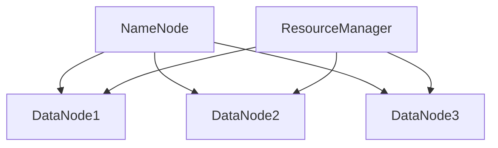

# Hadoop 集群规划

Hadoop是一个分布式计算框架，广泛用于大数据处理。为了确保Hadoop集群的高效运行，合理的集群规划至关重要。本文将详细介绍如何规划和设计一个Hadoop集群，涵盖硬件选择、节点配置、网络拓扑等方面。

## 1. 什么是Hadoop集群规划？

Hadoop集群规划是指在部署Hadoop集群之前，对硬件资源、网络架构和软件配置进行详细设计和规划的过程。合理的规划可以确保集群的性能、可扩展性和容错性。

## 2. 硬件选择

### 2.1 主节点（Master Node）

主节点负责管理整个集群，通常包括以下组件：

- **NameNode**：管理HDFS的元数据。
- **ResourceManager**：管理YARN的资源分配。

主节点需要较高的CPU和内存资源，建议使用高性能的服务器。

### 2.2 数据节点（Data Node）

数据节点负责存储实际数据并执行计算任务。数据节点的硬件配置应根据数据量和计算需求进行选择。

- **CPU**：多核处理器，建议至少8核。
- **内存**：建议至少32GB。
- **存储**：使用大容量硬盘，建议使用SSD以提高I/O性能。

### 2.3 网络配置

Hadoop集群对网络带宽要求较高，建议使用千兆或万兆以太网。确保网络拓扑结构合理，避免单点故障。



## 3. 节点配置

### 3.1 NameNode配置

NameNode是HDFS的核心组件，负责管理文件系统的元数据。建议将NameNode部署在独立的服务器上，并配置高可用性（HA）。

```xml
<configuration>
    <property>
        <name>dfs.namenode.rpc-address</name>
        <value>namenode:8020</value>
    </property>
    <property>
        <name>dfs.namenode.http-address</name>
        <value>namenode:50070</value>
    </property>
</configuration>
```

### 3.2 DataNode配置

DataNode负责存储数据块，并执行数据读写操作。每个DataNode的配置应保持一致，以确保负载均衡。

```xml
<configuration>
    <property>
        <name>dfs.datanode.data.dir</name>
        <value>/data/hadoop/hdfs/datanode</value>
    </property>
</configuration>
```

## 4. 网络拓扑

合理的网络拓扑设计可以提高集群的性能和可靠性。建议采用树形或星形拓扑结构，确保每个节点之间的通信延迟最小。

:::tip
在设计网络拓扑时，考虑使用冗余链路和交换机，以提高网络的容错性。
:::

## 5. 实际案例

假设我们有一个需要处理100TB数据的Hadoop集群，以下是我们的规划：

- **主节点**：2台高性能服务器，分别运行NameNode和ResourceManager。
- **数据节点**：10台服务器，每台配置32核CPU、64GB内存和10TB存储。
- **网络**：千兆以太网，采用星形拓扑结构。

通过合理的规划，该集群能够高效处理大规模数据，并具备良好的可扩展性。

## 6. 总结

Hadoop集群规划是确保集群高效运行的关键步骤。通过合理的硬件选择、节点配置和网络拓扑设计，可以构建一个高性能、可扩展的Hadoop集群。

## 7. 附加资源

- [Hadoop官方文档](https://hadoop.apache.org/docs/current/)
- 《Hadoop权威指南》—— Tom White

## 8. 练习

1. 设计一个处理50TB数据的Hadoop集群，列出所需的硬件配置和网络拓扑。
2. 在本地虚拟机中部署一个小型Hadoop集群，并测试其性能。

:::caution
在实际部署Hadoop集群时，务必进行充分的测试和性能调优，以确保集群的稳定性和高效性。
:::