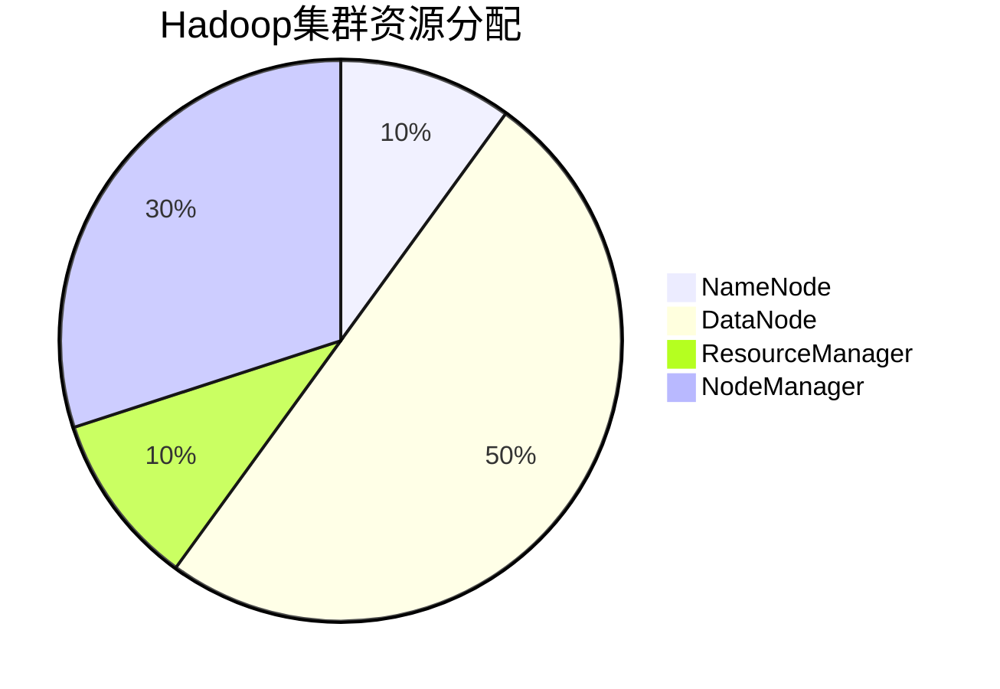

## 介绍

Hadoop资源规划是构建和运维Hadoop集群的关键步骤之一。它涉及为集群中的各个组件（如NameNode、DataNode、ResourceManager、NodeManager等）分配适当的硬件资源（如CPU、内存、存储和网络带宽）。合理的资源规划能够确保集群在高负载下仍能高效运行，同时避免资源浪费。

在本教程中，我们将逐步讲解Hadoop资源规划的核心概念，并通过实际案例展示如何为不同规模的集群进行资源分配。

---

## Hadoop 集群的核心组件

在开始资源规划之前，我们需要了解Hadoop集群的核心组件及其资源需求：

1. **NameNode**：负责管理HDFS的元数据，需要较高的内存和稳定的存储。
2. **DataNode**：存储实际数据，需要大量的磁盘空间和适度的CPU与内存。
3. **ResourceManager**：管理集群资源调度，需要较高的CPU和内存。
4. **NodeManager**：在每个节点上管理资源，需要适度的CPU和内存。

:::tip
**提示**：NameNode和ResourceManager是单点故障（SPOF），建议为它们配置高可用性（HA）。
:::

---

## 资源规划的关键因素

### 1. 数据量
数据量是决定集群规模的主要因素。你需要根据以下公式估算存储需求：

```
总存储需求 = 原始数据量 × 副本因子（通常为3）
```

例如，如果你有1TB的原始数据，副本因子为3，那么总存储需求为3TB。

### 2. 计算需求
计算需求取决于作业的类型和频率。例如，批处理作业（如MapReduce）需要更多的CPU资源，而实时处理作业（如Spark Streaming）则需要更高的内存。

### 3. 网络带宽
Hadoop集群中的数据传输非常频繁，因此网络带宽是一个关键因素。建议使用高速网络（如10GbE）以减少数据传输的瓶颈。

### 4. 硬件配置
以下是一个典型的Hadoop节点硬件配置示例：

| 组件       | CPU  | 内存  | 存储       |
|------------|------|-------|------------|
| NameNode   | 8核  | 64GB  | 1TB SSD    |
| DataNode   | 16核 | 128GB | 10TB HDD   |
| ResourceManager | 8核  | 32GB  | 500GB SSD  |
| NodeManager | 16核 | 64GB  | 1TB HDD    |

:::caution
**注意**：以上配置仅供参考，实际需求可能因业务场景而异。
:::

---

## 实际案例：中小型集群资源规划

假设我们需要为一个中小型企业规划Hadoop集群，以下是具体需求：

- 原始数据量：10TB
- 作业类型：批处理（MapReduce）和实时处理（Spark Streaming）
- 副本因子：3
- 集群规模：10个节点

### 1. 存储需求
```
总存储需求 = 10TB × 3 = 30TB
```
每个DataNode需要存储约3TB的数据。

### 2. 计算需求
- 批处理作业需要较高的CPU资源，因此每个NodeManager配置16核CPU。
- 实时处理作业需要较高的内存，因此每个NodeManager配置64GB内存。

### 3. 网络需求
建议使用10GbE网络，以确保数据传输效率。

### 4. 硬件配置
以下是每个节点的硬件配置：

| 组件       | CPU  | 内存  | 存储       |
|------------|------|-------|------------|
| NameNode   | 8核  | 64GB  | 1TB SSD    |
| DataNode   | 16核 | 64GB  | 3TB HDD    |
| ResourceManager | 8核  | 32GB  | 500GB SSD  |
| NodeManager | 16核 | 64GB  | 1TB HDD    |

---

## 资源分配的可视化

以下是一个简单的Mermaid图表，展示了资源分配的逻辑：



---

## 总结

Hadoop资源规划是确保集群高效运行的关键步骤。通过合理分配CPU、内存、存储和网络资源，你可以构建一个稳定且高性能的Hadoop集群。在实际操作中，建议根据业务需求灵活调整资源配置，并定期监控集群性能以优化资源利用率。

---

## 附加资源与练习

### 附加资源
- [Hadoop官方文档](https://hadoop.apache.org/docs/stable/)
- 《Hadoop权威指南》——Tom White

### 练习
1. 假设你有一个20TB的原始数据集，副本因子为3，请计算总存储需求。
2. 设计一个适合处理实时数据（如日志分析）的Hadoop集群资源规划方案。
3. 使用Mermaid绘制一个资源分配图表，展示NameNode、DataNode、ResourceManager和NodeManager的资源占比。

:::note
**提示**：完成练习后，可以尝试在实际环境中部署一个小型Hadoop集群，验证你的资源规划方案。
:::