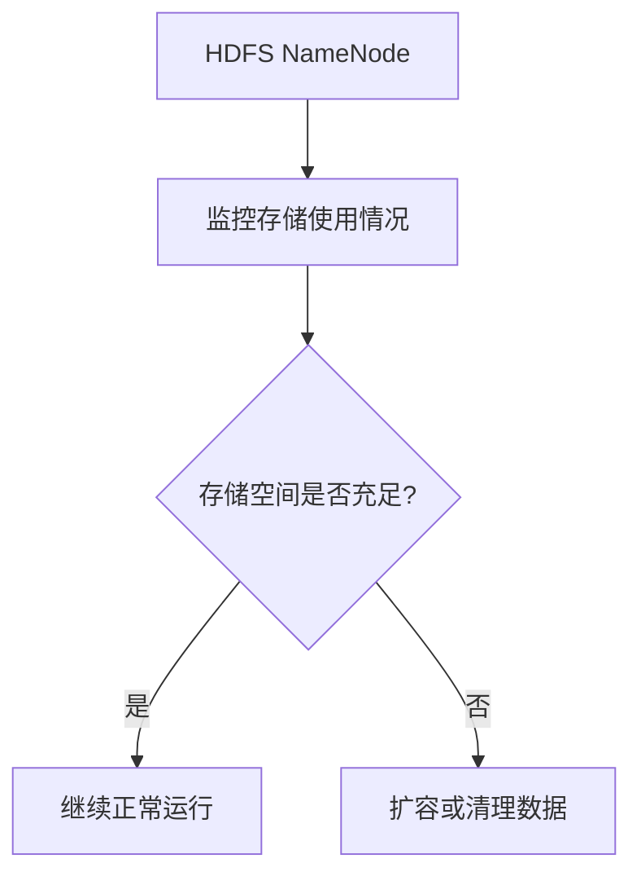
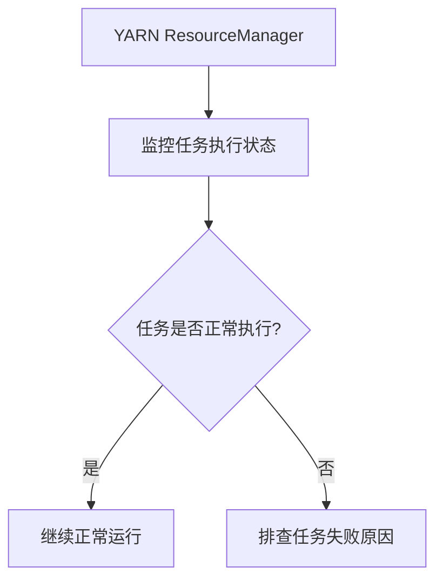

# Hadoop 监控系统

Hadoop是一个分布式计算框架，广泛应用于大数据处理。随着集群规模的扩大，监控Hadoop集群的健康状态和性能变得至关重要。Hadoop监控系统可以帮助运维人员实时了解集群的运行情况，及时发现和解决问题，确保集群的高效运行。

## 什么是Hadoop监控系统？

Hadoop监控系统是一组工具和技术的集合，用于实时监控Hadoop集群的各项指标，如资源使用情况、任务执行状态、节点健康状况等。通过监控系统，运维人员可以快速发现集群中的瓶颈、故障或异常行为，并采取相应的措施。

## Hadoop 监控系统的主要功能

1. **资源监控**：监控集群中各个节点的CPU、内存、磁盘和网络资源的使用情况。
2. **任务监控**：跟踪MapReduce、Spark等任务的执行状态和进度。
3. **节点健康监控**：检测集群中各个节点的健康状况，及时发现故障节点。
4. **日志管理**：收集和分析集群中各个组件的日志，帮助排查问题。
5. **报警系统**：当集群出现异常时，及时通知运维人员。

## 常用的Hadoop监控工具

### 1. Ambari

Apache Ambari是一个开源的Hadoop集群管理工具，提供了直观的Web界面，用于监控和管理Hadoop集群。Ambari可以监控HDFS、YARN、HBase等组件的状态，并提供详细的性能指标。

#### 示例：使用Ambari监控HDFS

```bash
# 启动Ambari服务
ambari-server start
```

在Ambari的Web界面中，你可以查看HDFS的存储使用情况、数据节点状态等信息。

### 2. Ganglia

Ganglia是一个分布式监控系统，适用于大规模集群。它可以收集和展示集群中各个节点的资源使用情况，如CPU、内存、磁盘和网络。

#### 示例：使用Ganglia监控集群资源

```bash
# 启动Ganglia监控服务
service ganglia-monitor start
```

通过Ganglia的Web界面，你可以查看集群中各个节点的资源使用情况。

### 3. Nagios

Nagios是一个强大的监控工具，支持自定义监控项和报警规则。它可以监控Hadoop集群中的各种服务，并在服务出现问题时发送报警。

#### 示例：使用Nagios监控Hadoop服务

```bash
# 配置Nagios监控Hadoop服务
define service {
    use                 generic-service
    host_name           hadoop-node1
    service_description HDFS NameNode
    check_command       check_hdfs_namenode
}
```

在Nagios的Web界面中，你可以查看Hadoop服务的状态，并设置报警规则。

## 实际应用场景

### 场景1：监控HDFS存储使用情况

在一个大型Hadoop集群中，HDFS的存储使用情况是一个关键指标。通过监控HDFS的存储使用情况，运维人员可以及时发现存储空间不足的问题，并采取扩容或清理数据的措施。



### 场景2：监控YARN任务执行状态

在运行大规模数据处理任务时，YARN的任务执行状态是一个重要的监控指标。通过监控YARN的任务执行状态，运维人员可以及时发现任务失败或延迟的问题，并采取相应的措施。



## 总结

Hadoop监控系统是确保Hadoop集群高效运行的关键工具。通过使用Ambari、Ganglia、Nagios等监控工具，运维人员可以实时了解集群的健康状态和性能指标，及时发现和解决问题。掌握Hadoop监控系统的使用，对于初学者来说是一个重要的技能。

## 附加资源

- [Apache Ambari官方文档](https://ambari.apache.org/)
- [Ganglia官方文档](http://ganglia.sourceforge.net/)
- [Nagios官方文档](https://www.nagios.org/)

## 练习

1. 在你的Hadoop集群中安装并配置Ambari，尝试监控HDFS和YARN的状态。
2. 使用Ganglia监控集群中各个节点的资源使用情况，并分析监控数据。
3. 配置Nagios监控Hadoop服务，并设置报警规则，模拟服务故障，观察报警是否生效。
