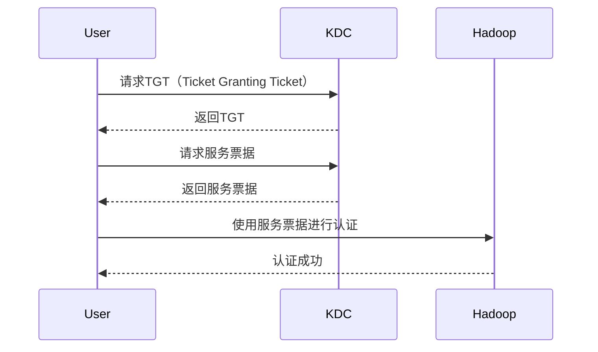

## 介绍

Hadoop是一个广泛使用的分布式计算框架，用于处理大规模数据集。随着数据量的增加和数据敏感性的提高，Hadoop的安全性变得至关重要。Hadoop安全架构旨在保护数据免受未经授权的访问、篡改和泄露。本文将详细介绍Hadoop的安全架构，帮助初学者理解其核心概念和实际应用。

## Hadoop 安全架构的核心组件

Hadoop安全架构主要由以下几个核心组件组成：

1. **认证（Authentication）**：确保用户或系统的身份是合法的。
2. **授权（Authorization）**：控制用户或系统对资源的访问权限。
3. **数据加密（Data Encryption）**：保护数据在传输和存储过程中的安全性。
4. **审计（Auditing）**：记录和监控系统的操作，以便检测和响应安全事件。

### 认证

Hadoop使用Kerberos进行认证。Kerberos是一种网络认证协议，通过使用票据（tickets）来验证用户和服务的身份。以下是一个简单的Kerberos认证流程：



### 授权

Hadoop使用访问控制列表（ACLs）和基于角色的访问控制（RBAC）来管理用户对资源的访问权限。以下是一个简单的ACL配置示例：

```xml
<property>
    <name>hadoop.security.authorization</name>
    <value>true</value>
</property>
<property>
    <name>hadoop.security.group.mapping</name>
    <value>org.apache.hadoop.security.LdapGroupsMapping</value>
</property>
```

### 数据加密

Hadoop支持数据传输和存储的加密。数据传输加密通常使用SSL/TLS协议，而数据存储加密则使用HDFS的透明数据加密（TDE）功能。以下是一个启用HDFS加密的配置示例：

```xml
<property>
    <name>dfs.encryption.data.transfer</name>
    <value>true</value>
</property>
<property>
    <name>dfs.encryption.data.transfer.cipher.suites</name>
    <value>AES/CTR/NoPadding</value>
</property>
```

### 审计

Hadoop的审计功能通过记录用户操作和系统事件来实现。审计日志可以用于检测和响应安全事件。以下是一个启用审计日志的配置示例：

```xml
<property>
    <name>hadoop.security.audit.logger</name>
    <value>INFO,audit</value>
</property>
<property>
    <name>hadoop.security.audit.log.file</name>
    <value>/var/log/hadoop-audit.log</value>
</property>
```

## 实际案例

假设一个公司使用Hadoop来处理客户数据。为了保护客户隐私，公司需要确保只有授权人员可以访问这些数据。以下是实现这一目标的步骤：

1. **配置Kerberos认证**：确保所有用户和服务都必须通过Kerberos认证。
2. **设置ACLs**：为不同的用户组设置访问控制列表，限制对敏感数据的访问。
3. **启用数据加密**：使用SSL/TLS加密数据传输，并启用HDFS的透明数据加密功能。
4. **启用审计日志**：记录所有用户操作和系统事件，以便在发生安全事件时进行追溯。

## 总结

Hadoop安全架构通过认证、授权、数据加密和审计等机制，确保数据在分布式环境中的安全性。理解这些核心组件及其配置方法，对于保护Hadoop集群中的数据至关重要。

## 附加资源

- [Hadoop官方文档](https://hadoop.apache.org/docs/current/)
- [Kerberos认证指南](https://web.mit.edu/kerberos/)
- [HDFS透明数据加密](https://hadoop.apache.org/docs/current/hadoop-project-dist/hadoop-hdfs/TransparentEncryption.html)

## 练习

1. 配置一个简单的Kerberos认证环境，并测试其功能。
2. 为HDFS设置ACLs，限制不同用户组的访问权限。
3. 启用HDFS的透明数据加密功能，并验证数据加密是否生效。
4. 配置审计日志，并分析日志内容以检测潜在的安全事件。
