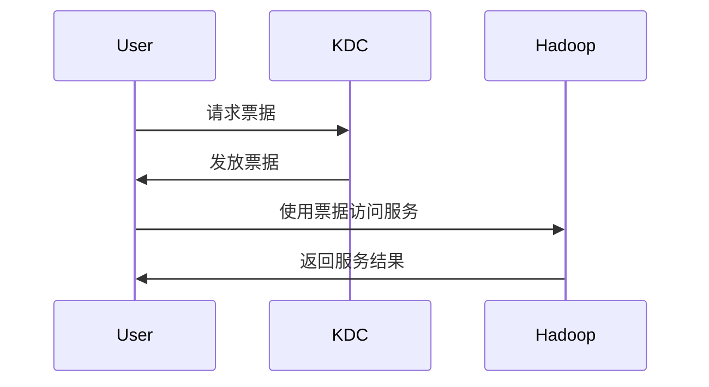

# Hadoop 安全工具

Hadoop作为一个分布式计算框架，广泛应用于大数据处理。然而，随着数据规模的增大，安全性问题也日益突出。为了保护Hadoop集群免受未经授权的访问和数据泄露，Hadoop提供了一系列安全工具和机制。本文将详细介绍这些工具，并通过实际案例展示它们的使用场景。

## 1. Hadoop安全机制概述

Hadoop的安全机制主要包括以下几个方面：

- **身份验证（Authentication）**：确保用户身份的真实性。
- **授权（Authorization）**：控制用户对资源的访问权限。
- **数据加密（Data Encryption）**：保护数据在传输和存储过程中的安全性。
- **审计（Auditing）**：记录用户操作，便于事后审查。

## 2. Hadoop安全工具

### 2.1 Kerberos

Kerberos是Hadoop中最常用的身份验证工具。它通过票据（Ticket）机制来验证用户身份，确保只有经过授权的用户才能访问Hadoop集群。

#### 2.1.1 Kerberos工作原理

Kerberos的工作原理可以分为以下几个步骤：

1. **用户登录**：用户向Kerberos认证服务器（KDC）请求票据。
2. **票据获取**：KDC验证用户身份后，发放票据。
3. **服务访问**：用户使用票据访问Hadoop服务。



#### 2.1.2 配置Kerberos

在Hadoop中配置Kerberos需要修改`core-site.xml`和`hdfs-site.xml`文件：

```xml
<configuration>
    <property>
        <name>hadoop.security.authentication</name>
        <value>kerberos</value>
    </property>
    <property>
        <name>hadoop.security.authorization</name>
        <value>true</value>
    </property>
</configuration>
```

### 2.2 Apache Ranger

Apache Ranger是一个集中式的安全管理框架，用于管理Hadoop生态系统中的访问控制策略。它支持细粒度的权限控制，并提供了审计功能。

#### 2.2.1 Ranger的主要功能

- **策略管理**：定义和管理访问控制策略。
- **审计日志**：记录用户操作，便于审计。
- **插件支持**：支持HDFS、Hive、HBase等组件的安全管理。

#### 2.2.2 配置Ranger

在Hadoop中集成Ranger需要安装Ranger插件，并配置相关策略。以下是一个简单的HDFS策略配置示例：

```json
{
    "policyName": "hdfs-policy",
    "resources": {
        "path": "/user/data"
    },
    "policyItems": [
        {
            "accesses": [
                {
                    "type": "read",
                    "isAllowed": true
                }
            ],
            "users": ["user1"],
            "groups": ["group1"]
        }
    ]
}
```

### 2.3 Apache Knox

Apache Knox是一个网关服务，用于保护Hadoop集群的REST API。它通过代理机制隐藏集群的内部细节，并提供身份验证和授权功能。

#### 2.3.1 Knox的主要功能

- **API保护**：保护Hadoop REST API免受未经授权的访问。
- **身份验证**：支持多种身份验证机制，如LDAP、OAuth等。
- **路由和负载均衡**：提供请求路由和负载均衡功能。

#### 2.3.2 配置Knox

在Hadoop中配置Knox需要安装Knox网关，并配置相关服务。以下是一个简单的Knox配置示例：

```xml
<gateway>
    <provider>
        <role>authentication</role>
        <name>ShiroProvider</name>
        <enabled>true</enabled>
    </provider>
</gateway>
```

## 3. 实际案例

### 3.1 使用Kerberos保护HDFS

假设我们有一个HDFS集群，存储了敏感数据。为了保护这些数据，我们使用Kerberos进行身份验证。以下是配置步骤：

1. **安装Kerberos**：在集群中安装Kerberos服务器。
2. **配置Hadoop**：修改`core-site.xml`和`hdfs-site.xml`文件，启用Kerberos认证。
3. **创建Kerberos主体**：为HDFS服务创建Kerberos主体。
4. **分发密钥表**：将密钥表分发到各个节点。

### 3.2 使用Ranger管理Hive权限

假设我们有一个Hive数据仓库，存储了多个部门的数据。为了控制各部门的访问权限，我们使用Ranger进行权限管理。以下是配置步骤：

1. **安装Ranger**：在集群中安装Ranger服务。
2. **配置Hive插件**：安装并配置Ranger Hive插件。
3. **创建策略**：在Ranger中创建Hive访问控制策略。
4. **测试策略**：验证策略是否生效。

## 4. 总结

Hadoop提供了多种安全工具，帮助用户保护大数据平台的安全性。通过Kerberos、Ranger和Knox等工具，用户可以有效地进行身份验证、权限管理和API保护。在实际应用中，根据具体需求选择合适的工具，并合理配置，可以大大提高Hadoop集群的安全性。

## 5. 附加资源

- [Hadoop官方文档](https://hadoop.apache.org/docs/current/)
- [Kerberos官方文档](https://web.mit.edu/kerberos/)
- [Apache Ranger官方文档](https://ranger.apache.org/)
- [Apache Knox官方文档](https://knox.apache.org/)

## 6. 练习

1. **配置Kerberos**：尝试在一个小型Hadoop集群中配置Kerberos，并验证其身份验证功能。
2. **使用Ranger管理HDFS权限**：在HDFS中创建一个目录，并使用Ranger配置访问控制策略。
3. **集成Knox**：在一个Hadoop集群中集成Knox网关，并测试其API保护功能。

通过以上练习，您将更深入地理解Hadoop安全工具的使用方法和实际应用场景。