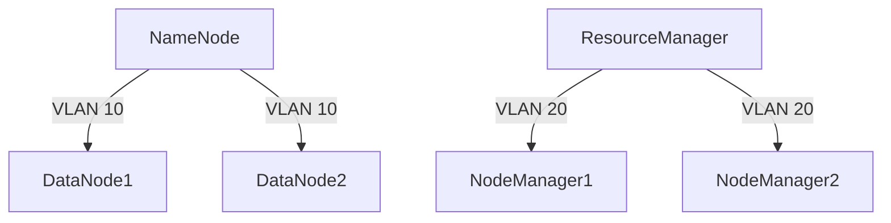

## 介绍

Hadoop是一个分布式计算框架，广泛应用于大数据处理。随着数据规模的增大和集群的扩展，网络安全问题变得尤为重要。**网络隔离**是Hadoop安全机制中的关键部分，它通过限制不同网络之间的通信，防止未经授权的访问和数据泄露。

网络隔离的核心思想是将集群中的不同组件（如NameNode、DataNode、ResourceManager等）划分到不同的网络区域中，确保只有经过授权的组件才能相互通信。这种隔离可以有效减少攻击面，提升集群的整体安全性。

## 为什么需要网络隔离？

在大数据环境中，Hadoop集群通常由多个节点组成，这些节点可能分布在不同的物理或虚拟网络中。如果没有网络隔离，攻击者可能通过一个节点的漏洞入侵整个集群。网络隔离可以：

- 限制攻击者的横向移动。
- 防止敏感数据泄露。
- 确保关键组件的安全性。

## Hadoop 网络隔离的实现方式

Hadoop网络隔离主要通过以下几种方式实现：

### 1. 防火墙规则

防火墙是网络隔离的基础工具。通过配置防火墙规则，可以限制不同节点之间的通信。例如，只允许NameNode与DataNode之间的通信，而阻止其他不必要的流量。

```bash
# 示例：使用iptables限制DataNode只能与NameNode通信
iptables -A INPUT -p tcp --dport 50010 -s namenode_ip -j ACCEPT
iptables -A INPUT -p tcp --dport 50010 -j DROP
```

### 2. 虚拟局域网（VLAN）

VLAN技术可以将物理网络划分为多个逻辑网络。通过将Hadoop集群的不同组件分配到不同的VLAN中，可以实现网络隔离。



### 3. 网络安全组（Security Groups）

在云环境中，网络安全组是一种常见的网络隔离方式。通过配置安全组规则，可以控制不同实例之间的网络流量。

```bash
# 示例：AWS安全组规则
- Type: SSH
  Protocol: TCP
  Port Range: 22
  Source: 192.168.1.0/24
- Type: Custom TCP
  Protocol: TCP
  Port Range: 50070
  Source: 10.0.0.0/16
```

## 实际案例

假设我们有一个Hadoop集群，包含以下组件：

- NameNode
- DataNode
- ResourceManager
- NodeManager

为了提升安全性，我们可以将NameNode和ResourceManager放在一个高安全级别的VLAN中，而将DataNode和NodeManager放在另一个VLAN中。通过防火墙规则，我们只允许NameNode与DataNode之间的通信，以及ResourceManager与NodeManager之间的通信。


## 总结

网络隔离是Hadoop安全机制中的重要组成部分。通过防火墙规则、VLAN和网络安全组等技术，可以有效限制不同组件之间的通信，提升集群的安全性。在实际应用中，网络隔离需要根据具体的业务需求和安全策略进行配置。

## 附加资源

- [Hadoop官方文档](https://hadoop.apache.org/docs/current/)
- [网络安全基础](https://www.cisco.com/c/en/us/products/security/what-is-network-security.html)
- [AWS安全组配置指南](https://docs.aws.amazon.com/vpc/latest/userguide/VPC_SecurityGroups.html)

## 练习

1. 在你的本地环境中配置一个简单的Hadoop集群，并尝试使用iptables实现网络隔离。
2. 在云环境中创建一个Hadoop集群，并使用网络安全组限制不同实例之间的通信。
3. 研究VLAN技术，并尝试在虚拟化环境中为Hadoop集群配置VLAN。

:::tip
在配置网络隔离时，务必测试所有规则，确保不会影响正常的集群通信。
:::