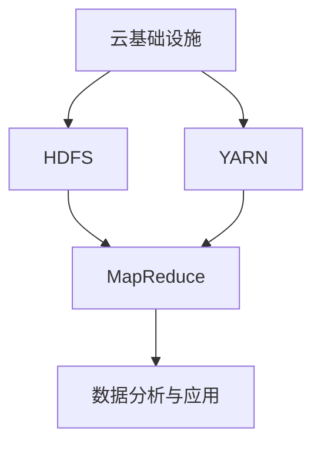

# Hadoop 云平台概述

Hadoop是一个开源的分布式计算框架，专为处理大规模数据集而设计。它能够在成百上千台服务器上并行处理数据，适用于大数据存储、处理和分析。随着云计算的普及，Hadoop云平台成为了许多企业和开发者的首选，因为它提供了弹性、可扩展性和成本效益。

本文将带你了解Hadoop云平台的基本概念、架构及其在实际中的应用场景。

---

## 什么是Hadoop云平台？

Hadoop云平台是将Hadoop生态系统部署在云基础设施上的解决方案。它利用云计算的资源池化、弹性扩展和按需付费等特性，使Hadoop能够更高效地运行。通过云平台，用户可以轻松地扩展集群规模，而无需担心硬件维护和资源浪费。

:::tip
Hadoop云平台的核心优势在于其灵活性和成本效益。用户可以根据需求动态调整资源，避免资源浪费。
:::

---

## Hadoop 云平台的架构

Hadoop云平台的架构通常包括以下几个核心组件：

1. **HDFS（Hadoop Distributed File System）**：分布式文件系统，用于存储大规模数据集。
2. **YARN（Yet Another Resource Negotiator）**：资源管理框架，负责集群资源的调度和管理。
3. **MapReduce**：分布式计算模型，用于处理和分析存储在HDFS中的数据。
4. **云基础设施**：如AWS、Azure、Google Cloud等，提供计算、存储和网络资源。

以下是一个典型的Hadoop云平台架构图：



---

## Hadoop 云平台的核心优势

1. **弹性扩展**：云平台允许用户根据需求动态调整集群规模，无需预先购买硬件。
2. **成本效益**：按需付费模式避免了资源浪费，降低了运维成本。
3. **高可用性**：云平台通常提供高可用性和容错机制，确保数据安全和系统稳定。
4. **易于管理**：云服务提供商通常提供自动化工具，简化了集群的部署和管理。

---

## 实际应用场景

### 案例1：日志分析

一家电商公司每天生成数TB的日志数据。通过将Hadoop部署在云平台上，他们可以快速处理这些日志，分析用户行为，优化推荐系统。

### 案例2：基因组数据分析

生物科技公司利用Hadoop云平台处理大规模的基因组数据，加速药物研发和疾病研究。

---

## 代码示例：在云平台上启动Hadoop集群

以下是一个简单的示例，展示如何在AWS上使用EMR（Elastic MapReduce）启动一个Hadoop集群：

```bash
# 使用AWS CLI创建EMR集群
aws emr create-cluster \
    --name "MyHadoopCluster" \
    --release-label emr-6.5.0 \
    --applications Name=Hadoop \
    --ec2-attributes KeyName=my-key-pair \
    --instance-type m5.xlarge \
    --instance-count 3 \
    --use-default-roles
```

**输入**：上述命令将创建一个包含3个节点的Hadoop集群。<br />
**输出**：集群创建成功后，AWS会返回集群ID，用户可以通过控制台或CLI管理集群。

---

## 总结

Hadoop云平台为大数据处理提供了强大的支持，结合云计算的弹性与成本效益，使其成为现代数据处理的理想选择。通过本文，你已经了解了Hadoop云平台的基本概念、架构及其实际应用场景。

---

## 附加资源与练习

1. **资源**：
   - [Hadoop官方文档](https://hadoop.apache.org/docs/stable/)
   - [AWS EMR入门指南](https://docs.aws.amazon.com/emr/latest/ManagementGuide/emr-gs.html)
2. **练习**：
   - 在AWS或Google Cloud上创建一个Hadoop集群，并尝试运行一个简单的MapReduce任务。
   - 使用HDFS存储数据，并通过YARN调度资源。

:::caution
在云平台上运行Hadoop时，请务必监控资源使用情况，以避免不必要的费用。
:::