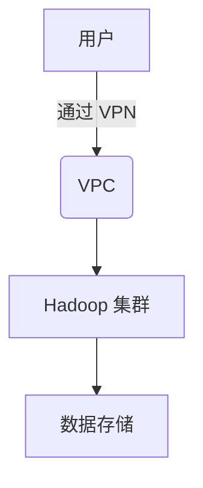

# Hadoop 云端安全

在现代大数据生态系统中，Hadoop 是一个广泛使用的分布式计算框架。随着越来越多的企业将 Hadoop 部署到云端，确保数据的安全性变得至关重要。本文将介绍 Hadoop 在云端部署时的安全措施，帮助初学者理解如何保护数据免受未经授权的访问和潜在威胁。

## 什么是Hadoop云端安全？

Hadoop 云端安全是指在云环境中部署 Hadoop 集群时，采取的一系列措施来保护数据、计算资源和网络通信。这些措施包括身份验证、授权、数据加密、访问控制和审计等。通过实施这些安全措施，可以确保 Hadoop 集群在云端运行时，数据不会被泄露、篡改或丢失。

## 关键安全概念

### 1. 身份验证（Authentication）

身份验证是确认用户身份的过程。在 Hadoop 中，通常使用 Kerberos 进行身份验证。Kerberos 是一种网络认证协议，通过使用票据（tickets）来验证用户和服务。

```bash
# 示例：使用 Kerberos 进行身份验证
kinit username@REALM
```

### 2. 授权（Authorization）

授权是确定用户是否有权限访问特定资源的过程。Hadoop 使用访问控制列表（ACLs）和基于角色的访问控制（RBAC）来管理权限。

```xml
<!-- 示例：HDFS 中的 ACL 配置 -->
<property>
  <name>dfs.namenode.acls.enabled</name>
  <value>true</value>
</property>
```

### 3. 数据加密（Data Encryption）

数据加密是保护数据在传输和存储过程中不被窃取或篡改的关键措施。Hadoop 支持数据传输加密（TLS/SSL）和数据存储加密（HDFS 加密区域）。

```bash
# 示例：启用 HDFS 加密区域
hdfs crypto -createZone -keyName mykey -path /encrypted_zone
```

### 4. 访问控制（Access Control）

访问控制是通过防火墙、安全组和网络隔离等手段，限制对 Hadoop 集群的访问。在云端，可以使用虚拟私有云（VPC）和安全组来实现网络隔离。



### 5. 审计（Auditing）

审计是记录和监控用户活动的过程，以便在发生安全事件时进行追溯。Hadoop 提供了审计日志功能，可以记录所有对 HDFS 和 YARN 的访问。

```xml
<!-- 示例：启用 HDFS 审计日志 -->
<property>
  <name>dfs.namenode.audit.loggers</name>
  <value>org.apache.hadoop.hdfs.server.namenode.audit.Log4jAuditLogger</value>
</property>
```

## 实际案例

### 案例：金融行业的数据保护

一家金融机构在云端部署了 Hadoop 集群，用于处理客户的交易数据。为了确保数据安全，他们采取了以下措施：

1. **身份验证**：使用 Kerberos 对所有用户和服务进行身份验证。
2. **授权**：通过 ACLs 和 RBAC 限制用户对敏感数据的访问。
3. **数据加密**：启用 HDFS 加密区域，确保数据在存储时被加密。
4. **访问控制**：使用 VPC 和安全组限制对 Hadoop 集群的网络访问。
5. **审计**：启用审计日志，记录所有对 HDFS 和 YARN 的访问。

通过这些措施，该金融机构成功保护了客户的交易数据，避免了数据泄露和未经授权的访问。

## 总结

Hadoop 云端安全是确保数据在云环境中安全存储和处理的关键。通过实施身份验证、授权、数据加密、访问控制和审计等措施，可以有效保护 Hadoop 集群免受安全威胁。对于初学者来说，理解这些基本概念是迈向安全部署 Hadoop 的第一步。

## 附加资源

- [Hadoop 官方文档](https://hadoop.apache.org/docs/current/)
- [Kerberos 身份验证指南](https://web.mit.edu/kerberos/)
- [HDFS 加密区域配置](https://hadoop.apache.org/docs/current/hadoop-project-dist/hadoop-hdfs/TransparentEncryption.html)

## 练习

1. 在你的本地 Hadoop 集群中启用 Kerberos 身份验证。
2. 配置 HDFS 加密区域，并尝试存储和读取加密数据。
3. 使用 VPC 和安全组在云端部署一个简单的 Hadoop 集群，并限制网络访问。

通过这些练习，你将更深入地理解 Hadoop 云端安全的关键概念和实践。