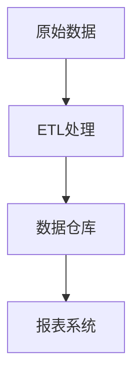

## 介绍

在大数据生态系统中，**元数据**是指描述数据的数据。它提供了关于数据的上下文信息，例如数据的来源、格式、结构、存储位置以及数据之间的关系。**Hadoop元数据管理**是指在Hadoop生态系统中，对元数据进行收集、存储、管理和使用的过程。有效的元数据管理可以帮助用户更好地理解、查找和使用数据，从而提高数据治理的效率。

在Hadoop中，元数据管理通常涉及以下内容：
- **数据表的元数据**：如表名、列名、数据类型、分区信息等。
- **数据存储的元数据**：如文件路径、文件大小、存储格式等。
- **数据血缘关系**：描述数据的来源、转换过程以及最终去向。
- **数据访问权限**：记录谁可以访问哪些数据。

## Hadoop 元数据管理工具

Hadoop生态系统中有多种工具可以用于元数据管理，以下是常用的几种：

### 1. Apache Hive Metastore

Apache Hive Metastore 是Hadoop中最常用的元数据管理工具之一。它存储了Hive表的元数据，包括表结构、分区信息、存储位置等。Hive Metastore 使用关系型数据库（如MySQL、PostgreSQL）来存储这些元数据。

#### 示例：查看Hive表的元数据

```sql
-- 查看表的元数据
DESCRIBE FORMATTED my_table;
```

**输出示例：**
```
+-------------------------------+----------------------------------------------------+
|           col_name            |                     data_type                      |
+-------------------------------+----------------------------------------------------+
| # col_name                    | data_type                                          |
| id                            | int                                                |
| name                          | string                                             |
| location                      | string                                             |
| # Partition Information       |                                                    |
| # col_name                    | data_type                                          |
| year                          | int                                                |
| month                         | int                                                |
+-------------------------------+----------------------------------------------------+
```

### 2. Apache Atlas

Apache Atlas 是一个强大的元数据管理和数据治理工具。它提供了数据分类、数据血缘、数据审计等功能，适用于复杂的数据治理场景。

#### 示例：使用Apache Atlas查看数据血缘



### 3. Apache Ranger

Apache Ranger 主要用于数据安全和访问控制。它可以管理Hadoop集群中数据的访问权限，并记录数据访问的审计日志。

#### 示例：配置数据访问权限

```xml
<policy>
    <name>my_policy</name>
    <resources>
        <table>my_table</table>
    </resources>
    <accesses>
        <access>
            <type>select</type>
            <users>user1,user2</users>
        </access>
    </accesses>
</policy>
```

## 实际应用场景

### 场景1：数据发现与分类

在一个大型企业中，数据可能分散在多个Hadoop集群中。通过元数据管理工具，用户可以快速查找和分类数据。例如，使用Apache Atlas，用户可以根据业务需求对数据进行分类，并快速定位所需的数据集。

### 场景2：数据血缘分析

数据血缘分析可以帮助用户了解数据的来源和转换过程。例如，在数据仓库中，用户可以通过Apache Atlas查看某个报表的数据来源，确保数据的准确性和一致性。

### 场景3：数据安全与合规

通过Apache Ranger，企业可以设置数据访问权限，确保只有授权用户才能访问敏感数据。同时，审计日志可以帮助企业满足合规要求。

## 总结

Hadoop元数据管理是大数据治理的核心组成部分。通过有效的元数据管理，用户可以更好地理解、查找和使用数据，从而提高数据治理的效率。常用的工具包括Apache Hive Metastore、Apache Atlas和Apache Ranger。这些工具可以帮助用户实现数据发现、数据血缘分析和数据安全等功能。

## 附加资源与练习

### 资源
- [Apache Hive官方文档](https://hive.apache.org/)
- [Apache Atlas官方文档](https://atlas.apache.org/)
- [Apache Ranger官方文档](https://ranger.apache.org/)

### 练习
1. 使用Hive Metastore创建一个表，并查看其元数据。
2. 在Apache Atlas中创建一个数据分类，并查看数据血缘关系。
3. 使用Apache Ranger配置一个数据访问策略，并测试其效果。

通过以上学习和练习，您将能够掌握Hadoop元数据管理的基本概念和工具，为数据治理打下坚实的基础。