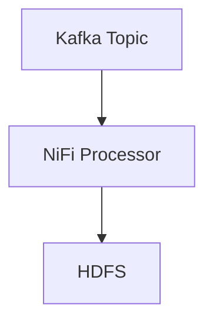

# Hadoop 治理工具

## 介绍

在大数据生态系统中，Hadoop 是一个广泛使用的分布式计算框架。随着数据量的增长，数据治理变得越来越重要。数据治理是指对数据的可用性、一致性、完整性和安全性进行管理的过程。Hadoop 治理工具帮助组织有效地管理其大数据资产，确保数据质量、合规性和安全性。

本文将介绍几种常见的 Hadoop 治理工具，并展示它们在实际应用中的使用场景。

## 常见的Hadoop治理工具

### 1. Apache Atlas

Apache Atlas 是一个元数据管理和数据治理工具，专为 Hadoop 生态系统设计。它提供了数据分类、元数据管理和数据血缘（Data Lineage）功能。

#### 主要功能
- **元数据管理**：存储和管理 Hadoop 生态系统中的元数据。
- **数据分类**：为数据资产添加标签和分类。
- **数据血缘**：追踪数据的来源和流向。

#### 示例：创建实体

```java
// 创建一个Hive表的元数据实体
Entity hiveTable = new Entity("hive_table");
hiveTable.setAttribute("name", "sales_data");
hiveTable.setAttribute("description", "Sales data for 2023");
hiveTable.setAttribute("owner", "admin");

// 将实体添加到Atlas
AtlasClient atlasClient = new AtlasClient("http://localhost:21000");
atlasClient.createEntity(hiveTable);
```

#### 输出
```json
{
  "guid": "12345",
  "status": "SUCCESS"
}
```

### 2. Apache Ranger

Apache Ranger 是一个集中式的安全管理框架，用于在 Hadoop 生态系统中实施细粒度的访问控制。

#### 主要功能
- **访问控制**：定义和管理用户对数据的访问权限。
- **审计**：记录所有数据访问活动。
- **策略管理**：创建和管理访问策略。

#### 示例：创建访问策略

```java
// 创建一个HDFS访问策略
RangerPolicy policy = new RangerPolicy();
policy.setName("sales_data_access");
policy.setResource("hdfs:///sales_data");
policy.setUserPermissions("admin", Arrays.asList("read", "write"));

// 将策略添加到Ranger
RangerClient rangerClient = new RangerClient("http://localhost:6080");
rangerClient.createPolicy(policy);
```

#### 输出
```json
{
  "id": 67890,
  "status": "SUCCESS"
}
```

### 3. Apache NiFi

Apache NiFi 是一个数据流自动化工具，用于在 Hadoop 生态系统中进行数据摄取、转换和分发。

#### 主要功能
- **数据流管理**：设计和执行数据流。
- **数据转换**：对数据进行实时转换。
- **数据监控**：监控数据流的性能和状态。

#### 示例：创建数据流



#### 代码示例
```java
// 创建一个NiFi数据流
FlowController flowController = new FlowController();
flowController.addProcessor("KafkaProcessor", "Kafka Topic");
flowController.addProcessor("HDFSProcessor", "HDFS");
flowController.connectProcessors("KafkaProcessor", "HDFSProcessor");

// 启动数据流
flowController.start();
```

#### 输出
```json
{
  "flowId": "12345",
  "status": "RUNNING"
}
```

## 实际案例

### 案例1：金融行业的数据治理

在金融行业中，数据治理尤为重要。某银行使用 Apache Atlas 来管理其 Hadoop 集群中的元数据，确保所有数据的来源和流向都清晰可见。同时，他们使用 Apache Ranger 来实施严格的访问控制，确保只有授权人员可以访问敏感数据。

### 案例2：电商行业的数据流管理

某电商公司使用 Apache NiFi 来管理其数据流。他们从 Kafka 中摄取用户行为数据，经过 NiFi 的实时处理后，将数据存储到 HDFS 中。通过 NiFi 的监控功能，他们可以实时查看数据流的性能，确保数据处理的及时性和准确性。

## 总结

Hadoop 治理工具在大数据生态系统中扮演着至关重要的角色。通过使用 Apache Atlas、Apache Ranger 和 Apache NiFi 等工具，组织可以有效地管理其数据资产，确保数据的质量、合规性和安全性。

## 附加资源

- [Apache Atlas 官方文档](https://atlas.apache.org/)
- [Apache Ranger 官方文档](https://ranger.apache.org/)
- [Apache NiFi 官方文档](https://nifi.apache.org/)

## 练习

1. 使用 Apache Atlas 创建一个 Hive 表的元数据实体，并查看其数据血缘。
2. 使用 Apache Ranger 创建一个 HDFS 访问策略，并测试其访问控制效果。
3. 使用 Apache NiFi 设计一个简单的数据流，从 Kafka 中摄取数据并存储到 HDFS 中。

通过完成这些练习，您将更好地理解 Hadoop 治理工具的实际应用。