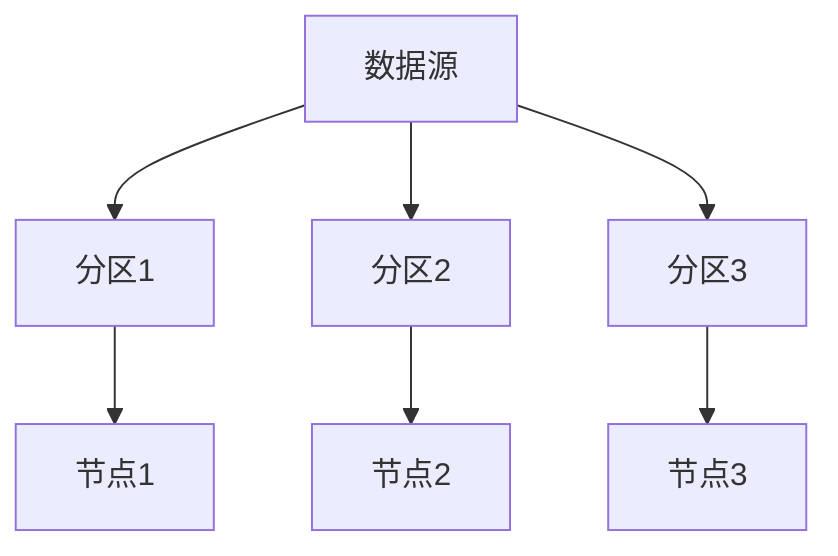

# Hadoop 数据共享策略

在现代大数据生态系统中，数据共享是一个至关重要的环节。Hadoop作为一个分布式计算框架，提供了多种数据共享策略，以确保数据能够在不同用户、团队或应用程序之间高效、安全地流动。本文将详细介绍Hadoop中的数据共享策略，并通过实际案例帮助初学者理解其应用场景。

## 什么是Hadoop数据共享策略？

Hadoop数据共享策略是指在Hadoop分布式文件系统（HDFS）中，如何管理和控制数据的访问权限、存储位置以及数据流动的规则。这些策略旨在确保数据的安全性、可用性和一致性，同时提高数据共享的效率。

## 数据共享策略的核心概念

### 1. 数据访问控制

Hadoop通过访问控制列表（ACL）和权限模型来控制数据的访问权限。每个文件和目录都有相应的权限设置，决定了哪些用户或用户组可以读取、写入或执行该文件。

```bash
# 示例：设置HDFS文件的权限
hdfs dfs -chmod 750 /user/data/sample.txt
```

:::note
**注意**：权限模式 `750` 表示文件所有者有读、写、执行权限，同组用户有读和执行权限，其他用户没有任何权限。
:::

### 2. 数据分区与存储

Hadoop允许将数据分区存储在不同的节点上，以提高数据访问的效率。通过合理的数据分区策略，可以减少数据访问的延迟，并优化数据处理的性能。



### 3. 数据复制与容错

HDFS默认会将数据复制到多个节点上，以防止数据丢失。这种复制策略不仅提高了数据的可靠性，还允许在数据访问时从最近的节点获取数据，从而减少网络延迟。

```bash
# 示例：查看HDFS文件的复制因子
hdfs dfs -stat %r /user/data/sample.txt
```

:::tip
**提示**：默认情况下，HDFS的复制因子为3，即每个数据块会被复制到3个不同的节点上。
:::

### 4. 数据共享协议

Hadoop支持多种数据共享协议，如HTTP、FTP和HDFS协议。这些协议允许用户通过不同的方式访问和共享数据，从而满足不同的业务需求。

```bash
# 示例：通过HTTP访问HDFS文件
curl http://namenode:50070/webhdfs/v1/user/data/sample.txt?op=OPEN
```

## 实际案例：跨团队数据共享

假设一个公司有两个团队：数据分析团队和机器学习团队。数据分析团队负责处理原始数据，而机器学习团队需要使用这些数据来训练模型。为了实现高效的数据共享，可以采取以下策略：

1. **数据分区存储**：将原始数据按日期分区存储，便于机器学习团队按需访问。
2. **访问控制**：为机器学习团队设置只读权限，确保他们无法修改原始数据。
3. **数据复制**：将数据复制到离机器学习团队最近的节点，以减少数据访问的延迟。

```bash
# 示例：为机器学习团队设置只读权限
hdfs dfs -setfacl -m group:machine_learning:r-- /user/data/raw
```

## 总结

Hadoop数据共享策略是确保数据在分布式环境中高效、安全流动的关键。通过合理的数据访问控制、分区存储、复制策略以及共享协议，可以显著提高数据共享的效率和安全性。希望本文能帮助初学者更好地理解Hadoop中的数据共享策略，并在实际项目中灵活应用。

## 附加资源与练习

- **资源**：
  - [Hadoop官方文档](https://hadoop.apache.org/docs/current/)
  - [HDFS权限管理指南](https://hadoop.apache.org/docs/current/hadoop-project-dist/hadoop-hdfs/HdfsPermissionsGuide.html)

- **练习**：
  1. 在HDFS中创建一个目录，并为其设置不同的权限模式，观察不同用户访问时的行为。
  2. 尝试使用HTTP协议访问HDFS中的文件，并记录访问时间。
  3. 修改HDFS文件的复制因子，观察数据存储的变化。

:::caution
**警告**：在修改HDFS权限或复制因子时，请确保了解其影响，以免造成数据丢失或访问问题。
:::