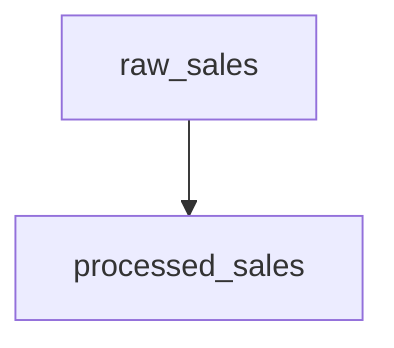

# Hadoop 数据血缘分析

## 介绍

在数据治理中，**数据血缘分析**（Data Lineage Analysis）是一个关键的概念。它帮助我们追踪数据的来源、流向以及转换过程，确保数据的透明性和可追溯性。在Hadoop生态系统中，数据血缘分析尤为重要，因为Hadoop通常用于处理大规模数据，涉及多个数据源和复杂的转换逻辑。

数据血缘分析可以帮助我们回答以下问题：
- 数据从哪里来？
- 数据经过了哪些处理步骤？
- 数据最终被用于哪些地方？

## 数据血缘分析的基本概念

### 什么是数据血缘？

数据血缘是指数据的生命周期，包括数据的来源、流向以及在整个数据处理流程中的转换过程。它可以帮助我们理解数据的依赖关系，确保数据的准确性和一致性。

### 为什么需要数据血缘分析？

1. **数据质量**：通过追踪数据的来源和转换过程，可以更容易地发现数据质量问题。
2. **合规性**：在金融、医疗等行业，数据血缘分析是合规性要求的一部分。
3. **故障排查**：当数据处理过程中出现问题时，数据血缘分析可以帮助快速定位问题源头。
4. **影响分析**：当数据源或处理逻辑发生变化时，数据血缘分析可以帮助评估这些变化对下游系统的影响。

## Hadoop 中的数据血缘分析

在Hadoop生态系统中，数据血缘分析通常涉及以下几个组件：
- **HDFS**：Hadoop分布式文件系统，存储原始数据和处理后的数据。
- **MapReduce**：用于数据处理的编程模型。
- **Hive**：用于数据仓库和SQL查询。
- **Spark**：用于大规模数据处理的引擎。

### 数据血缘分析的实现

在Hadoop中，数据血缘分析可以通过以下方式实现：

1. **日志分析**：通过分析Hadoop作业的日志，追踪数据的来源和流向。
2. **元数据管理**：使用元数据管理工具（如Apache Atlas）来记录数据的血缘关系。
3. **自定义脚本**：编写自定义脚本，解析Hadoop作业的输入输出路径，构建数据血缘图。

### 示例：使用Apache Atlas进行数据血缘分析

Apache Atlas是一个开源的元数据管理和数据治理工具，支持Hadoop生态系统中的数据血缘分析。以下是一个简单的示例，展示如何使用Apache Atlas来追踪数据的血缘关系。

#### 1. 安装和配置Apache Atlas

首先，确保你已经安装了Apache Atlas，并正确配置了Hadoop、Hive等组件的集成。

#### 2. 创建数据血缘

假设我们有一个Hive表 `sales_data`，它从 `raw_sales` 表中提取数据，并经过一些转换后存储到 `processed_sales` 表中。

```sql
CREATE TABLE processed_sales AS
SELECT customer_id, SUM(amount) AS total_amount
FROM raw_sales
GROUP BY customer_id;
```

#### 3. 查看数据血缘

在Apache Atlas的Web UI中，你可以查看 `processed_sales` 表的数据血缘关系。它将显示 `processed_sales` 表的数据来源是 `raw_sales` 表，并且经过了 `SUM` 和 `GROUP BY` 操作。



### 实际案例

#### 案例：电商数据分析

假设你在一家电商公司工作，负责分析用户的购买行为。你有一个Hive表 `user_purchases`，它从多个数据源（如日志文件、数据库）中提取数据，并经过一系列转换后存储到 `user_behavior` 表中。

通过数据血缘分析，你可以追踪 `user_behavior` 表的数据来源，确保数据的准确性和一致性。如果发现数据异常，你可以快速定位问题源头，并进行修复。

## 总结

数据血缘分析是Hadoop数据治理中的重要组成部分。它帮助我们追踪数据的来源、流向和转换过程，确保数据的透明性和可追溯性。通过使用工具如Apache Atlas，我们可以轻松实现数据血缘分析，并在实际场景中应用它来提高数据质量和合规性。

## 附加资源

- [Apache Atlas官方文档](https://atlas.apache.org/)
- [Hadoop数据治理指南](https://hadoop.apache.org/docs/current/hadoop-project-dist/hadoop-hdfs/HdfsDataGovernance.html)
- [数据血缘分析的最佳实践](https://www.databricks.com/blog/2019/08/14/data-lineage-best-practices.html)

## 练习

1. 在你的Hadoop集群中安装并配置Apache Atlas。
2. 创建一个Hive表，并使用Apache Atlas追踪其数据血缘关系。
3. 尝试在Apache Atlas中查看一个复杂数据处理流程的数据血缘图，并分析其依赖关系。
