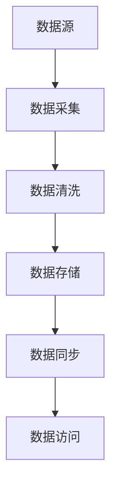

# Hadoop 主数据管理

## 介绍

在大数据生态系统中，**主数据管理（Master Data Management, MDM）** 是一个关键的概念。它指的是对组织中的核心业务实体（如客户、产品、供应商等）进行统一管理的过程。主数据是组织中最重要的数据资产之一，通常需要在多个系统和应用程序之间共享和同步。

在Hadoop生态系统中，主数据管理变得更加复杂，因为数据通常分布在多个节点上，并且数据量巨大。Hadoop主数据管理的目标是通过分布式存储和处理技术，确保主数据的一致性、准确性和可用性。

## 主数据管理的核心概念

### 1. 主数据的定义

主数据是指组织中最重要的业务实体数据，通常是跨多个系统共享的。例如，客户信息、产品信息、供应商信息等都属于主数据。

### 2. 主数据管理的目标

- **一致性**：确保主数据在所有系统中保持一致。
- **准确性**：确保主数据的准确性和完整性。
- **可用性**：确保主数据在需要时能够被快速访问和使用。

### 3. Hadoop中的主数据管理

在Hadoop中，主数据管理通常涉及以下步骤：

1. **数据采集**：从多个数据源中采集主数据。
2. **数据清洗**：对采集到的数据进行清洗和标准化。
3. **数据存储**：将清洗后的数据存储在Hadoop分布式文件系统（HDFS）中。
4. **数据同步**：确保主数据在多个系统之间同步。
5. **数据访问**：通过Hadoop生态系统中的工具（如Hive、Spark等）访问和分析主数据。

## 实现Hadoop主数据管理的步骤

### 1. 数据采集

在Hadoop中，数据采集通常使用工具如Apache Flume或Apache Kafka。以下是一个使用Flume采集数据的示例：

```bash
# flume.conf
agent.sources = source1
agent.sinks = sink1
agent.channels = channel1

agent.sources.source1.type = exec
agent.sources.source1.command = tail -F /var/log/source.log
agent.sources.source1.channels = channel1

agent.channels.channel1.type = memory
agent.channels.channel1.capacity = 1000
agent.channels.channel1.transactionCapacity = 100

agent.sinks.sink1.type = hdfs
agent.sinks.sink1.hdfs.path = hdfs://namenode:8020/user/flume/data
agent.sinks.sink1.hdfs.fileType = DataStream
agent.sinks.sink1.channel = channel1
```

### 2. 数据清洗

数据清洗是主数据管理中的一个关键步骤。可以使用Apache Spark进行数据清洗。以下是一个简单的Spark代码示例：

```python
from pyspark.sql import SparkSession

# 初始化Spark会话
spark = SparkSession.builder.appName("DataCleaning").getOrCreate()

# 读取数据
df = spark.read.csv("hdfs://namenode:8020/user/flume/data/source.log", header=True)

# 数据清洗
df_cleaned = df.na.drop()  # 删除空值
df_cleaned = df_cleaned.dropDuplicates()  # 删除重复值

# 保存清洗后的数据
df_cleaned.write.csv("hdfs://namenode:8020/user/flume/data/cleaned_data")
```

### 3. 数据存储

清洗后的数据可以存储在HDFS中。以下是一个将数据存储到HDFS的示例：

```bash
hdfs dfs -put cleaned_data.csv /user/flume/data/cleaned_data
```

### 4. 数据同步

数据同步可以通过Apache NiFi或自定义脚本来实现。以下是一个简单的NiFi流程示例：



### 5. 数据访问

数据访问可以通过Hive或Spark SQL来实现。以下是一个使用Hive查询数据的示例：

```sql
CREATE EXTERNAL TABLE IF NOT EXISTS cleaned_data (
    id INT,
    name STRING,
    age INT
)
LOCATION '/user/flume/data/cleaned_data';

SELECT * FROM cleaned_data WHERE age > 30;
```

## 实际案例

### 案例：电商平台的主数据管理

假设我们有一个电商平台，需要对客户信息进行主数据管理。以下是实现步骤：

1. **数据采集**：从多个数据源（如CRM系统、订单系统等）采集客户信息。
2. **数据清洗**：使用Spark清洗客户信息，删除重复记录和空值。
3. **数据存储**：将清洗后的客户信息存储在HDFS中。
4. **数据同步**：使用NiFi将客户信息同步到其他系统（如营销系统、物流系统等）。
5. **数据访问**：通过Hive查询客户信息，生成报表或进行数据分析。

## 总结

Hadoop主数据管理是大数据生态系统中的一个重要组成部分。通过合理的数据采集、清洗、存储、同步和访问，可以确保主数据的一致性、准确性和可用性。对于初学者来说，掌握这些基本概念和实现步骤是进入大数据领域的重要一步。

## 附加资源

- [Apache Hadoop官方文档](https://hadoop.apache.org/docs/current/)
- [Apache Spark官方文档](https://spark.apache.org/docs/latest/)
- [Apache NiFi官方文档](https://nifi.apache.org/docs.html)

## 练习

1. 使用Flume采集日志数据，并将其存储到HDFS中。
2. 使用Spark清洗数据，删除空值和重复记录。
3. 使用Hive查询清洗后的数据，并生成一个简单的报表。

通过完成这些练习，你将更好地理解Hadoop主数据管理的实际应用。