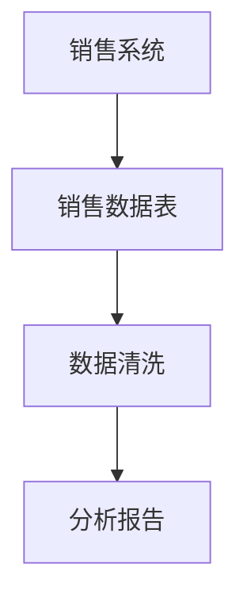

# Hadoop 数据目录

## 介绍

在大数据生态系统中，Hadoop 是一个广泛使用的分布式存储和计算框架。随着数据量的增长，如何有效地管理和治理数据成为了一个重要课题。**Hadoop 数据目录**（Hadoop Data Catalog）是一种用于组织和描述数据的工具，它帮助用户发现、理解和管理存储在 Hadoop 中的数据。

数据目录的核心功能是提供数据的元数据（metadata），即关于数据的数据。通过数据目录，用户可以轻松查找数据、了解数据的来源、结构、用途以及访问权限等信息。

## 数据目录的作用

Hadoop 数据目录的主要作用包括：

1. **数据发现**：帮助用户快速找到所需的数据集。
2. **数据理解**：提供数据的上下文信息，如数据来源、格式、结构等。
3. **数据治理**：确保数据的质量、一致性和合规性。
4. **数据访问控制**：管理数据的访问权限，确保数据安全。

## Hadoop 数据目录的组成

Hadoop 数据目录通常由以下几个部分组成：

1. **元数据存储**：存储数据的描述信息，如数据表的结构、字段类型、数据来源等。
2. **数据发现工具**：提供搜索和浏览功能，帮助用户查找数据。
3. **数据治理工具**：用于管理数据的质量、合规性和访问权限。
4. **数据血缘（Data Lineage）**：记录数据的来源和转换过程，帮助用户理解数据的生命周期。

## 实际案例

假设我们有一个存储在 Hadoop 中的销售数据集，包含以下字段：

- `order_id`：订单ID
- `customer_id`：客户ID
- `order_date`：订单日期
- `total_amount`：订单总金额

通过 Hadoop 数据目录，我们可以轻松找到这个数据集，并了解每个字段的含义、数据类型以及数据的来源。例如，我们可以通过数据目录发现 `total_amount` 字段的单位是美元，并且该数据来源于公司的销售系统。

## 代码示例

以下是一个简单的示例，展示如何使用 Apache Atlas（一个流行的 Hadoop 数据目录工具）来创建和管理元数据。

```bash
# 创建一个新的实体类型
curl -v -u admin:admin -X POST -H 'Content-Type: application/json' -d '{
  "name": "sales_data",
  "description": "Sales data from the company",
  "typeVersion": "1.0",
  "attributeDefs": [
    {
      "name": "order_id",
      "typeName": "string",
      "isOptional": false,
      "cardinality": "SINGLE"
    },
    {
      "name": "customer_id",
      "typeName": "string",
      "isOptional": false,
      "cardinality": "SINGLE"
    },
    {
      "name": "order_date",
      "typeName": "date",
      "isOptional": false,
      "cardinality": "SINGLE"
    },
    {
      "name": "total_amount",
      "typeName": "double",
      "isOptional": false,
      "cardinality": "SINGLE"
    }
  ]
}' http://localhost:21000/api/atlas/v2/types/typedefs
```

:::note
在上面的示例中，我们使用 Apache Atlas 的 REST API 创建了一个名为 `sales_data` 的实体类型，并定义了其字段的元数据。
:::

## 数据血缘示例

数据血缘是数据目录中的一个重要概念，它展示了数据的来源和转换过程。以下是一个简单的数据血缘图：



:::tip
通过数据血缘图，我们可以清晰地看到数据从销售系统到最终分析报告的整个流程。
:::

## 总结

Hadoop 数据目录是大数据治理中的重要工具，它帮助用户发现、理解和管理数据。通过数据目录，用户可以轻松查找数据、了解数据的上下文信息，并确保数据的质量和合规性。本文介绍了 Hadoop 数据目录的基本概念、作用以及实际应用，并提供了代码示例和数据血缘图。

## 附加资源

- [Apache Atlas 官方文档](https://atlas.apache.org/)
- [Hadoop 数据治理指南](https://hadoop.apache.org/docs/current/hadoop-project-dist/hadoop-hdfs/HdfsDataGovernance.html)
- [数据血缘与数据治理](https://www.dataversity.net/data-lineage-and-data-governance/)

## 练习

1. 使用 Apache Atlas 创建一个新的实体类型，并定义其字段的元数据。
2. 绘制一个数据血缘图，展示数据从来源到最终分析的整个流程。
3. 思考并讨论数据目录在数据治理中的重要性。